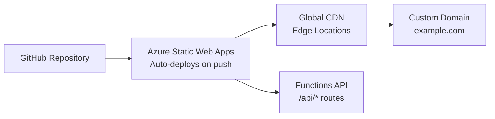

# How to Deploy Static Sites on Azure Static Web Apps with OpenTofu

Author: [nawazdhandala](https://www.github.com/nawazdhandala)

Tags: OpenTofu, Azure, Static Web Apps, Static Site, CDN, Custom Domain, Infrastructure as Code

Description: Learn how to deploy static websites using Azure Static Web Apps with OpenTofu, including custom domain configuration, environment slots, and function app integration for API backends.

---

Azure Static Web Apps provides global CDN hosting for static sites with built-in CI/CD, custom domains, and optional API backends via Azure Functions. OpenTofu manages the Static Web App resource, custom domain bindings, and environment configuration.

## Architecture



## Static Web App Resource

```hcl
# static_web_app.tf

resource "azurerm_resource_group" "web" {
  name     = "rg-web-${var.environment}"
  location = var.location
}

resource "azurerm_static_web_app" "main" {
  name                = "swa-${var.app_name}-${var.environment}"
  resource_group_name = azurerm_resource_group.web.name
  location            = var.location  # Available in select regions
  sku_tier            = var.environment == "production" ? "Standard" : "Free"
  sku_size            = var.environment == "production" ? "Standard" : "Free"

  tags = {
    Environment = var.environment
    ManagedBy   = "opentofu"
  }
}

# The deployment token is used by CI/CD to push content
output "deployment_token" {
  value     = azurerm_static_web_app.main.api_key
  sensitive = true
}

output "default_host_name" {
  value = azurerm_static_web_app.main.default_host_name
}
```

## Custom Domain Binding

```hcl
# custom_domain.tf

# DNS CNAME record pointing to Static Web App
resource "azurerm_dns_cname_record" "app" {
  name                = var.subdomain  # e.g., "www" or "app"
  zone_name           = var.dns_zone_name
  resource_group_name = var.dns_resource_group
  ttl                 = 300
  record              = azurerm_static_web_app.main.default_host_name
}

# For apex domain, use alias record or TXT + CNAME workaround
resource "azurerm_dns_txt_record" "apex_validation" {
  name                = "@"
  zone_name           = var.dns_zone_name
  resource_group_name = var.dns_resource_group
  ttl                 = 300

  record {
    value = azurerm_static_web_app.main.default_host_name
  }
}

# Bind custom domain to Static Web App
resource "azurerm_static_web_app_custom_domain" "main" {
  static_web_app_id = azurerm_static_web_app.main.id
  domain_name       = "${var.subdomain}.${var.dns_zone_name}"
  validation_type   = "cname-delegation"

  depends_on = [azurerm_dns_cname_record.app]
}
```

## Environment Variables

```hcl
# App settings passed to the Functions API backend
# Note: Frontend environment variables must be set during build time
resource "azurerm_static_web_app" "main" {
  name                = "swa-${var.app_name}-${var.environment}"
  resource_group_name = azurerm_resource_group.web.name
  location            = var.location
  sku_tier            = "Standard"
  sku_size            = "Standard"

  app_settings = {
    COSMOS_DB_CONNECTION = var.cosmos_db_connection
    STORAGE_ACCOUNT_URL  = var.storage_account_url
    API_KEY              = var.api_key
  }
}
```

## GitHub Actions Deployment

```hcl
# Store deployment token as GitHub Actions secret
resource "github_actions_secret" "swa_token" {
  repository      = var.github_repo
  secret_name     = "AZURE_STATIC_WEB_APPS_API_TOKEN"
  plaintext_value = azurerm_static_web_app.main.api_key
}
```

## GitHub Actions Workflow Template

```yaml
# .github/workflows/azure-static-web-apps.yml
# Reference output of this OpenTofu configuration
name: Deploy Static Web App

on:
  push:
    branches: [main]

jobs:
  deploy:
    runs-on: ubuntu-latest
    steps:
      - uses: actions/checkout@v4

      - name: Build
        run: npm ci && npm run build

      - name: Deploy to Azure Static Web Apps
        uses: Azure/static-web-apps-deploy@v1
        with:
          azure_static_web_apps_api_token: ${{ secrets.AZURE_STATIC_WEB_APPS_API_TOKEN }}
          repo_token: ${{ secrets.GITHUB_TOKEN }}
          action: "upload"
          app_location: "/"
          output_location: "dist"
```

## Staging Environments

```hcl
# Static Web Apps automatically creates preview environments for PRs
# Named branches also get their own URL: https://<branch>.<random>.azurestaticapps.net

# For explicit named environments:
locals {
  environments = var.environment == "production" ? {} : {
    staging = {
      branch = "staging"
    }
  }
}
```

## Best Practices

- Use `sku_tier = "Standard"` for production - the Free tier doesn't support custom domains with HTTPS or private endpoints.
- Store the `api_key` (deployment token) as a GitHub Actions secret or Azure DevOps variable - it grants write access to your Static Web App.
- Use the `cname-delegation` validation type for subdomains - it's simpler than TXT validation. For apex domains, use `dns-txt-token` validation instead.
- Leverage the built-in preview environments for PRs - Static Web Apps automatically deploys PR branches to isolated preview URLs at no extra cost.
- Keep infrastructure (`opentofu`) and deployment (GitHub Actions) concerns separate - OpenTofu provisions the resource and DNS; CI/CD deploys the content.
