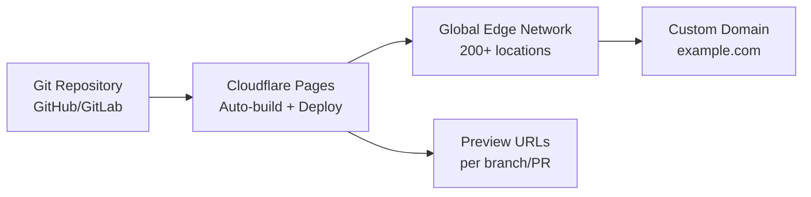

# How to Deploy Static Sites on Cloudflare Pages with OpenTofu

Author: [nawazdhandala](https://www.github.com/nawazdhandala)

Tags: OpenTofu, Cloudflare, Pages, Static Site, CDN, Custom Domain, Infrastructure as Code

Description: Learn how to configure Cloudflare Pages projects, custom domains, and deployment settings using OpenTofu's Cloudflare provider for globally distributed static site hosting.

---

Cloudflare Pages provides a global edge network for static sites with automatic builds from Git, preview deployments for every PR, and zero-config HTTPS. OpenTofu manages the Pages project, custom domain bindings, and environment variables.

## Architecture



## Cloudflare Pages Project

```hcl
# pages.tf
terraform {
  required_providers {
    cloudflare = {
      source  = "cloudflare/cloudflare"
      version = "~> 4.0"
    }
  }
}

resource "cloudflare_pages_project" "main" {
  account_id        = var.cloudflare_account_id
  name              = var.project_name
  production_branch = "main"

  # Configure build settings for the framework
  build_config {
    build_command       = "npm run build"
    destination_dir     = "dist"
    root_dir            = ""  # Root of repo
  }

  # Connect to GitHub/GitLab repository
  source {
    type = "github"
    config {
      owner                         = var.github_org
      repo_name                     = var.github_repo
      production_branch             = "main"
      pr_comments_enabled           = true
      deployments_enabled           = true
      production_deployment_enabled = true
      preview_deployment_setting    = "custom"
      preview_branch_includes       = ["staging", "develop"]
    }
  }

  deployment_configs {
    preview {
      environment_variables = {
        ENVIRONMENT = "preview"
        API_URL     = var.api_url_staging
      }
    }

    production {
      environment_variables = {
        ENVIRONMENT = "production"
        API_URL     = var.api_url_production
      }

      # Secrets are stored encrypted — use for API keys
      secrets = {
        ANALYTICS_KEY = var.analytics_key
      }
    }
  }
}
```

## Custom Domain Binding

```hcl
# custom_domain.tf

# Bind custom domain to Pages project
resource "cloudflare_pages_domain" "main" {
  account_id   = var.cloudflare_account_id
  project_name = cloudflare_pages_project.main.name
  domain       = var.domain_name
}

# DNS record pointing to Pages project
data "cloudflare_zone" "main" {
  name = var.domain_name
}

resource "cloudflare_record" "pages_apex" {
  zone_id = data.cloudflare_zone.main.id
  name    = "@"
  type    = "CNAME"
  value   = cloudflare_pages_project.main.subdomain
  proxied = true  # Through Cloudflare proxy for DDoS protection + caching
  ttl     = 1     # Auto TTL when proxied
}

resource "cloudflare_record" "pages_www" {
  zone_id = data.cloudflare_zone.main.id
  name    = "www"
  type    = "CNAME"
  value   = var.domain_name
  proxied = true
  ttl     = 1
}
```

## Environment-Specific Projects

```hcl
# For multiple environments, create separate projects
locals {
  environments = {
    production = {
      branch  = "main"
      domain  = var.domain_name
      api_url = "https://api.${var.domain_name}"
    }
    staging = {
      branch  = "staging"
      domain  = "staging.${var.domain_name}"
      api_url = "https://api-staging.${var.domain_name}"
    }
  }
}

resource "cloudflare_pages_project" "env" {
  for_each = local.environments

  account_id        = var.cloudflare_account_id
  name              = "${var.project_name}-${each.key}"
  production_branch = each.value.branch

  build_config {
    build_command = "npm run build"
    destination_dir = "dist"
  }

  deployment_configs {
    production {
      environment_variables = {
        ENVIRONMENT = each.key
        API_URL     = each.value.api_url
      }
    }
  }
}
```

## Web Analytics (Optional)

```hcl
# Enable Cloudflare Web Analytics for the site
resource "cloudflare_web_analytics_site" "main" {
  account_id   = var.cloudflare_account_id
  zone_tag     = data.cloudflare_zone.main.id
  auto_install = true
}

output "web_analytics_tag" {
  description = "Add this tag to your HTML for Web Analytics"
  value       = cloudflare_web_analytics_site.main.site_tag
}
```

## Outputs

```hcl
output "pages_url" {
  description = "Default Cloudflare Pages URL"
  value       = "https://${cloudflare_pages_project.main.subdomain}"
}

output "production_url" {
  description = "Custom domain URL"
  value       = "https://${var.domain_name}"
}
```

## Best Practices

- Set `proxied = true` on the DNS CNAME record to route traffic through Cloudflare's proxy — this enables DDoS protection, caching, and WAF without additional configuration.
- Use the `secrets` field in `deployment_configs` for API keys and sensitive values — they're stored encrypted and not exposed in logs or the dashboard.
- Configure `preview_branch_includes` to only build specific branches as previews rather than all branches — this prevents accidental exposure of unfinished work.
- Leverage Cloudflare Pages' built-in preview deployments for PR review workflows instead of managing separate staging infrastructure.
- Use `pr_comments_enabled = true` to automatically comment on PRs with preview deployment URLs — this improves code review workflows significantly.
