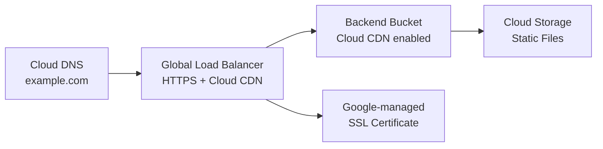

# How to Deploy a Static Site on GCP Cloud Storage with OpenTofu

Author: [nawazdhandala](https://www.github.com/nawazdhandala)

Tags: OpenTofu, GCP, Cloud Storage, Static Site, CDN, Cloud DNS, Load Balancer, Infrastructure as Code

Description: Learn how to host a static website on GCP Cloud Storage with Cloud CDN, custom domain, HTTPS, and Google-managed SSL certificates using OpenTofu.

---

GCP Cloud Storage serves static websites via HTTP, but for HTTPS and a custom domain you need a load balancer in front. OpenTofu manages the full stack: Cloud Storage bucket, backend bucket, HTTPS load balancer, SSL certificate, and Cloud DNS records.

## Architecture



## Cloud Storage Bucket

```hcl
# storage.tf

resource "google_storage_bucket" "site" {
  name          = var.domain_name
  location      = "US"
  storage_class = "STANDARD"

  # Enable website serving
  website {
    main_page_suffix = "index.html"
    not_found_page   = "404.html"
  }

  # Uniform bucket-level access - use IAM not ACLs
  uniform_bucket_level_access = true

  cors {
    origin          = ["https://${var.domain_name}"]
    method          = ["GET", "HEAD"]
    response_header = ["Content-Type"]
    max_age_seconds = 3600
  }

  labels = {
    environment = var.environment
    managed-by  = "opentofu"
  }
}

# Make bucket contents publicly readable
resource "google_storage_bucket_iam_member" "public_read" {
  bucket = google_storage_bucket.site.name
  role   = "roles/storage.objectViewer"
  member = "allUsers"
}
```

## Load Balancer with Cloud CDN

```hcl
# lb.tf

# Reserve global static IP
resource "google_compute_global_address" "site" {
  name = "${replace(var.domain_name, ".", "-")}-ip"
}

# Backend bucket with Cloud CDN enabled
resource "google_compute_backend_bucket" "site" {
  name        = "${replace(var.domain_name, ".", "-")}-backend"
  bucket_name = google_storage_bucket.site.name
  enable_cdn  = true

  cdn_policy {
    cache_mode        = "CACHE_ALL_STATIC"
    default_ttl       = 3600
    max_ttl           = 86400
    client_ttl        = 3600
    negative_caching  = true
  }
}

# URL map
resource "google_compute_url_map" "site" {
  name            = "${replace(var.domain_name, ".", "-")}-urlmap"
  default_service = google_compute_backend_bucket.site.id

  # Route /api/* to a backend service if needed
  # host_rule { ... }
}

# Google-managed SSL certificate
resource "google_compute_managed_ssl_certificate" "site" {
  name = "${replace(var.domain_name, ".", "-")}-cert"

  managed {
    domains = [var.domain_name, "www.${var.domain_name}"]
  }

  lifecycle {
    create_before_destroy = true
  }
}

# HTTPS proxy
resource "google_compute_target_https_proxy" "site" {
  name             = "${replace(var.domain_name, ".", "-")}-https-proxy"
  url_map          = google_compute_url_map.site.id
  ssl_certificates = [google_compute_managed_ssl_certificate.site.id]
}

# HTTPS forwarding rule
resource "google_compute_global_forwarding_rule" "https" {
  name       = "${replace(var.domain_name, ".", "-")}-https"
  target     = google_compute_target_https_proxy.site.id
  ip_address = google_compute_global_address.site.id
  port_range = "443"
}

# HTTP to HTTPS redirect
resource "google_compute_url_map" "redirect" {
  name = "${replace(var.domain_name, ".", "-")}-redirect"

  default_url_redirect {
    https_redirect         = true
    redirect_response_code = "MOVED_PERMANENTLY_DEFAULT"
    strip_query            = false
  }
}

resource "google_compute_target_http_proxy" "redirect" {
  name    = "${replace(var.domain_name, ".", "-")}-http"
  url_map = google_compute_url_map.redirect.id
}

resource "google_compute_global_forwarding_rule" "http" {
  name       = "${replace(var.domain_name, ".", "-")}-http"
  target     = google_compute_target_http_proxy.redirect.id
  ip_address = google_compute_global_address.site.id
  port_range = "80"
}
```

## Cloud DNS Records

```hcl
# dns.tf
resource "google_dns_managed_zone" "main" {
  name     = replace(var.domain_name, ".", "-")
  dns_name = "${var.domain_name}."
}

resource "google_dns_record_set" "apex" {
  name         = "${var.domain_name}."
  type         = "A"
  ttl          = 300
  managed_zone = google_dns_managed_zone.main.name
  rrdatas      = [google_compute_global_address.site.address]
}

resource "google_dns_record_set" "www" {
  name         = "www.${var.domain_name}."
  type         = "CNAME"
  ttl          = 300
  managed_zone = google_dns_managed_zone.main.name
  rrdatas      = ["${var.domain_name}."]
}
```

## Outputs

```hcl
output "load_balancer_ip" {
  description = "Configure this IP at your domain registrar if not using Cloud DNS"
  value       = google_compute_global_address.site.address
}

output "bucket_name" {
  description = "Upload static files to this bucket"
  value       = google_storage_bucket.site.name
}
```

## Best Practices

- Use a global load balancer in front of the bucket rather than direct bucket website hosting - this provides HTTPS, Cloud CDN, and custom domain support.
- Enable `uniform_bucket_level_access` on the storage bucket - it disables ACLs and forces use of IAM, which is easier to audit and manage.
- Use `cache_mode = "CACHE_ALL_STATIC"` for static site assets - Cloud CDN will automatically cache assets by content type and significantly reduce origin load.
- Google-managed SSL certificates take 10-60 minutes to provision after DNS propagates - the load balancer will return 502 errors until the certificate is ready.
- Upload site content using the `gsutil rsync` command or Cloud Build rather than OpenTofu `google_storage_bucket_object` resources - managing hundreds of files via state is inefficient.
