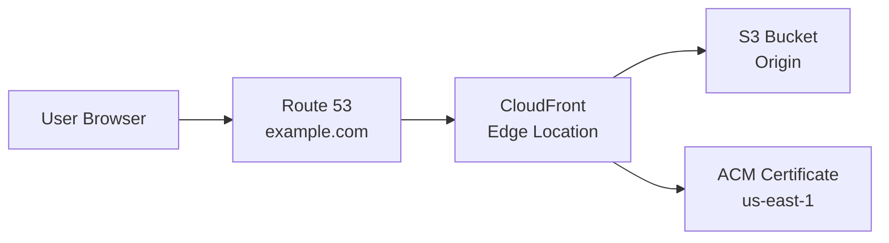

# How to Deploy a Static Site on S3 and CloudFront with OpenTofu

Author: [nawazdhandala](https://www.github.com/nawazdhandala)

Tags: OpenTofu, AWS, S3, CloudFront, Static Site, CDN, ACM, Route53, Infrastructure as Code

Description: Learn how to deploy a static website on AWS S3 with CloudFront CDN, custom domain, HTTPS via ACM, and automatic cache invalidation using OpenTofu.

---

Hosting a static site on S3 with CloudFront provides global CDN distribution, HTTPS, and sub-millisecond TTFB from edge locations. OpenTofu manages the entire stack: S3 bucket, CloudFront distribution, ACM certificate, and Route 53 DNS records.

## Architecture



## S3 Bucket Configuration

```hcl
# s3.tf
resource "aws_s3_bucket" "site" {
  bucket = var.domain_name

  tags = {
    Environment = var.environment
    ManagedBy   = "opentofu"
  }
}

# Block all public access — serve via CloudFront OAC only
resource "aws_s3_bucket_public_access_block" "site" {
  bucket = aws_s3_bucket.site.id

  block_public_acls       = true
  block_public_policy     = true
  ignore_public_acls      = true
  restrict_public_buckets = true
}

resource "aws_s3_bucket_versioning" "site" {
  bucket = aws_s3_bucket.site.id
  versioning_configuration {
    status = "Enabled"
  }
}

# Bucket policy — allow CloudFront OAC only
resource "aws_s3_bucket_policy" "site" {
  bucket = aws_s3_bucket.site.id

  policy = jsonencode({
    Version = "2012-10-17"
    Statement = [{
      Sid    = "AllowCloudFrontOAC"
      Effect = "Allow"
      Principal = {
        Service = "cloudfront.amazonaws.com"
      }
      Action   = "s3:GetObject"
      Resource = "${aws_s3_bucket.site.arn}/*"
      Condition = {
        StringEquals = {
          "AWS:SourceArn" = aws_cloudfront_distribution.site.arn
        }
      }
    }]
  })
}
```

## CloudFront Distribution

```hcl
# cloudfront.tf

# Origin Access Control — replaces deprecated OAI
resource "aws_cloudfront_origin_access_control" "site" {
  name                              = var.domain_name
  description                       = "OAC for ${var.domain_name}"
  origin_access_control_origin_type = "s3"
  signing_behavior                  = "always"
  signing_protocol                  = "sigv4"
}

resource "aws_cloudfront_distribution" "site" {
  enabled             = true
  is_ipv6_enabled     = true
  default_root_object = "index.html"
  aliases             = [var.domain_name, "www.${var.domain_name}"]
  price_class         = "PriceClass_100"  # US, Canada, Europe

  origin {
    domain_name              = aws_s3_bucket.site.bucket_regional_domain_name
    origin_id                = "s3-${var.domain_name}"
    origin_access_control_id = aws_cloudfront_origin_access_control.site.id
  }

  default_cache_behavior {
    allowed_methods        = ["GET", "HEAD", "OPTIONS"]
    cached_methods         = ["GET", "HEAD"]
    target_origin_id       = "s3-${var.domain_name}"
    viewer_protocol_policy = "redirect-to-https"
    compress               = true

    # Use managed cache policy — optimized for S3 origins
    cache_policy_id            = "658327ea-f89d-4fab-a63d-7e88639e58f6"  # CachingOptimized
    origin_request_policy_id   = "88a5eaf4-2fd4-4709-b370-b4c650ea3fcf"  # CORS-S3Origin
  }

  # SPA routing — serve index.html for 404s
  custom_error_response {
    error_code            = 404
    response_code         = 200
    response_page_path    = "/index.html"
    error_caching_min_ttl = 0
  }

  custom_error_response {
    error_code            = 403
    response_code         = 200
    response_page_path    = "/index.html"
    error_caching_min_ttl = 0
  }

  viewer_certificate {
    acm_certificate_arn      = aws_acm_certificate_validation.main.certificate_arn
    ssl_support_method       = "sni-only"
    minimum_protocol_version = "TLSv1.2_2021"
  }

  restrictions {
    geo_restriction {
      restriction_type = "none"
    }
  }

  tags = {
    Environment = var.environment
    ManagedBy   = "opentofu"
  }
}
```

## ACM Certificate (Must Be in us-east-1)

```hcl
# acm.tf
provider "aws" {
  alias  = "us_east_1"
  region = "us-east-1"
}

resource "aws_acm_certificate" "main" {
  provider                  = aws.us_east_1
  domain_name               = var.domain_name
  subject_alternative_names = ["www.${var.domain_name}"]
  validation_method         = "DNS"

  lifecycle {
    create_before_destroy = true
  }
}

resource "aws_acm_certificate_validation" "main" {
  provider                = aws.us_east_1
  certificate_arn         = aws_acm_certificate.main.arn
  validation_record_fqdns = [for record in aws_route53_record.cert_validation : record.fqdn]
}
```

## Route 53 DNS

```hcl
# dns.tf
resource "aws_route53_record" "apex" {
  zone_id = aws_route53_zone.main.zone_id
  name    = var.domain_name
  type    = "A"

  alias {
    name                   = aws_cloudfront_distribution.site.domain_name
    zone_id                = aws_cloudfront_distribution.site.hosted_zone_id
    evaluate_target_health = false
  }
}

resource "aws_route53_record" "www" {
  zone_id = aws_route53_zone.main.zone_id
  name    = "www.${var.domain_name}"
  type    = "CNAME"
  ttl     = 300
  records = [aws_cloudfront_distribution.site.domain_name]
}
```

## Best Practices

- Use Origin Access Control (OAC) rather than the deprecated Origin Access Identity (OAI) — OAC supports AWS Signature Version 4 and is the current best practice for S3-CloudFront integration.
- Set `block_public_access` on the S3 bucket — the bucket should never be publicly accessible directly; only CloudFront should access it.
- Set `price_class = "PriceClass_100"` unless you have global traffic — it restricts distribution to US/Canada/Europe and reduces costs significantly.
- Use managed cache policies (`CachingOptimized`) rather than custom cache behaviors — they're maintained by AWS and optimized for common use cases.
- For single-page applications, add custom error responses for 403 and 404 that return `index.html` with 200 status — this enables client-side routing.
