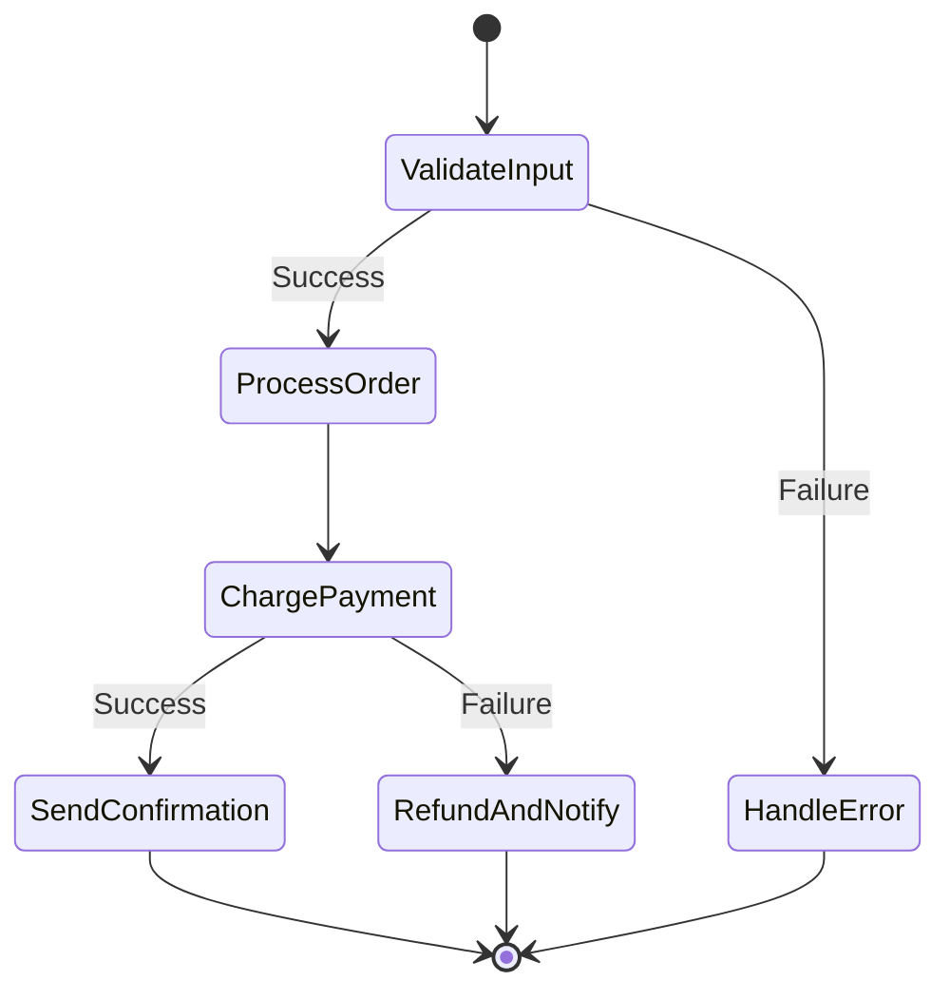

# How to Deploy Step Functions with OpenTofu on AWS

Author: [nawazdhandala](https://www.github.com/nawazdhandala)

Tags: OpenTofu, AWS, Step Functions, State Machines, Serverless, Orchestration, Infrastructure as Code

Description: Learn how to deploy AWS Step Functions state machines with OpenTofu, including Express and Standard workflows, Lambda integrations, error handling, and IAM execution roles.

---

AWS Step Functions orchestrate multi-step serverless workflows as state machines. OpenTofu defines the state machine definition, IAM execution role, logging, and related Lambda functions as a single infrastructure unit.

## Step Functions Workflow



## IAM Execution Role

```hcl
# iam.tf

resource "aws_iam_role" "step_functions" {
  name = "${var.state_machine_name}-execution-role"

  assume_role_policy = jsonencode({
    Version = "2012-10-17"
    Statement = [{
      Effect    = "Allow"
      Principal = { Service = "states.amazonaws.com" }
      Action    = "sts:AssumeRole"
    }]
  })
}

resource "aws_iam_role_policy" "step_functions" {
  name = "step-functions-permissions"
  role = aws_iam_role.step_functions.id

  policy = jsonencode({
    Version = "2012-10-17"
    Statement = [
      {
        Effect   = "Allow"
        Action   = ["lambda:InvokeFunction"]
        Resource = [
          aws_lambda_function.validate.arn,
          aws_lambda_function.process.arn,
          aws_lambda_function.charge.arn,
          aws_lambda_function.notify.arn,
        ]
      },
      {
        Effect = "Allow"
        Action = [
          "logs:CreateLogGroup",
          "logs:CreateLogDelivery",
          "logs:PutLogEvents",
          "logs:DescribeLogGroups",
          "logs:DescribeResourcePolicies"
        ]
        Resource = "*"
      },
      {
        Effect = "Allow"
        Action = ["xray:PutTraceSegments", "xray:GetSamplingRules"]
        Resource = "*"
      }
    ]
  })
}
```

## Standard State Machine

```hcl
# state_machine.tf
resource "aws_sfn_state_machine" "order_processing" {
  name     = var.state_machine_name
  role_arn = aws_iam_role.step_functions.arn
  type     = "STANDARD"  # Long-running, exactly-once, up to 1 year

  definition = jsonencode({
    Comment = "Order processing workflow"
    StartAt = "ValidateInput"
    States = {
      ValidateInput = {
        Type     = "Task"
        Resource = aws_lambda_function.validate.arn
        Retry = [{
          ErrorEquals = ["Lambda.ServiceException", "Lambda.TooManyRequestsException"]
          IntervalSeconds = 2
          MaxAttempts     = 3
          BackoffRate     = 2
        }]
        Catch = [{
          ErrorEquals = ["States.ALL"]
          Next        = "HandleError"
          ResultPath  = "$.error"
        }]
        Next = "ProcessOrder"
      }

      ProcessOrder = {
        Type     = "Task"
        Resource = aws_lambda_function.process.arn
        Next     = "ChargePayment"
      }

      ChargePayment = {
        Type     = "Task"
        Resource = aws_lambda_function.charge.arn
        Retry = [{
          ErrorEquals     = ["PaymentServiceException"]
          IntervalSeconds = 5
          MaxAttempts     = 2
          BackoffRate     = 1.5
        }]
        Catch = [{
          ErrorEquals = ["States.ALL"]
          Next        = "RefundAndNotify"
          ResultPath  = "$.paymentError"
        }]
        Next = "SendConfirmation"
      }

      SendConfirmation = {
        Type     = "Task"
        Resource = aws_lambda_function.notify.arn
        End      = true
      }

      RefundAndNotify = {
        Type     = "Task"
        Resource = aws_lambda_function.notify.arn
        End      = true
      }

      HandleError = {
        Type  = "Fail"
        Error = "ValidationFailed"
        Cause = "Input validation failed"
      }
    }
  })

  logging_configuration {
    log_destination        = "${aws_cloudwatch_log_group.sfn.arn}:*"
    include_execution_data = true
    level                  = "ERROR"
  }

  tracing_configuration {
    enabled = true
  }
}
```

## Express Workflow for High-Throughput

```hcl
# Express workflows: fast, at-least-once, up to 5 minutes
resource "aws_sfn_state_machine" "data_pipeline" {
  name     = "${var.environment}-data-pipeline"
  role_arn = aws_iam_role.step_functions.arn
  type     = "EXPRESS"  # High throughput, at-least-once

  definition = jsonencode({
    StartAt = "Transform"
    States = {
      Transform = {
        Type     = "Task"
        Resource = aws_lambda_function.transform.arn
        Next     = "Load"
      }
      Load = {
        Type     = "Task"
        Resource = aws_lambda_function.load.arn
        End      = true
      }
    }
  })

  logging_configuration {
    # Express workflows require CloudWatch Logs
    log_destination        = "${aws_cloudwatch_log_group.sfn_express.arn}:*"
    include_execution_data = false  # Don't log payload for Express
    level                  = "ALL"  # Express requires ALL level
  }
}
```

## CloudWatch Log Group

```hcl
resource "aws_cloudwatch_log_group" "sfn" {
  name              = "/aws/states/${var.state_machine_name}"
  retention_in_days = var.environment == "production" ? 90 : 14
}

resource "aws_cloudwatch_log_group" "sfn_express" {
  name              = "/aws/states/${var.environment}-data-pipeline"
  retention_in_days = 7
}
```

## Best Practices

- Use Standard workflows for business-critical processes that need exactly-once execution and execution history.
- Use Express workflows for high-throughput data pipelines - they're 10x cheaper but are at-least-once.
- Always configure `Retry` on Lambda task states - Lambda can throttle under load.
- Enable `include_execution_data = true` for Standard workflows to debug failures from the CloudWatch console.
- Define error handling with `Catch` blocks at each task state rather than a single top-level catch - granular error handling produces better diagnostics.
