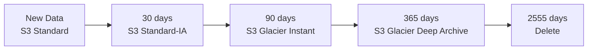

# How to Optimize Storage Costs with Lifecycle Policies in OpenTofu

Author: [nawazdhandala](https://www.github.com/nawazdhandala)

Tags: OpenTofu, AWS, S3 Lifecycle, Cost Optimization, Storage Class, Intelligent Tiering, Infrastructure as Code

Description: Learn how to configure S3 lifecycle policies, Intelligent Tiering, and EBS snapshot lifecycle rules using OpenTofu to automatically reduce storage costs as data ages.

---

Storage costs accumulate silently - S3 objects, EBS snapshots, and CloudWatch logs from years ago continue to accrue charges. Lifecycle policies automate the transition to cheaper storage tiers and deletion of expired data, reducing costs without manual intervention.

## Storage Cost Optimization Strategy



## S3 Lifecycle Rules

```hcl
# s3_lifecycle.tf

resource "aws_s3_bucket_lifecycle_configuration" "data_lake" {
  bucket = aws_s3_bucket.data_lake.id

  rule {
    id     = "raw-data-lifecycle"
    status = "Enabled"

    filter {
      prefix = "raw/"
    }

    transition {
      days          = 30
      storage_class = "STANDARD_IA"  # 45% cheaper than Standard
    }

    transition {
      days          = 90
      storage_class = "GLACIER_IR"   # 68% cheaper than Standard
    }

    transition {
      days          = 365
      storage_class = "DEEP_ARCHIVE"  # 95% cheaper than Standard
    }

    expiration {
      days = 2555  # 7 years retention
    }

    noncurrent_version_transition {
      noncurrent_days = 30
      storage_class   = "STANDARD_IA"
    }

    noncurrent_version_expiration {
      noncurrent_days = 90  # Delete old versions after 90 days
    }
  }

  rule {
    id     = "logs-lifecycle"
    status = "Enabled"

    filter {
      prefix = "logs/"
    }

    transition {
      days          = 14
      storage_class = "STANDARD_IA"
    }

    expiration {
      days = 90  # Logs expire after 90 days
    }

    abort_incomplete_multipart_upload {
      days_after_initiation = 7  # Clean up failed uploads
    }
  }

  rule {
    id     = "delete-old-temp-files"
    status = "Enabled"

    filter {
      prefix = "temp/"
    }

    expiration {
      days = 7
    }
  }
}
```

## S3 Intelligent Tiering for Unknown Access Patterns

```hcl
resource "aws_s3_bucket_intelligent_tiering_configuration" "archives" {
  bucket = aws_s3_bucket.data.id
  name   = "entire-bucket"

  # Move to Archive tier after 90 days without access
  tiering {
    access_tier = "ARCHIVE_ACCESS"
    days        = 90
  }

  # Move to Deep Archive after 180 days
  tiering {
    access_tier = "DEEP_ARCHIVE_ACCESS"
    days        = 180
  }
}
```

## EBS Snapshot Lifecycle Policy

```hcl
resource "aws_dlm_lifecycle_policy" "ebs_snapshots" {
  description        = "EBS snapshot lifecycle policy"
  execution_role_arn = aws_iam_role.dlm.arn
  state              = "ENABLED"

  policy_details {
    resource_types = ["VOLUME"]

    schedule {
      name = "daily-snapshots"

      create_rule {
        interval      = 24
        interval_unit = "HOURS"
        times         = ["03:00"]
      }

      retain_rule {
        count = 7  # Keep 7 daily snapshots
      }

      tags_to_add = {
        SnapshotCreator = "dlm-policy"
      }

      copy_tags = true
    }

    schedule {
      name = "weekly-snapshots"

      create_rule {
        cron_expression = "cron(0 3 ? * SAT *)"  # Every Saturday at 3 AM
      }

      retain_rule {
        count = 4  # Keep 4 weekly snapshots
      }
    }

    target_tags = {
      Environment = var.environment
      Backup      = "true"
    }
  }
}
```

## CloudWatch Log Retention

```hcl
# Set retention on all log groups instead of keeping forever
locals {
  log_retention_days = {
    dev        = 7
    staging    = 30
    production = 90
  }
}

resource "aws_cloudwatch_log_group" "app" {
  name              = "/app/${var.environment}/application"
  retention_in_days = local.log_retention_days[var.environment]
}
```

## Best Practices

- Set lifecycle rules on every S3 bucket - objects without lifecycle policies accumulate indefinitely.
- Use `abort_incomplete_multipart_upload` rules on all buckets to delete failed upload fragments that silently accumulate.
- Use Intelligent Tiering for data with unknown access patterns - it automatically moves data to cheaper tiers without predefined rules.
- Set CloudWatch Log Group retention policies when creating log groups in OpenTofu - the default is to keep logs forever.
- EBS snapshot policies save significantly over time - without policies, teams often accumulate years of daily snapshots.
