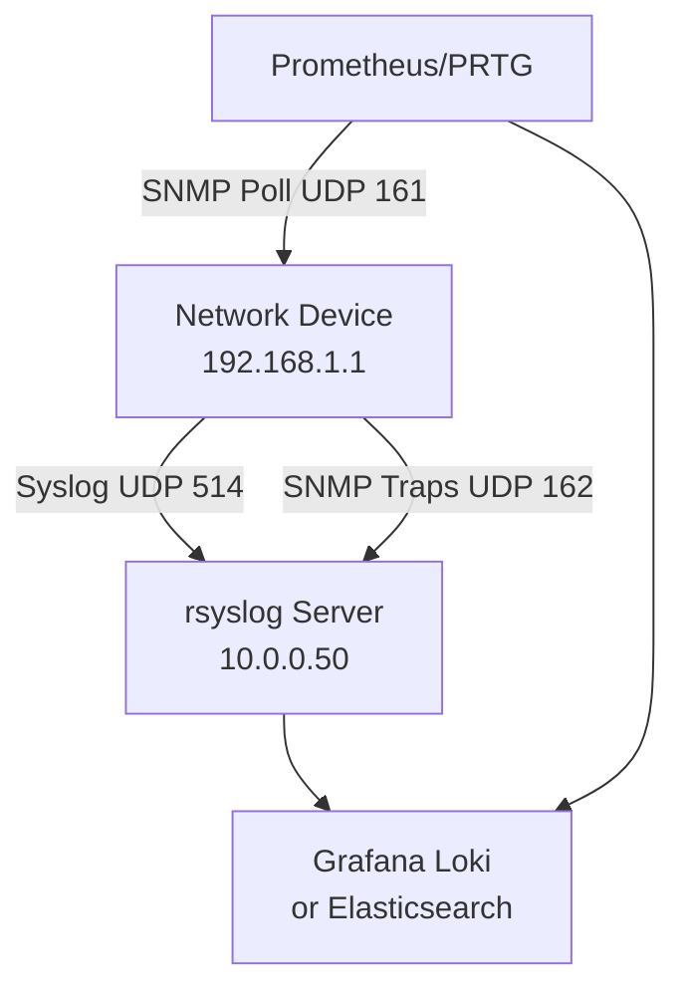

# How to Set Up Syslog and SNMP Together for Comprehensive Monitoring

Author: [nawazdhandala](https://www.github.com/nawazdhandala)

Tags: Syslog, SNMP, Monitoring, IPv4, Rsyslog, SNMP Traps, Network, Operation

Description: Learn how to combine syslog and SNMP to build comprehensive network device monitoring by collecting event logs and polling performance metrics over IPv4.

---

Syslog and SNMP are complementary monitoring approaches:
- **Syslog**: Push-based event logging (device sends events when they happen).
- **SNMP**: Pull-based metrics polling (monitoring system queries device statistics periodically).

Using both together gives you complete observability: event visibility from syslog and performance trends from SNMP.

## Architecture



## Step 1: Configure Syslog Reception (rsyslog)

```bash
# /etc/rsyslog.conf (on the central syslog server)

# Enable UDP syslog reception on port 514

module(load="imudp")
input(type="imudp" port="514" address="10.0.0.50")

# Enable TCP syslog reception (more reliable)
module(load="imtcp")
input(type="imtcp" port="514")

# Store logs by source IP in separate files
$template PerDeviceLog,"/var/log/devices/%FROMHOST-IP%.log"
if $fromhost-ip startswith "192.168." then ?PerDeviceLog

systemctl restart rsyslog
```

## Step 2: Configure SNMP Trap Reception

```bash
# /etc/snmp/snmptrapd.conf
# Accept SNMP traps from network devices

# Authentication: allow community "public" from all sources
authCommunity log,execute,net public

# Log traps to syslog
logOption f /var/log/snmptraps.log

# Or execute a script when a trap arrives
traphandle default /usr/local/bin/handle-trap.sh
```

```bash
# Start snmptrapd to listen for traps
systemctl enable --now snmptrapd
ss -ulnp | grep 162   # Verify listening on UDP 162
```

## Step 3: Send Syslog and SNMP Traps from a Cisco Device

```text
! Cisco IOS - configure syslog
logging host 10.0.0.50
logging trap informational
logging source-interface Loopback0

! Configure SNMP v2c traps
snmp-server community public ro
snmp-server host 10.0.0.50 traps version 2c public
snmp-server enable traps
snmp-server enable traps snmp linkup linkdown
snmp-server enable traps ospf state-change
```

## Step 4: Poll SNMP Metrics with Prometheus

```yaml
# prometheus.yml - use SNMP Exporter for metrics
scrape_configs:
  - job_name: 'snmp'
    static_configs:
      - targets:
          - 192.168.1.1    # Cisco router IPv4
          - 192.168.1.2    # Switch IPv4
    metrics_path: /snmp
    params:
      module: [cisco_wlc]
    relabel_configs:
      - source_labels: [__address__]
        target_label: __param_target
      - source_labels: [__param_target]
        target_label: instance
      - target_label: __address__
        replacement: 10.0.0.50:9116   # SNMP Exporter address
```

## Step 5: Correlate Syslog Events with SNMP Metrics in Grafana

- Add **Loki** as a data source for syslog logs.
- Add **Prometheus** as a data source for SNMP metrics.
- Create a **Grafana dashboard** that shows both time-series metrics and log panels on the same view.
- Use Grafana Annotations to mark syslog events (e.g., interface flaps) on metric graphs.

## Key Takeaways

- Syslog catches event-driven notifications (link failures, authentication errors) while SNMP captures continuous performance metrics.
- Use `snmptrapd` to receive trap notifications; parse them with `snmptt` for structured logging.
- Correlate syslog timestamps with SNMP metric anomalies in Grafana for root cause analysis.
- Enable both `logging trap` and `snmp-server enable traps` on network devices for maximum visibility.
