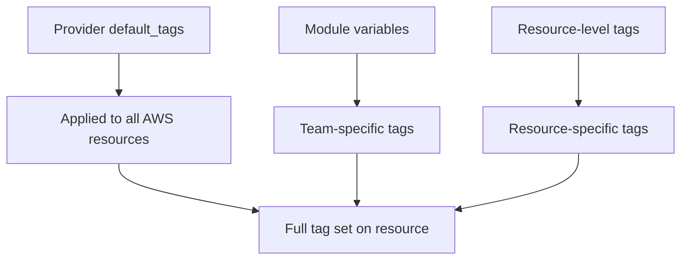

# How to Tag Resources for Cost Allocation with OpenTofu

Author: [nawazdhandala](https://www.github.com/nawazdhandala)

Tags: OpenTofu, AWS, Cost Allocation, Resource Tagging, Cost Management, Infrastructure as Code

Description: Learn how to implement consistent resource tagging strategies with OpenTofu using default tags, tag validation, and module-enforced tags to enable accurate cost allocation across teams and...

---

Cost allocation tags let you break down cloud bills by environment, team, project, and service. Without consistent tagging, it's impossible to answer "how much does staging cost?" or "which team is driving EC2 spend?" OpenTofu enforces tagging at the provider and module level so tags are applied consistently.

## Tagging Strategy



## Provider Default Tags

```hcl
# providers.tf - applied to every AWS resource

provider "aws" {
  region = var.aws_region

  default_tags {
    tags = {
      Environment = var.environment
      ManagedBy   = "opentofu"
      Repository  = "github.com/myorg/infrastructure"
      CostCenter  = var.cost_center
    }
  }
}
```

## Enforced Tags in Modules

```hcl
# modules/compute/ec2/variables.tf
variable "tags" {
  type        = map(string)
  description = "Additional tags for this resource"
  default     = {}
}

variable "team" {
  type        = string
  description = "Team that owns this resource (required for cost allocation)"
  validation {
    condition     = length(var.team) > 0
    error_message = "team is required for cost allocation"
  }
}

variable "project" {
  type        = string
  description = "Project name for cost allocation"
}

# module/compute/ec2/main.tf
locals {
  required_tags = {
    Team    = var.team
    Project = var.project
  }
  all_tags = merge(local.required_tags, var.tags)
}

resource "aws_instance" "this" {
  # ...
  tags = local.all_tags
}
```

## Tag Validation Policy

```hcl
# Use AWS Config to enforce tagging (managed via OpenTofu)
resource "aws_config_config_rule" "required_tags" {
  name = "required-tags"

  source {
    owner             = "AWS"
    source_identifier = "REQUIRED_TAGS"
  }

  input_parameters = jsonencode({
    tag1Key   = "Environment"
    tag2Key   = "Team"
    tag3Key   = "ManagedBy"
    tag4Key   = "Project"
  })

  scope {
    compliance_resource_types = [
      "AWS::EC2::Instance",
      "AWS::RDS::DBInstance",
      "AWS::S3::Bucket",
      "AWS::ElasticLoadBalancingV2::LoadBalancer"
    ]
  }
}
```

## Cost Allocation Tag Activation

```hcl
# Activate tags for cost allocation reports (must be done per tag key)
resource "aws_ce_cost_allocation_tag" "environment" {
  tag_key = "Environment"
  status  = "Active"
}

resource "aws_ce_cost_allocation_tag" "team" {
  tag_key = "Team"
  status  = "Active"
}

resource "aws_ce_cost_allocation_tag" "project" {
  tag_key = "Project"
  status  = "Active"
}
```

## Tagging Standards

```hcl
# locals.tf - define your standard tag schema
locals {
  standard_tags = {
    Environment = var.environment        # dev, staging, production
    Team        = var.team               # platform, backend, data
    Project     = var.project            # project-name or service-name
    CostCenter  = var.cost_center        # department code for finance
    ManagedBy   = "opentofu"
    Repository  = var.repo_url
    CreatedAt   = formatdate("YYYY-MM-DD", timestamp())
  }
}
```

## Best Practices

- Use `provider default_tags` to apply mandatory tags to every resource - it's more reliable than adding tags to every resource block.
- Validate required tags in module variables using `validation` blocks so the plan fails if tags are missing.
- Activate cost allocation tags in AWS Cost Explorer - tags are only visible in billing reports after activation.
- Never use timestamps in tags that trigger constant drift on every plan - use `ignore_changes` or set `CreatedAt` only on creation.
- Enforce tagging compliance with AWS Config rules and review non-compliant resources weekly.
