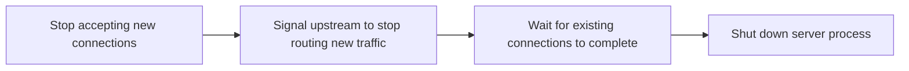

# How to Handle TCP Connection Draining During Server Shutdown

Author: [nawazdhandala](https://www.github.com/nawazdhandala)

Tags: TCP, Linux, Graceful Shutdown, Load Balancing, Kubernetes, Networking

Description: Implement TCP connection draining to allow in-flight requests to complete before a server shuts down, preventing abrupt connection resets during deployments.

## Introduction

TCP connection draining is the process of gracefully stopping a server by allowing active connections to finish naturally while refusing new ones. Without draining, a sudden server shutdown sends RST packets to all active connections, causing errors for users whose requests were in progress. Proper draining is essential for zero-downtime deployments.

## The Draining Process



## Draining with nginx

```bash
# Send QUIT signal to nginx for graceful shutdown with connection draining
nginx -s quit

# nginx closes the listening socket, waits for active connections to finish
# Then shuts down completely

# Check nginx is draining (workers showing low connection count)
nginx -s status   # (available in nginx Plus)
# or
ss -tlnp | grep nginx
# Socket will disappear once all connections drain
```

## Draining in Node.js

```javascript
const http = require('http');
const server = http.createServer(handleRequest);

// Track active connections
const connections = new Set();
server.on('connection', (socket) => {
    connections.add(socket);
    socket.on('close', () => connections.delete(socket));
});

function gracefulShutdown() {
    console.log('Starting graceful shutdown...');

    // Stop accepting new connections
    server.close(() => {
        console.log('Server closed. All connections drained.');
        process.exit(0);
    });

    // Give existing connections 30 seconds to finish
    setTimeout(() => {
        console.log('Forcing shutdown after 30s timeout');
        connections.forEach(socket => socket.destroy());
        process.exit(1);
    }, 30000);
}

process.on('SIGTERM', gracefulShutdown);
process.on('SIGINT', gracefulShutdown);
```

## Draining with iptables (Graceful Linux Service Shutdown)

```bash
#!/bin/bash
# Graceful TCP drain script for any service on port 8080

PORT=8080
DRAIN_TIMEOUT=30

echo "Step 1: Stop new connections (drop new SYNs)"
iptables -I INPUT -p tcp --dport $PORT --syn -j DROP

echo "Step 2: Notify upstream (e.g., remove from load balancer)"
# API call to load balancer or update health check endpoint
curl -X POST http://lb-api/deregister/$(hostname)

echo "Step 3: Wait for existing connections to drain"
ELAPSED=0
while [ $ELAPSED -lt $DRAIN_TIMEOUT ]; do
    ACTIVE=$(ss -tn state established "( dport = :$PORT or sport = :$PORT )" | wc -l)
    if [ "$ACTIVE" -eq 0 ]; then
        echo "All connections drained after ${ELAPSED}s"
        break
    fi
    echo "  $ACTIVE active connections, waiting..."
    sleep 2
    ELAPSED=$((ELAPSED + 2))
done

echo "Step 4: Stop the service"
systemctl stop myapp
iptables -D INPUT -p tcp --dport $PORT --syn -j DROP
```

## Kubernetes Preemptive Drain with preStop Hook

```yaml
# deployment.yaml
spec:
  template:
    spec:
      containers:
      - name: myapp
        lifecycle:
          preStop:
            exec:
              # Sleep to allow the load balancer to deregister the pod
              # and drain its connection table before SIGTERM
              command: ["/bin/sleep", "15"]
        terminationGracePeriodSeconds: 60
```

## Conclusion

Connection draining is the difference between a zero-downtime deployment and a burst of errors. The key steps are: stop accepting new connections, signal the load balancer to redirect new traffic, wait for active connections to complete, then shut down. Kubernetes preStop hooks and signal handling in your application process are the main mechanisms for production systems.
