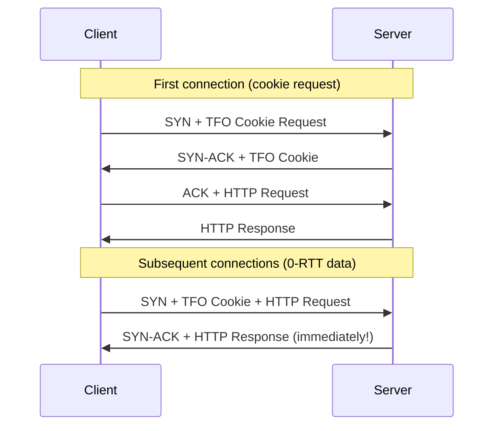

# How to Reduce TCP Connection Latency with TCP Fast Open

Author: [nawazdhandala](https://www.github.com/nawazdhandala)

Tags: TCP, Fast Open, TFO, Linux, Latency, Performance

Description: Learn how to enable TCP Fast Open (TFO) on Linux to eliminate the round-trip latency of the TCP handshake for repeat connections, reducing connection establishment time.

## What Is TCP Fast Open?

Standard TCP requires a full 3-way handshake (SYN → SYN-ACK → ACK) before any data can be sent. For short-lived connections (HTTP, DNS over TCP), this handshake adds one full RTT of latency per connection.

TCP Fast Open (RFC 7413) allows data to be sent in the SYN packet on repeat connections using a cookie cached from a previous handshake:



## Step 1: Check TFO Support

```bash
# Check if TFO is supported and current setting
sysctl net.ipv4.tcp_fastopen

# Values:
# 0 = disabled
# 1 = client-only (send data in SYN)
# 2 = server-only (accept data in SYN)
# 3 = both client and server

# Expected on modern Linux: 1
```

## Step 2: Enable TFO on Server and Client

```bash
# Enable TFO for both client and server roles
sudo sysctl -w net.ipv4.tcp_fastopen=3

# Make persistent
cat >> /etc/sysctl.d/99-tcp-fastopen.conf << 'EOF'
# TCP Fast Open - enable for both client and server
net.ipv4.tcp_fastopen = 3
EOF

sudo sysctl -p /etc/sysctl.d/99-tcp-fastopen.conf
```

## Step 3: Configure Applications to Use TFO

### Nginx (server-side TFO)

```nginx
# /etc/nginx/nginx.conf
http {
    # Enable TFO for client connections
    listen 80 fastopen=256;
    listen 443 ssl fastopen=256;
}
```

### Python (client using TFO)

```python
import socket

# Create a TCP socket
sock = socket.socket(socket.AF_INET, socket.SOCK_STREAM)
sock.setsockopt(socket.SOL_SOCKET, socket.SO_REUSEADDR, 1)

# Enable TFO (Linux constant: TCP_FASTOPEN_CONNECT = 30)
TCP_FASTOPEN_CONNECT = 30
sock.setsockopt(socket.IPPROTO_TCP, TCP_FASTOPEN_CONNECT, 1)

# Connect and send data — TFO handles the rest
sock.connect(('192.168.1.100', 80))
sock.sendall(b'GET / HTTP/1.1\r\nHost: example.com\r\n\r\n')
```

### curl (TFO support)

```bash
# curl uses TFO automatically when available on supported kernels
# Check if curl was compiled with TFO support
curl --version | grep -i tfo

# Force TFO test
curl --tcp-fastopen -v http://192.168.1.100/
```

## Step 4: Verify TFO Is Working

```bash
# Capture TFO negotiation
sudo tcpdump -i any -c 20 -w /tmp/tfo-test.pcap 'tcp[tcpflags] & tcp-syn != 0'

# Analyze for TFO cookie options
tshark -r /tmp/tfo-test.pcap -T fields \
  -e tcp.options.tfo \
  -e tcp.options.tfo.cookie \
  -Y "tcp.flags.syn == 1"

# Check TFO statistics
cat /proc/net/netstat | tr ' ' '\n' | grep -i -A1 "FastOpen"

# netstat -s equivalent
netstat -s | grep -i "fast open"
```

## Step 5: Measure Latency Improvement

```bash
# Install ab (Apache Benchmark) for HTTP latency testing
# Time connection to an endpoint - first connection (no cookie)
time curl -s -o /dev/null http://192.168.1.100/

# Second connection (TFO cookie available) - should be faster
time curl -s -o /dev/null http://192.168.1.100/

# More precise measurement with ab
ab -n 1000 -c 1 http://192.168.1.100/index.html
# TFO reduces "Time per request" (mean) for repeat connections
```

## Step 6: TFO Blackhole Detection

Some middleboxes (firewalls, NAT devices) drop TFO SYN packets. Linux detects this automatically:

```bash
# Check if TFO blackhole detection has triggered
sysctl net.ipv4.tcp_fastopen_blackhole_timeout_sec
# Non-zero means TFO was disabled due to detected blackhole

# If TFO gets disabled due to blackhole, re-enable:
sudo sysctl -w net.ipv4.tcp_fastopen_blackhole_timeout_sec=0
```

## Conclusion

TCP Fast Open reduces connection latency by allowing data to be sent in the initial SYN packet on repeat connections. Enable it system-wide with `sysctl net.ipv4.tcp_fastopen=3`, configure your server application to accept TFO connections, and verify with tcpdump that TFO cookie options appear in SYN packets. TFO provides the greatest benefit for short-lived TCP connections with measurable RTT (>5ms) such as API calls to remote services.
