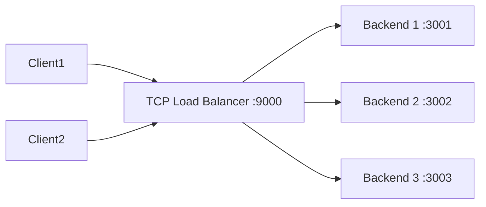

# How to Build a TCP Load Balancer in Node.js for IPv4

Author: [nawazdhandala](https://www.github.com/nawazdhandala)

Tags: Node.js, TCP, Load Balancer, IPv4, Networking, net module

Description: Learn how to build a Layer-4 TCP load balancer in Node.js that distributes IPv4 connections across multiple backend servers using round-robin selection.

## TCP Load Balancer Architecture



## Basic Round-Robin TCP Load Balancer

```javascript
const net = require('net');

const BACKENDS = [
    { host: '127.0.0.1', port: 3001 },
    { host: '127.0.0.1', port: 3002 },
    { host: '127.0.0.1', port: 3003 },
];

let backendIndex = 0;

function getNextBackend() {
    const backend = BACKENDS[backendIndex];
    backendIndex = (backendIndex + 1) % BACKENDS.length;
    return backend;
}

const server = net.createServer((clientSocket) => {
    const clientAddr = `${clientSocket.remoteAddress}:${clientSocket.remotePort}`;
    const backend = getNextBackend();

    console.log(`${clientAddr} -> ${backend.host}:${backend.port}`);

    // Connect to the backend
    const backendSocket = net.createConnection(
        { host: backend.host, port: backend.port, family: 4 },
        () => {
            // Bidirectional piping between client and backend
            clientSocket.pipe(backendSocket);
            backendSocket.pipe(clientSocket);
        }
    );

    // Error handling
    const cleanup = (label, err) => {
        if (err) console.error(`[${label}] Error: ${err.message}`);
        clientSocket.destroy();
        backendSocket.destroy();
    };

    clientSocket.on('error', (err) => cleanup('client', err));
    backendSocket.on('error', (err) => {
        console.error(`Backend ${backend.host}:${backend.port} error: ${err.message}`);
        clientSocket.destroy();
    });

    clientSocket.on('close', () => backendSocket.destroy());
    backendSocket.on('close', () => clientSocket.destroy());
});

server.listen(9000, '0.0.0.0', () => {
    console.log('TCP load balancer on :9000');
    console.log(`Backends: ${BACKENDS.map(b => `${b.host}:${b.port}`).join(', ')}`);
});
```

## Load Balancer with Health Checks

```javascript
const net = require('net');

class HealthCheckedLoadBalancer {
    constructor(backends, healthCheckInterval = 5000) {
        this.backends = backends.map(b => ({ ...b, healthy: true }));
        this.index = 0;
        this.startHealthChecks(healthCheckInterval);
    }

    checkBackend(backend) {
        return new Promise((resolve) => {
            const socket = net.createConnection(
                { host: backend.host, port: backend.port, family: 4 }
            );
            socket.setTimeout(2000);
            socket.on('connect', () => { socket.destroy(); resolve(true); });
            socket.on('error', () => { socket.destroy(); resolve(false); });
            socket.on('timeout', () => { socket.destroy(); resolve(false); });
        });
    }

    startHealthChecks(interval) {
        setInterval(async () => {
            for (const backend of this.backends) {
                const wasHealthy = backend.healthy;
                backend.healthy = await this.checkBackend(backend);
                if (wasHealthy && !backend.healthy) {
                    console.log(`Backend DOWN: ${backend.host}:${backend.port}`);
                } else if (!wasHealthy && backend.healthy) {
                    console.log(`Backend UP: ${backend.host}:${backend.port}`);
                }
            }
        }, interval);
    }

    getNextHealthy() {
        const healthy = this.backends.filter(b => b.healthy);
        if (healthy.length === 0) return null;
        const backend = healthy[this.index % healthy.length];
        this.index = (this.index + 1) % healthy.length;
        return backend;
    }

    createServer(port) {
        const server = net.createServer((clientSocket) => {
            const backend = this.getNextHealthy();
            if (!backend) {
                console.log('No healthy backends available');
                clientSocket.end();
                return;
            }

            const backendSocket = net.createConnection(
                { host: backend.host, port: backend.port, family: 4 },
                () => {
                    clientSocket.pipe(backendSocket);
                    backendSocket.pipe(clientSocket);
                }
            );

            clientSocket.on('error', () => { clientSocket.destroy(); backendSocket.destroy(); });
            backendSocket.on('error', () => { clientSocket.destroy(); backendSocket.destroy(); });
        });

        server.listen(port, '0.0.0.0', () => {
            console.log(`Load balancer on :${port} (with health checks)`);
        });
        return server;
    }
}

const lb = new HealthCheckedLoadBalancer([
    { host: '127.0.0.1', port: 3001 },
    { host: '127.0.0.1', port: 3002 },
    { host: '127.0.0.1', port: 3003 },
]);

lb.createServer(9000);
```

## Conclusion

A Node.js TCP load balancer uses `net.createServer` to accept connections and `net.createConnection` to connect to backends, with `socket.pipe()` for bidirectional data forwarding. Adding periodic health checks prevents routing to dead backends. For production, use dedicated load balancers like HAProxy or Nginx which offer more features, better performance, and battle-tested reliability.
