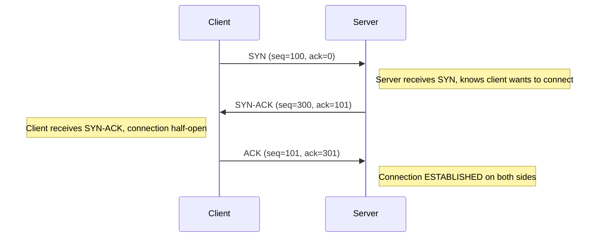

# How to Understand the TCP Three-Way Handshake (SYN, SYN-ACK, ACK)

Author: [nawazdhandala](https://www.github.com/nawazdhandala)

Tags: TCP, Networking, Protocol, Troubleshooting, Wireshark, IPv4

Description: Understand the TCP three-way handshake process, the role of SYN, SYN-ACK, and ACK packets, and how to observe and troubleshoot handshake failures.

## Introduction

The TCP three-way handshake is the connection establishment procedure used by every TCP connection. It synchronizes sequence numbers between client and server before any data is exchanged, ensuring reliable and ordered communication. Understanding this process is fundamental to diagnosing connection failures at the transport layer.

## The Three-Way Handshake



1. **SYN**: Client picks a random Initial Sequence Number (ISN) and sends SYN
2. **SYN-ACK**: Server picks its own ISN, acknowledges client's ISN+1
3. **ACK**: Client acknowledges server's ISN+1, connection established

## Capturing the Handshake

```bash
# Capture a TCP handshake on port 80

tcpdump -i eth0 -n 'tcp port 80 and (tcp-syn or tcp-ack)'

# More readable: capture with sequence numbers
tcpdump -i eth0 -n -S 'tcp port 80'
# -S flag shows absolute (not relative) sequence numbers

# Example output:
# 10:00:00 C > S: Flags [S], seq 1234567890 (SYN)
# 10:00:00 S > C: Flags [S.], seq 987654321, ack 1234567891 (SYN-ACK)
# 10:00:00 C > S: Flags [.], ack 987654322 (ACK)
```

## TCP Flags

| Flag | Meaning | Bit |
|---|---|---|
| SYN | Synchronize sequence numbers | 0x002 |
| ACK | Acknowledgment field valid | 0x010 |
| RST | Reset connection | 0x004 |
| FIN | No more data to send | 0x001 |
| PSH | Push data to application | 0x008 |
| URG | Urgent pointer valid | 0x020 |

## What Each Phase Establishes

```bash
# After the SYN-ACK, both sides know:
# - Each other's initial sequence numbers
# - Window sizes (how much data can be buffered)
# - TCP options (MSS, SACK, window scaling, timestamps)

# View negotiated options in tcpdump
tcpdump -i eth0 -n -v 'tcp[tcpflags] & tcp-syn != 0'
# Shows: mss 1460, sackOK, timestamp, nop, wscale 7
```

## Connection States During Handshake

```bash
# Check connection states on the server
ss -tn state syn-received
# Shows half-open connections waiting for the third ACK

ss -tn state established
# Shows fully established connections

# On the client
ss -tn state syn-sent
# Shows connections awaiting SYN-ACK
```

## Common Handshake Failures

```bash
# Failure 1: SYN reaches server but no SYN-ACK returns
# -> Server firewall blocking outbound SYN-ACK, or server down
tcpdump -i eth0 -n 'tcp[tcpflags] & tcp-syn != 0'   # Watch for SYN arriving

# Failure 2: SYN-ACK arrives but connection still fails
# -> Client firewall blocking inbound SYN-ACK, or client RSTs the connection
tcpdump -i eth0 -n 'tcp port 80'   # Watch the full exchange

# Failure 3: Connection resets immediately after ACK
# -> Application rejected the connection (closed port)
# -> RST appears right after the third ACK
```

## Conclusion

The TCP three-way handshake is both a security mechanism (ISN prevents spoofing) and a connection setup protocol (window and option negotiation). Handshake failures are always visible in packet captures - the flag sequence tells you exactly which phase failed and which side is responsible. A missing SYN-ACK points to the server or its network; a missing final ACK or an immediate RST points to the client side.
