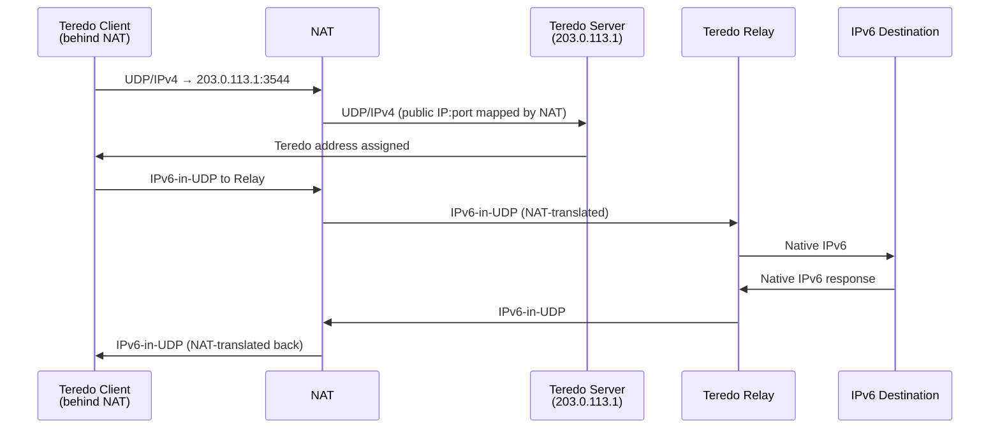

# How to Understand Teredo Tunneling Through NAT

Author: [nawazdhandala](https://www.github.com/nawazdhandala)

Tags: IPv6, Teredo, NAT, Tunneling, RFC 4380

Description: Learn how Teredo provides IPv6 connectivity through NAT using UDP encapsulation, how Teredo addresses work, and why it is deprecated and should be disabled.

## Overview

Teredo (RFC 4380) was designed to provide IPv6 connectivity for hosts behind IPv4 NAT, where other tunneling mechanisms like 6in4 (protocol 41) are blocked. It encapsulates IPv6 in UDP/IPv4, which traverses NAT. It was widely deployed in Windows Vista, 7, and 8, enabling IPv6 in homes and offices that didn't have native IPv6 or IPv6-capable routers. Teredo is now deprecated and disabled by default in modern Windows versions.

## How Teredo Works

```text
[Client behind NAT]                [Teredo Server]
  Private IPv4: 192.168.1.10         Public IPv4: 203.0.113.1
  Public IPv4:  203.0.113.50         UDP port: 3544
  NAT type: full cone

Step 1: Client sends UDP 3544 to Teredo Server
Step 2: Server learns client's mapped public IPv4:port
Step 3: Server assigns Teredo IPv6 address to client
Step 4: Client can now send/receive IPv6 via UDP to Server/Relay

Teredo Relay: decapsulates UDP and forwards to IPv6 internet
```

## Teredo Address Structure

Teredo addresses use the `2001::/32` prefix:

```text
2001:0000:SSSS:SSSS:FFFF:PPPP:~CCCC:CCCC
         │         │    │    │
         │         │    │    └─ ~client_IPv4 (bitwise NOT)
         │         │    └─ ~client_port (bitwise NOT)
         │         └─ NAT flags
         └─ Teredo server IPv4 (hex)

Example:
  Server: 203.0.113.1  = cb00:7101
  Client mapped IP: 192.0.2.100 = NOT(c000:0264) = 3fff:fd9b
  Client mapped port: 32000 = NOT(7d00) = 82ff

  Teredo address: 2001:0:cb00:7101:0:82ff:3fff:fd9b
```

## Teredo Components

| Component | Role |
|---|---|
| Teredo Server | Maps client's public IP/port, assigns address |
| Teredo Relay | Decapsulates UDP, forwards to IPv6 internet |
| Teredo Client | Host behind NAT using Teredo |

Microsoft operated the primary Teredo servers (`teredo.ipv6.microsoft.com`). Third-party servers exist but quality varies.

## Packet Flow



## Security Problems with Teredo

Teredo created serious security risks in enterprise environments:

### 1. Firewall Bypass

```text
Enterprise IPv4 firewall blocks all outbound ports except 80/443
But allows UDP port 3544 (or even all UDP)

Attacker uses Teredo to:
  1. Establish IPv6 tunnel over UDP 3544
  2. Communicate with C2 server via IPv6
  3. IPv6 traffic bypasses IPv4 firewall entirely
  4. IPv6 firewall may not exist or not inspect UDP payloads
```

### 2. Unexpected Inbound Connectivity

Teredo relays serve as entry points - hosts that were considered "behind NAT" and unreachable become reachable via IPv6 through Teredo relays.

### 3. No Enterprise Control

Unlike 6in4 where you configure a specific tunnel broker, Teredo auto-discovers servers - the enterprise has no control over which relay is used.

## Why Teredo Is Deprecated

- Modern ISPs provide native IPv6 - NAT traversal no longer needed
- Windows 8 and later disable Teredo when native IPv6 is available
- Windows 11 disables Teredo by default completely
- Security tools cannot reliably inspect IPv6-in-UDP payloads
- IETF formally recommends against Teredo for general use

## Checking Teredo Status

```powershell
# Windows - check Teredo state

netsh interface teredo show state

# Example output:
# Type              : client
# Server Name       : teredo.ipv6.microsoft.com
# Mapped Address    : 203.0.113.50:32000
# Network:          : unmanaged
# NAT:              : cone

# If state is "dormant" or "offline" - Teredo is inactive
```

## Summary

Teredo was an ingenious NAT-traversal mechanism that embedded IPv6 in UDP/IPv4 packets and used servers and relays to provide IPv6 connectivity. Teredo addresses use the `2001::/32` prefix and encode the Teredo server and client's NAT-mapped address. It is now deprecated because native IPv6 is widely available and Teredo creates security risks by bypassing IPv4 firewalls with IPv6-over-UDP. Block UDP port 3544 at enterprise perimeters and disable Teredo on Windows with `netsh interface teredo set state disabled`.
