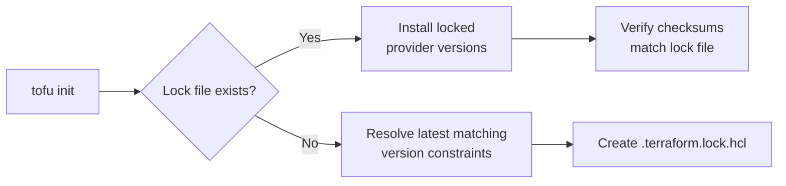

# How to Manage the .terraform.lock.hcl File with OpenTofu

Author: [nawazdhandala](https://www.github.com/nawazdhandala)

Tags: OpenTofu, Lock File, Provider Versions, Dependency Lock, terraform.lock.hcl, Infrastructure as Code

Description: Learn how the OpenTofu dependency lock file works, why you should commit it to version control, and how to manage provider version constraints and platform-specific checksums.

---

The `.terraform.lock.hcl` file records the exact provider versions and checksums used in your OpenTofu configuration. Committing it to version control ensures every team member and CI/CD pipeline uses identical provider versions, preventing "works on my machine" issues caused by provider updates.

## Lock File Role in OpenTofu



## Lock File Structure

```hcl
# .terraform.lock.hcl — auto-generated by OpenTofu
# Commit this file to version control

provider "registry.opentofu.org/hashicorp/aws" {
  version     = "5.40.0"
  constraints = "~> 5.0"

  hashes = [
    # Checksums for each platform/OS combination
    "h1:abc123...",  # darwin_amd64
    "h1:def456...",  # darwin_arm64
    "h1:ghi789...",  # linux_amd64
    "h1:jkl012...",  # linux_arm64
    "zh:mno345...",  # Source zip hash
  ]
}

provider "registry.opentofu.org/hashicorp/kubernetes" {
  version     = "2.27.0"
  constraints = "~> 2.0"

  hashes = [
    "h1:pqr678...",
    "h1:stu901...",
  ]
}
```

## Version Constraints in providers.tf

```hcl
# providers.tf
terraform {
  required_version = ">= 1.6.0"

  required_providers {
    aws = {
      source  = "hashicorp/aws"
      version = "~> 5.0"  # Allow 5.x, block 6.x
    }
    kubernetes = {
      source  = "hashicorp/kubernetes"
      version = "~> 2.0"
    }
    helm = {
      source  = "hashicorp/helm"
      version = "~> 2.0"
    }
  }
}
```

## Initializing with Lock File

```bash
# First time — creates lock file
tofu init

# Subsequent runs — uses versions from lock file
tofu init

# Upgrade a specific provider within constraints
tofu init -upgrade

# Upgrade all providers within constraints
tofu providers lock

# Add checksums for additional platforms (for cross-platform teams)
tofu providers lock \
  -platform=linux/amd64 \
  -platform=linux/arm64 \
  -platform=darwin/amd64 \
  -platform=darwin/arm64 \
  -platform=windows/amd64
```

## Updating the Lock File

```hcl
# To update a provider version:
# 1. Update the version constraint in providers.tf
terraform {
  required_providers {
    aws = {
      source  = "hashicorp/aws"
      version = "~> 5.40"  # Previously was "~> 5.0"
    }
  }
}
```

```bash
# 2. Run init with -upgrade to update the lock file
tofu init -upgrade

# 3. Review the diff in .terraform.lock.hcl
git diff .terraform.lock.hcl

# 4. Test that existing configurations still work
tofu plan

# 5. Commit the updated lock file with the providers.tf change
git add .terraform.lock.hcl providers.tf
git commit -m "Upgrade AWS provider to 5.40.x"
```

## CI/CD Lock File Verification

```yaml
# .github/workflows/terraform.yml
jobs:
  validate:
    steps:
      - uses: actions/checkout@v4

      - name: Setup OpenTofu
        uses: opentofu/setup-opentofu@v1
        with:
          tofu_version: "1.6.x"

      - name: Init (verify lock file — no -upgrade)
        run: tofu init

      - name: Verify lock file is up to date
        run: |
          # If lock file changed during init, it wasn't committed
          if ! git diff --quiet .terraform.lock.hcl; then
            echo "Lock file is out of date. Run 'tofu init' locally and commit the changes."
            git diff .terraform.lock.hcl
            exit 1
          fi
```

## Lock File for Multiple Platforms

```bash
# Team uses Linux (CI) and macOS (local dev)
# Generate checksums for all platforms at once
tofu providers lock \
  -platform=linux/amd64 \
  -platform=linux/arm64 \
  -platform=darwin/amd64 \
  -platform=darwin/arm64

# Lock file will include hashes for all platforms
# This prevents "hash mismatch" errors when different team members run init
```

## Best Practices

- Always commit `.terraform.lock.hcl` to version control — it's not a build artifact, it's a dependency specification that ensures reproducible deployments.
- Never add `.terraform.lock.hcl` to `.gitignore` — this is a common mistake that causes providers to upgrade unexpectedly in CI/CD when new patch versions are released.
- Run `tofu providers lock -platform=...` for all platforms your team uses when adding new providers — this prevents "hash mismatch" errors for team members on different operating systems.
- Treat lock file updates as infrastructure changes requiring review — a provider upgrade may introduce breaking changes, so PR review for lock file changes is appropriate.
- In CI/CD, run `tofu init` without `-upgrade` and fail if the lock file changes — this ensures CI always uses the committed provider versions.
