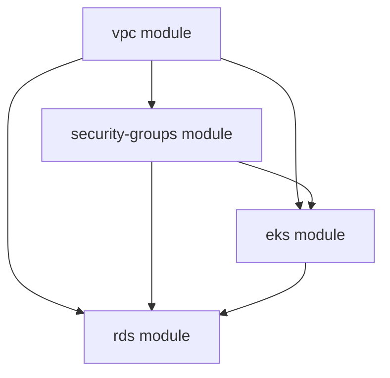

# How to Use Terragrunt Dependencies with OpenTofu

Author: [nawazdhandala](https://www.github.com/nawazdhandala)

Tags: OpenTofu, Terragrunt, Dependencies, Infrastructure as Code, Orchestration, DevOps

Description: Learn how to declare and consume inter-module dependencies in Terragrunt so OpenTofu modules are provisioned in the correct order and can share outputs.

## Introduction

In a real infrastructure project, modules depend on each other - EKS needs the VPC, RDS needs both the VPC and the security groups. Terragrunt's `dependency` blocks let you declare these relationships explicitly, share outputs between modules, and ensure `run-all` operations respect the correct order.

## Declaring a Dependency

The `dependency` block references another Terragrunt module and exposes its outputs:

```hcl
# environments/prod/eks/terragrunt.hcl

include "root" {
  path = find_in_parent_folders()
}

terraform {
  source = "../../../modules/eks"
}

# Declare a dependency on the VPC module
dependency "vpc" {
  config_path = "../vpc"

  # Provide mock outputs so plans work without applying the VPC first
  mock_outputs = {
    vpc_id          = "vpc-00000000"
    private_subnets = ["subnet-00000001", "subnet-00000002"]
  }
  mock_outputs_allowed_terraform_commands = ["validate", "plan"]
}

# Declare a dependency on the security groups module
dependency "sg" {
  config_path = "../security-groups"

  mock_outputs = {
    eks_node_sg_id = "sg-00000000"
  }
  mock_outputs_allowed_terraform_commands = ["validate", "plan"]
}

# Pass outputs from dependencies as inputs to this module
inputs = {
  vpc_id          = dependency.vpc.outputs.vpc_id
  subnet_ids      = dependency.vpc.outputs.private_subnets
  node_sg_id      = dependency.sg.outputs.eks_node_sg_id
  cluster_name    = "prod-eks"
}
```

## The VPC Module That is Depended Upon

```hcl
# environments/prod/vpc/terragrunt.hcl
include "root" {
  path = find_in_parent_folders()
}

terraform {
  source = "../../../modules/vpc"
}

inputs = {
  cidr_block  = "10.0.0.0/16"
  environment = "prod"
}
```

## Dependency Graph Visualization



## Running All Modules in Order

Terragrunt's `run-all` command reads the dependency graph and applies modules in the correct sequence:

```bash
# Apply all modules in dependency order (apply VPC first, then SG, then EKS/RDS)
terragrunt run-all apply

# Plan all modules
terragrunt run-all plan

# Destroy in reverse dependency order
terragrunt run-all destroy
```

## Handling Circular Dependencies

If Terragrunt reports a cycle, split the circular dependency by extracting shared resources into a separate module:

```text
# Bad: module-a depends on module-b depends on module-a
# Fix: extract the shared resource into module-shared
module-shared  (no dependencies)
module-a       (depends on module-shared)
module-b       (depends on module-shared)
```

## Skipping Dependency Outputs (External State)

When a dependency is managed outside Terragrunt, read its outputs via a `data "terraform_remote_state"` block instead:

```hcl
# Read outputs from an externally-managed state file
data "terraform_remote_state" "shared_network" {
  backend = "s3"
  config = {
    bucket = "shared-state-bucket"
    key    = "shared/network/tofu.tfstate"
    region = "us-east-1"
  }
}
```

## Conclusion

Terragrunt's `dependency` blocks provide a clean, explicit way to wire together OpenTofu modules. Mock outputs keep your CI pipelines fast by enabling `plan` without needing all upstream modules applied, while `run-all` guarantees resources are created in the right order.
