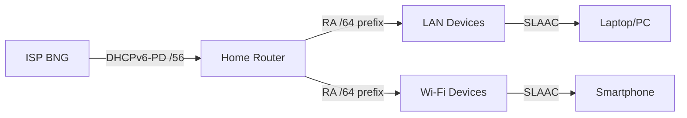

# How to Test IPv6 Connectivity on Your Home Network

Author: [nawazdhandala](https://www.github.com/nawazdhandala)

Tags: IPv6, Home Network, Testing, SLAAC, DHCPv6

Description: Comprehensive guide to testing IPv6 connectivity on home networks, from router prefix delegation to individual device address assignment and end-to-end internet connectivity.

## Home IPv6 Architecture



## Step 1: Test at the Router

Verify the router received a prefix from the ISP.

```bash
# OpenWrt router shell — check WAN IPv6
ip -6 addr show dev eth0.2    # WAN interface

# Check delegated prefix
ip -6 route show | grep "::/56\|::/48"

# Check LAN interface has a /64 from the prefix
ip -6 addr show dev br-lan

# Check DHCPv6 client log on OpenWrt
logread | grep -i "dhcp6\|prefix" | tail -20

# Ping ISP gateway
ping6 fe80::1%eth0.2    # link-local default gateway
```

## Step 2: Verify Router Is Advertising to LAN

The router should send Router Advertisements (RAs) to distribute IPv6 to devices.

```bash
# On a Linux device on the LAN, capture RA packets
sudo tcpdump -i eth0 -n 'icmp6 and ip6[40] == 134' -c 5

# Alternatively, trigger a solicitation and watch for response
sudo rdisc6 eth0

# Expected RA output shows:
#   Prefix: 2001:db8:home:1::/64
#   Valid lifetime: 86400
#   Preferred lifetime: 14400
#   Flags: on-link, autoconf (SLAAC enabled)

# Check router RA configuration (OpenWrt)
cat /etc/config/network | grep -A5 "option ip6assign"
```

## Step 3: Test Device Address Assignment

On each device, confirm a global IPv6 address was assigned via SLAAC.

```bash
# Linux
ip -6 addr show | grep "scope global"
# Expected: inet6 2001:db8:home:1:xxxx:xxxx:xxxx:xxxx/64 scope global dynamic

# macOS
ifconfig | grep "inet6" | grep -v "fe80\|::1"

# Windows
ipconfig | findstr "IPv6"
# Or in PowerShell:
Get-NetIPAddress -AddressFamily IPv6 | Where-Object {$_.PrefixOrigin -eq "RouterAdvertisement"}
```

## Step 4: End-to-End Connectivity Tests

Test full IPv6 internet connectivity from a device on the LAN.

```bash
# Basic ping to public IPv6
ping6 2606:4700:4700::1111     # Cloudflare DNS
ping6 2001:4860:4860::8888     # Google DNS

# Test DNS resolution using IPv6 transport
dig AAAA google.com @2606:4700:4700::1111

# Fetch a web page over IPv6
curl -6 -v https://ipv6.google.com 2>&1 | grep "IPv6\|Connected\|200"

# Check your public IPv6 address as seen by the internet
curl -6 https://ifconfig.co

# Traceroute — verify traffic takes IPv6 path
traceroute6 2001:4860:4860::8888
# or on macOS:
traceroute6 2001:4860:4860::8888
```

## Step 5: Test MTU and Fragmentation

IPv6 requires end-to-end path MTU of at least 1280 bytes; mismatched MTU causes silent failures.

```bash
# Test with increasing packet sizes
for size in 1280 1400 1452 1480; do
    result=$(ping6 -c 1 -s $size 2001:4860:4860::8888 2>&1 | grep -c "1 received")
    echo "Size ${size}: $( [ $result -eq 1 ] && echo OK || echo FAIL )"
done

# Check the router's MTU setting on WAN
ip link show dev eth0.2 | grep mtu

# If large pings fail, reduce MTU on WAN interface (OpenWrt)
ip link set dev eth0.2 mtu 1480
```

## Step 6: Automated Test Script

Run a comprehensive IPv6 health check on any Linux device.

```bash
#!/bin/bash
# test-ipv6-home.sh

PASS=0; FAIL=0

check() {
    local desc=$1; shift
    if "$@" &>/dev/null; then
        echo "PASS: $desc"; ((PASS++))
    else
        echo "FAIL: $desc"; ((FAIL++))
    fi
}

check "Global IPv6 address assigned" ip -6 addr show | grep -q "scope global"
check "Default IPv6 route exists" ip -6 route show default | grep -q "via\|dev"
check "Ping Cloudflare IPv6" ping6 -c2 2606:4700:4700::1111
check "Ping Google IPv6" ping6 -c2 2001:4860:4860::8888
check "DNS AAAA lookup" dig +short AAAA google.com | grep -q ":"
check "HTTP over IPv6" curl -6 -sf --max-time 5 https://ipv6.google.com

echo ""
echo "Results: ${PASS} passed, ${FAIL} failed"
```

## Conclusion

Home network IPv6 testing follows the stack: ISP to router (DHCPv6-PD), router to LAN (RA/SLAAC), device address assignment, and end-to-end internet reachability. Capture Router Advertisements with `tcpdump` to confirm the router is advertising the correct /64 prefix. Test from multiple devices and check both ping and HTTP over IPv6. MTU issues are common with PPPoE connections — reduce WAN MTU to 1480 or enable IPv6 PMTUD (`net.ipv6.conf.all.disable_ipv6=0` and ensure RA includes MTU option). Use the automated test script to quickly verify all layers at once.
