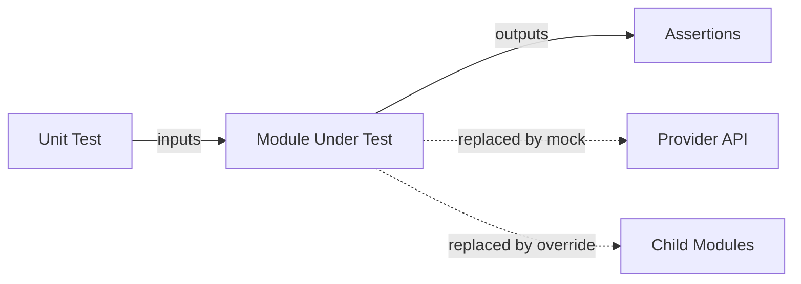

# How to Test Modules in Isolation with OpenTofu

Author: [nawazdhandala](https://www.github.com/nawazdhandala)

Tags: OpenTofu, Testing, Module Isolation, Unit Testing, Infrastructure as Code

Description: Discover strategies for testing OpenTofu modules in complete isolation using mock providers, overrides, and targeted test directories.

## Introduction

Module isolation testing means verifying a module's logic independent of its dependencies-other modules, real cloud providers, or external data sources. This approach produces fast, deterministic tests that can run without any credentials.

## The Isolation Testing Philosophy

A well-isolated module test answers: "Given specific inputs, does this module produce the correct resource configuration?" It does not ask "Does AWS accept this configuration?" (that is integration testing).



## Setting Up a Test for a Standalone Module

Consider a VPC module with no child module dependencies:

```hcl
# modules/vpc/main.tf

resource "aws_vpc" "this" {
  cidr_block           = var.cidr_block
  enable_dns_hostnames = var.enable_dns_hostnames
  enable_dns_support   = true

  tags = merge(var.tags, {
    Name = var.name
  })
}

output "vpc_id"    { value = aws_vpc.this.id }
output "vpc_cidr"  { value = aws_vpc.this.cidr_block }
```

```hcl
# modules/vpc/tests/vpc_unit.tftest.hcl

mock_provider "aws" {
  mock_resource "aws_vpc" {
    defaults = {
      id         = "vpc-mock-unit-test"
      cidr_block = "10.0.0.0/16"
    }
  }
}

variables {
  name                 = "test-vpc"
  cidr_block           = "10.0.0.0/16"
  enable_dns_hostnames = true
  tags                 = { Environment = "test" }
}

run "vpc_has_correct_cidr" {
  command = apply

  assert {
    condition     = aws_vpc.this.cidr_block == "10.0.0.0/16"
    error_message = "VPC CIDR does not match input"
  }
}

run "vpc_has_name_tag" {
  command = apply

  assert {
    condition     = aws_vpc.this.tags["Name"] == "test-vpc"
    error_message = "VPC should have a Name tag"
  }

  assert {
    condition     = aws_vpc.this.tags["Environment"] == "test"
    error_message = "VPC should have the Environment tag from var.tags"
  }
}

run "dns_hostnames_enabled_by_default" {
  command = plan

  assert {
    condition     = aws_vpc.this.enable_dns_hostnames == true
    error_message = "DNS hostnames should be enabled"
  }
}
```

## Isolating a Module with Dependencies

When the module calls other modules, override them:

```hcl
# tests/app_module_isolated.tftest.hcl

mock_provider "aws" {}

# Provide fixed outputs from the networking dependency
override_module {
  target = module.networking

  outputs = {
    vpc_id          = "vpc-isolated-test"
    private_subnets = ["subnet-a", "subnet-b"]
  }
}

# Provide fixed outputs from the secrets dependency
override_module {
  target = module.secrets

  outputs = {
    db_password_arn = "arn:aws:secretsmanager:us-east-1:123456789012:secret:db-password"
  }
}

run "application_layer_configuration" {
  variables {
    app_name     = "myapp"
    desired_count = 2
  }

  assert {
    condition     = aws_ecs_service.this.desired_count == 2
    error_message = "ECS service desired count should match variable"
  }

  assert {
    condition     = aws_ecs_service.this.network_configuration[0].subnets == toset(["subnet-a", "subnet-b"])
    error_message = "ECS service should use the private subnets from networking module"
  }
}
```

## Directory Structure for Isolated Tests

```text
modules/
  networking/
    main.tf
    tests/
      unit/
        vpc_unit.tftest.hcl    ← isolated, mock providers
        subnet_unit.tftest.hcl
      integration/
        full_network.tftest.hcl ← real providers
```

Run isolated tests only:
```bash
tofu test -test-directory=tests/unit
```

## Key Isolation Techniques

| Technique | Use Case |
|---|---|
| `mock_provider` | Replace entire provider with fake |
| `override_resource` | Control specific resource computed values |
| `override_data` | Stub data source lookups |
| `override_module` | Replace child module with fixed outputs |
| `command = plan` | Avoid resource creation entirely |

## Conclusion

Testing modules in isolation is the foundation of a reliable infrastructure testing strategy. By combining mock providers, resource overrides, and module overrides, you can achieve high test coverage across your entire module library-quickly, cheaply, and without cloud access.
