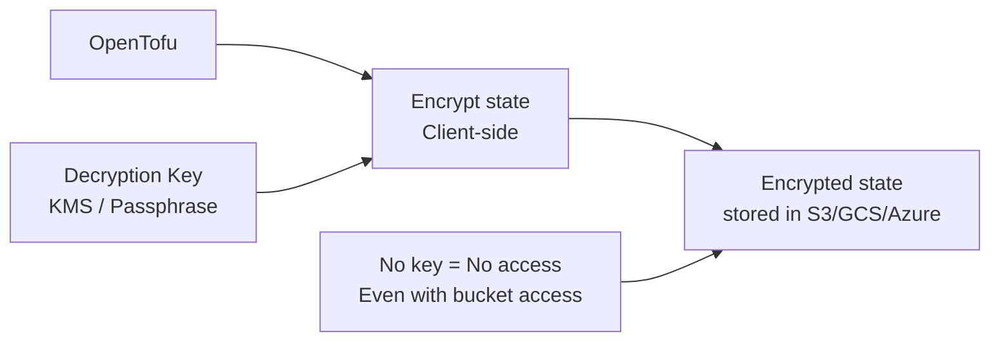

# How to Encrypt State with TF_ENCRYPTION in OpenTofu

Author: [nawazdhandala](https://www.github.com/nawazdhandala)

Tags: OpenTofu, TF_ENCRYPTION, State Encryption, Security, KMS, AES, Infrastructure as Code

Description: Learn how to configure client-side state encryption in OpenTofu using the encryption block and TF_ENCRYPTION environment variable to protect sensitive infrastructure state at rest.

---

OpenTofu 1.7+ introduced native client-side state encryption. This encrypts the state file before writing it to the backend (S3, Azure Blob, GCS), so even if someone gains access to the bucket, they cannot read resource attributes, secrets, or sensitive configuration values stored in state.

## State Encryption Architecture



## Encryption Configuration

```hcl
# encryption.tf or main.tf
terraform {
  # State encryption — OpenTofu 1.7+ feature
  encryption {
    # Key provider: AWS KMS
    key_provider "aws_kms" "main" {
      kms_key_id = var.kms_key_arn  # Must exist before first init
      region     = var.region
    }

    # Method: AES-GCM encryption
    method "aes_gcm" "state" {
      keys = key_provider.aws_kms.main
    }

    # Apply to state file
    state {
      method = method.aes_gcm.state

      # Fallback: allows reading unencrypted state during migration
      fallback {
        method = method.unencrypted.migration
      }
    }

    # Optionally encrypt plan files too
    plan {
      method = method.aes_gcm.state
    }
  }

  backend "s3" {
    bucket         = var.state_bucket
    key            = "${var.project}/${var.environment}/terraform.tfstate"
    region         = var.region
    encrypt        = true   # S3-side encryption (separate from client-side)
    dynamodb_table = var.lock_table
  }
}
```

## KMS Key Configuration

```hcl
# kms.tf — create the encryption key before enabling state encryption
resource "aws_kms_key" "state_encryption" {
  description             = "OpenTofu state encryption key for ${var.project}"
  enable_key_rotation     = true
  deletion_window_in_days = 30

  policy = jsonencode({
    Version = "2012-10-17"
    Statement = [
      {
        Sid    = "Enable IAM User Permissions"
        Effect = "Allow"
        Principal = {
          AWS = "arn:aws:iam::${data.aws_caller_identity.current.account_id}:root"
        }
        Action   = "kms:*"
        Resource = "*"
      },
      {
        Sid    = "Allow OpenTofu Role"
        Effect = "Allow"
        Principal = {
          AWS = var.opentofu_role_arn
        }
        Action = [
          "kms:Decrypt",
          "kms:Encrypt",
          "kms:GenerateDataKey",
          "kms:DescribeKey",
        ]
        Resource = "*"
      }
    ]
  })

  tags = {
    Purpose     = "opentofu-state-encryption"
    Environment = var.environment
    ManagedBy   = "opentofu"
  }
}

resource "aws_kms_alias" "state_encryption" {
  name          = "alias/${var.project}-opentofu-state"
  target_key_id = aws_kms_key.state_encryption.key_id
}
```

## Passphrase-Based Encryption

```hcl
# Alternative: passphrase-based encryption (no KMS dependency)
terraform {
  encryption {
    key_provider "pbkdf2" "main" {
      # Passphrase loaded from environment variable
      passphrase = var.encryption_passphrase
    }

    method "aes_gcm" "state" {
      keys = key_provider.pbkdf2.main
    }

    state {
      method = method.aes_gcm.state
    }
  }
}
```

```bash
# Set passphrase via environment variable (CI/CD)
export TF_VAR_encryption_passphrase="$(aws secretsmanager get-secret-value \
  --secret-id opentofu/state-encryption-key \
  --query SecretString --output text)"

tofu plan
```

## TF_ENCRYPTION Environment Variable

```bash
# Full encryption configuration via environment variable
# Useful when you can't add encryption block to HCL

export TF_ENCRYPTION='
key_provider "pbkdf2" "main" {
  passphrase = "your-secure-passphrase"
}

method "aes_gcm" "state" {
  keys = key_provider.pbkdf2.main
}

state {
  method = method.aes_gcm.state
}
'

tofu plan
```

## Migrating Unencrypted State

```hcl
# Step 1: Add encryption with fallback for unencrypted state
terraform {
  encryption {
    key_provider "aws_kms" "main" {
      kms_key_id = aws_kms_key.state_encryption.arn
      region     = var.region
    }

    method "aes_gcm" "state" {
      keys = key_provider.aws_kms.main
    }

    method "unencrypted" "migration" {}

    state {
      method = method.aes_gcm.state

      # Allow reading existing unencrypted state
      fallback {
        method = method.unencrypted.migration
      }
    }
  }
}
```

```bash
# Step 2: Run apply to re-write state with encryption
tofu apply -refresh-only  # Reads unencrypted, writes encrypted

# Step 3: Remove the fallback block
# Edit encryption block to remove fallback {}

# Step 4: Verify state is now encrypted
aws s3 cp s3://bucket/path/terraform.tfstate /tmp/state.json
cat /tmp/state.json  # Should show encrypted binary data, not JSON
```

## Best Practices

- Create the KMS key separately from the encrypted state — if the KMS key and state are managed in the same configuration, you need an unencrypted state to create the key, creating a bootstrapping problem.
- Enable key rotation on KMS keys used for state encryption — `enable_key_rotation = true` automatically rotates the key annually without needing to re-encrypt state.
- Use the `fallback` block when migrating from unencrypted state — without it, OpenTofu will fail to read the existing state when encryption is first enabled.
- Store passphrase-based encryption keys in a secrets manager (AWS Secrets Manager, HashiCorp Vault) rather than hardcoding them or storing in `.tfvars` files.
- Grant KMS key access only to the specific IAM roles that run OpenTofu — broad KMS permissions defeat the purpose of state encryption.
