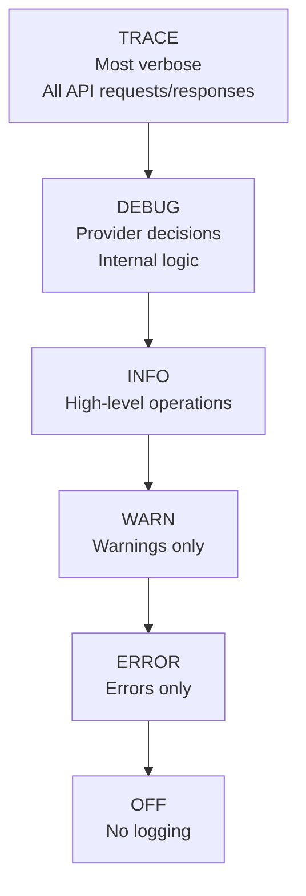

# How to Enable Debug Logging with TF_LOG in OpenTofu - A Practical Guide

Author: [nawazdhandala](https://www.github.com/nawazdhandala)

Tags: OpenTofu, TF_LOG, Debug Logging, Troubleshooting, Environment Variable, Infrastructure as Code

Description: Learn how to use the TF_LOG environment variable to enable debug logging in OpenTofu for troubleshooting provider issues, API calls, and configuration errors.

---

OpenTofu's `TF_LOG` environment variable controls the verbosity of debug output. When troubleshooting provider errors, API failures, or unexpected plan behavior, enabling debug logging reveals the underlying API calls and provider decision-making that isn't visible in normal output.

## Log Level Hierarchy



## Setting Log Levels

```bash
# Levels from most to least verbose:

export TF_LOG=TRACE   # Everything - API request bodies, responses, provider internals
export TF_LOG=DEBUG   # Provider logic and decisions
export TF_LOG=INFO    # General operation information
export TF_LOG=WARN    # Warnings that don't stop execution
export TF_LOG=ERROR   # Errors only

# Enable and run plan
export TF_LOG=DEBUG
tofu plan

# One-liner without persisting the variable
TF_LOG=DEBUG tofu plan

# Disable logging
export TF_LOG=
# or
unset TF_LOG
```

## Provider-Specific Logging

```bash
# Log only the core OpenTofu logs (not provider plugins)
export TF_LOG_CORE=DEBUG

# Log only provider plugin logs
export TF_LOG_PROVIDER=DEBUG

# Separate log levels for core and providers
export TF_LOG_CORE=INFO
export TF_LOG_PROVIDER=TRACE  # Full provider API debugging
```

## Saving Logs to a File

```bash
# TF_LOG writes to stderr by default
# Redirect to a file for analysis

export TF_LOG=DEBUG
export TF_LOG_PATH="./tofu-debug.log"

tofu plan

# Now review the log
cat tofu-debug.log | grep "Request"
cat tofu-debug.log | grep "Response"
cat tofu-debug.log | grep "Error"

# Search for specific API calls
grep "DescribeInstances" tofu-debug.log
grep "HTTP/1.1 4" tofu-debug.log  # Find 4xx errors
```

## Common Debugging Scenarios

```bash
# Scenario 1: Provider authentication errors
export TF_LOG=DEBUG
tofu plan 2>&1 | grep -A 5 "auth"
# Shows: credential resolution, STS calls, assumed role ARN

# Scenario 2: Resource creation timing out
export TF_LOG=DEBUG
tofu apply 2>&1 | grep -E "(waiting|timeout|retry)"

# Scenario 3: Plan showing unexpected resource replacement
export TF_LOG=TRACE
tofu plan 2>&1 | grep -B 5 -A 5 "forces replacement"

# Scenario 4: Provider version resolution
export TF_LOG=DEBUG
tofu init 2>&1 | grep -i "version"
```

## Reading DEBUG Output

```text
# Example TF_LOG=DEBUG output (truncated)
2026-03-20T10:15:30.123Z [DEBUG] provider.terraform-provider-aws: Starting aws provider
2026-03-20T10:15:30.456Z [DEBUG] provider.terraform-provider-aws: configuring provider with args
2026-03-20T10:15:30.789Z [DEBUG] provider.terraform-provider-aws: Refreshing credentials
2026-03-20T10:15:31.012Z [DEBUG] provider.terraform-provider-aws: Assumed role ARN: arn:aws:iam::123456789012:role/OpenTofuRole
2026-03-20T10:15:31.234Z [DEBUG] provider.terraform-provider-aws: API call: DescribeInstances
2026-03-20T10:15:31.456Z [DEBUG] provider.terraform-provider-aws: Response: 200 OK

# TRACE adds full HTTP request/response bodies:
2026-03-20T10:15:31.678Z [TRACE] provider.terraform-provider-aws: HTTP Request:
  POST /  HTTP/1.1
  Host: ec2.us-east-1.amazonaws.com
  Content-Type: application/x-www-form-urlencoded
  Action=DescribeInstances&...
```

## Structured Log Analysis

```bash
# Filter and format debug logs for readability
export TF_LOG=DEBUG
export TF_LOG_PATH=/tmp/tofu.log

tofu plan

# Extract all API calls
grep "API call\|HTTP Request\|Request Method" /tmp/tofu.log

# Find all AWS API errors
grep "Error\|error\|failed\|Failed" /tmp/tofu.log | grep -v "^#"

# Timeline of operations
grep "$(date +%Y-%m-%d)" /tmp/tofu.log | awk '{print $1, $2, $3}' | sort

# Count API calls by service
grep -oP "(?<=provider\.terraform-provider-aws: )[A-Z][a-zA-Z]+" /tmp/tofu.log | sort | uniq -c | sort -rn
```

## CI/CD: Conditional Debug Logging

```yaml
# .github/workflows/terraform.yml
jobs:
  plan:
    env:
      # Enable debug logging only when manually triggered with debug flag
      TF_LOG: ${{ github.event.inputs.debug_enabled == 'true' && 'DEBUG' || '' }}
      TF_LOG_PATH: ${{ github.event.inputs.debug_enabled == 'true' && '/tmp/tofu-debug.log' || '' }}

    steps:
      - name: OpenTofu Plan
        run: tofu plan

      - name: Upload debug log
        if: github.event.inputs.debug_enabled == 'true'
        uses: actions/upload-artifact@v4
        with:
          name: tofu-debug-log
          path: /tmp/tofu-debug.log
          retention-days: 3
```

## Best Practices

- Use `TF_LOG=DEBUG` as your first debugging step - it reveals provider decisions without the overwhelming volume of TRACE output.
- Always use `TF_LOG_PATH` to write logs to a file - debug output is voluminous and difficult to parse when mixed with normal plan output in the terminal.
- Never commit `TF_LOG` to CI/CD configuration without a conditional - permanent debug logging in CI creates multi-megabyte log files and may expose sensitive API responses.
- Use `TF_LOG_PROVIDER=TRACE` and `TF_LOG_CORE=ERROR` when debugging a specific provider - this reduces noise from the OpenTofu core while maximizing provider visibility.
- After identifying the issue, reproduce it at ERROR log level to confirm - this ensures the fix works without debug logging overhead.
