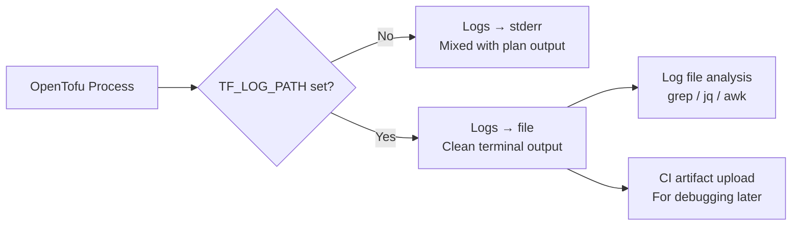

# How to Use TF_LOG_PATH for Log File Output in OpenTofu

Author: [nawazdhandala](https://www.github.com/nawazdhandala)

Tags: OpenTofu, TF_LOG_PATH, Logging, Debug, Log Files, Troubleshooting, Infrastructure as Code

Description: Learn how to use TF_LOG_PATH to redirect OpenTofu debug logs to a file for analysis, CI/CD artifact collection, and structured troubleshooting workflows.

---

`TF_LOG_PATH` redirects OpenTofu's debug log output from stderr to a file. Combined with `TF_LOG` level settings, this enables structured log collection, CI/CD artifact uploads, and log analysis without cluttering terminal output.

## Log Output Flow



## Basic Usage

```bash
# Redirect all logs to a file
export TF_LOG=DEBUG
export TF_LOG_PATH="./tofu-debug.log"
tofu plan

# Core and provider logs to separate files
export TF_LOG_CORE=DEBUG
export TF_LOG_PATH_CORE="./tofu-core.log"

export TF_LOG_PROVIDER=TRACE
export TF_LOG_PATH_PROVIDER="./tofu-provider.log"

tofu plan

# Timestamped log file for each run
export TF_LOG=DEBUG
export TF_LOG_PATH="./logs/tofu-$(date +%Y%m%d-%H%M%S).log"
mkdir -p logs
tofu apply
```

## Log File Structure

```
# Example TF_LOG_PATH file content structure
# Each line includes: timestamp [LEVEL] source: message

2026-03-20T10:15:30.123Z [INFO]  OpenTofu version: 1.6.3
2026-03-20T10:15:30.234Z [DEBUG] provider: Starting plugin
2026-03-20T10:15:30.456Z [DEBUG] provider.terraform-provider-aws: Configuring provider
2026-03-20T10:15:30.678Z [TRACE] provider.terraform-provider-aws: HTTP request started
2026-03-20T10:15:30.890Z [TRACE] provider.terraform-provider-aws: HTTP request completed
2026-03-20T10:15:31.012Z [DEBUG] backend/local: starting Plan operation
```

## CI/CD Log Collection

```yaml
# .github/workflows/terraform.yml
name: OpenTofu Deploy

on: [push]

jobs:
  plan:
    runs-on: ubuntu-latest

    env:
      TF_LOG: DEBUG
      TF_LOG_PATH: /tmp/tofu-debug.log

    steps:
      - uses: actions/checkout@v4

      - name: Setup OpenTofu
        uses: opentofu/setup-opentofu@v1

      - name: Init
        run: tofu init

      - name: Plan
        run: tofu plan -out=plan.tfplan
        continue-on-error: true
        id: plan

      - name: Upload debug log on failure
        if: steps.plan.outcome == 'failure'
        uses: actions/upload-artifact@v4
        with:
          name: tofu-debug-${{ github.run_id }}
          path: /tmp/tofu-debug.log
          retention-days: 7

      - name: Fail workflow if plan failed
        if: steps.plan.outcome == 'failure'
        run: exit 1
```

## Log Rotation for Long-Running Operations

```bash
# For tofu apply operations that take a long time (large infra changes)
# Use a log rotation approach to prevent huge single files

export TF_LOG=INFO  # Less verbose for apply operations
export TF_LOG_PATH="/var/log/opentofu/apply-$(date +%Y%m%d).log"

# Apply with tee to see output and save to file simultaneously
tofu apply 2>&1 | tee -a /var/log/opentofu/apply-$(date +%Y%m%d).log
```

## Log Analysis Scripts

```bash
#!/bin/bash
# scripts/analyze-logs.sh — extract useful information from tofu logs

LOG_FILE="${1:-./tofu-debug.log}"

echo "=== OpenTofu Log Analysis ==="
echo "File: $LOG_FILE"
echo ""

echo "=== Error Summary ==="
grep -i "error\|failed\|fatal" "$LOG_FILE" | grep -v "^#" | tail -20

echo ""
echo "=== API Call Summary ==="
grep -oP "(?<= API Request )\w+" "$LOG_FILE" | sort | uniq -c | sort -rn | head -20

echo ""
echo "=== Timeline (key events) ==="
grep -E "\[INFO\]|\[WARN\]|\[ERROR\]" "$LOG_FILE" | head -30

echo ""
echo "=== HTTP Error Codes ==="
grep -oP "HTTP/\d+\.\d+ \d{3}" "$LOG_FILE" | grep -v "200\|201\|204" | sort | uniq -c
```

## Sensitive Data Considerations

```bash
# WARNING: Debug logs may contain sensitive information:
# - API request payloads (may include resource values)
# - Authentication tokens (short-lived, but still sensitive)
# - Environment variable values passed to providers

# Best practices for log security:
# 1. Never commit log files to version control
# 2. Set short retention periods for CI artifact logs (3-7 days)
# 3. Restrict access to log artifact downloads in CI/CD

# Add to .gitignore
echo "*.log" >> .gitignore
echo "logs/" >> .gitignore

# 4. Use INFO level in production CI to reduce sensitive data exposure
# DEBUG/TRACE logs contain full HTTP request/response bodies
```

## Automated Log Cleanup

```bash
# scripts/cleanup-logs.sh
# Remove debug logs older than 7 days
find ./logs -name "*.log" -mtime +7 -delete
echo "Cleaned up old debug logs"

# For CI/CD: clean up before running to avoid disk fill
rm -f /tmp/tofu-*.log
```

## Best Practices

- Set `TF_LOG_PATH` to `/tmp/tofu-<run-id>.log` in CI/CD rather than the workspace directory — this prevents log files from being accidentally included in artifacts or polluting the workspace.
- Use `TF_LOG=INFO` or `TF_LOG=DEBUG` for most CI/CD runs, and only escalate to `TRACE` for specific troubleshooting sessions — TRACE logs can be hundreds of megabytes for large configurations.
- Always upload log files as CI artifacts when a plan or apply fails — having the debug logs available after the fact eliminates the need to re-run with logging enabled.
- Scrub log files before sharing with external support — search for AWS account IDs, access keys, secret values, and resource ARNs before sending logs to third parties.
- Set log file retention to 3-7 days in CI/CD — debug logs are only useful immediately after a failure and shouldn't accumulate indefinitely.
