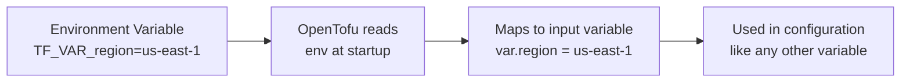

# How to Use the TF_VAR_ Prefix with OpenTofu

Author: [nawazdhandala](https://www.github.com/nawazdhandala)

Tags: OpenTofu, Environment Variables, TF_VAR_, Variables, CI/CD, Secrets, Infrastructure as Code

Description: Learn how to use the TF_VAR_ environment variable prefix to pass input variables to OpenTofu configurations without flags or var files, ideal for CI/CD pipelines and managing sensitive values.

---

OpenTofu reads environment variables prefixed with `TF_VAR_` and maps them to input variables automatically. This allows you to inject variable values from CI/CD environment variables, secret managers, or shell profiles without storing them in files.

## TF_VAR_ Variable Resolution



## Basic Usage

```bash
# Pass a simple string variable
export TF_VAR_region="us-east-1"
export TF_VAR_environment="production"

tofu plan  # var.region = "us-east-1", var.environment = "production"

# Pass numbers
export TF_VAR_instance_count="3"

# Pass booleans (as strings)
export TF_VAR_enable_monitoring="true"
```

## Corresponding Variable Declarations

```hcl
# variables.tf
variable "region" {
  type        = string
  description = "AWS region"
}

variable "environment" {
  type        = string
  description = "Deployment environment"
  validation {
    condition     = contains(["dev", "staging", "production"], var.environment)
    error_message = "Environment must be dev, staging, or production."
  }
}

variable "instance_count" {
  type        = number
  description = "Number of instances to provision"
}

variable "enable_monitoring" {
  type        = bool
  description = "Enable CloudWatch detailed monitoring"
  default     = false
}
```

## Complex Variable Types

```bash
# Lists — use HCL list syntax
export TF_VAR_subnet_ids='["subnet-abc123", "subnet-def456", "subnet-ghi789"]'

# Maps — use HCL map syntax
export TF_VAR_tags='{"Environment": "production", "Team": "platform", "ManagedBy": "opentofu"}'

# Objects
export TF_VAR_database_config='{"engine": "postgres", "version": "15", "instance_class": "db.t3.medium"}'
```

```hcl
# variables.tf — corresponding declarations for complex types
variable "subnet_ids" {
  type = list(string)
}

variable "tags" {
  type = map(string)
}

variable "database_config" {
  type = object({
    engine         = string
    version        = string
    instance_class = string
  })
}
```

## Sensitive Variables in CI/CD

```bash
# GitHub Actions — set secrets as TF_VAR_ environment variables
# In the GitHub Actions workflow:
```

```yaml
# .github/workflows/deploy.yml
jobs:
  deploy:
    runs-on: ubuntu-latest
    environment: production

    env:
      TF_VAR_aws_account_id: ${{ secrets.AWS_ACCOUNT_ID }}
      TF_VAR_database_password: ${{ secrets.DATABASE_PASSWORD }}
      TF_VAR_api_key: ${{ secrets.API_KEY }}

    steps:
      - uses: actions/checkout@v4

      - name: Configure AWS credentials
        uses: aws-actions/configure-aws-credentials@v4
        with:
          role-to-assume: ${{ secrets.AWS_ROLE_ARN }}
          aws-region: us-east-1

      - name: OpenTofu Plan
        run: |
          tofu init
          tofu plan -out=plan.tfplan

      - name: OpenTofu Apply
        run: tofu apply plan.tfplan
```

## Shell Profile for Local Development

```bash
# ~/.zshrc or ~/.bashrc — development variable configuration
# WARNING: Don't store production secrets here

# Non-sensitive development defaults
export TF_VAR_region="us-east-1"
export TF_VAR_environment="dev"
export TF_VAR_project_name="myapp"

# Fetch sensitive values from AWS Secrets Manager or 1Password
# eval $(aws secretsmanager get-secret-value --secret-id dev/terraform-vars --query SecretString --output text | jq -r 'to_entries | .[] | "export TF_VAR_\(.key)=\(.value)"')
```

## Variable Precedence Order

```bash
# OpenTofu resolves variables in this order (later takes precedence):
# 1. Default values in variable declarations
# 2. terraform.tfvars file
# 3. terraform.tfvars.json file
# 4. *.auto.tfvars and *.auto.tfvars.json files
# 5. TF_VAR_ environment variables
# 6. -var flags on the command line
# 7. -var-file flags on the command line

# TF_VAR_ takes precedence over tfvars files
# This is useful for overriding tfvars defaults in CI/CD

export TF_VAR_environment="production"
tofu plan -var-file=dev.tfvars  # TF_VAR_environment still wins over dev.tfvars
```

## Debugging Variable Values

```bash
# Verify TF_VAR_ variables are being picked up
tofu console
> var.region
"us-east-1"
> var.environment
"production"

# Or check in plan output
tofu plan -var=environment=test 2>&1 | grep "environment"
```

## Best Practices

- Use `TF_VAR_` environment variables for secrets in CI/CD rather than `-var` flags — environment variables don't appear in process listings (`ps aux`) or shell history.
- Mark sensitive variables with `sensitive = true` in their declarations — this prevents OpenTofu from printing the value in plan output and logs.
- Set development defaults in shell profiles but always override in CI/CD — this prevents accidentally deploying development configurations to production.
- Use consistent naming: if your variable is named `database_password`, the environment variable is `TF_VAR_database_password` (case-sensitive, exact match).
- For complex objects and lists, validate the HCL syntax before setting the environment variable — invalid syntax produces confusing error messages during `tofu plan`.
