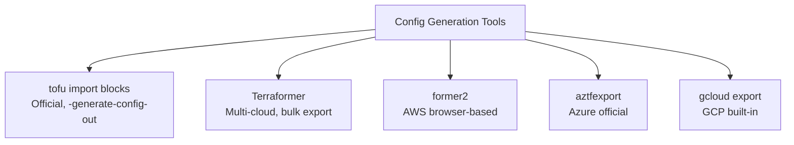

# How to Use Third-Party Tools for Config Generation with OpenTofu

Author: [nawazdhandala](https://www.github.com/nawazdhandala)

Tags: OpenTofu, Config Generation, Former, Terraformer, Migration, Infrastructure as Code

Description: Learn how to use third-party tools like Terraformer, former2, and cloud-native export tools to generate OpenTofu configurations from existing cloud infrastructure.

---

Beyond the built-in `import` block, several third-party tools can scan existing cloud infrastructure and generate OpenTofu/Terraform configuration automatically. These tools are especially useful when migrating large, undocumented environments.

## Tool Comparison



## Terraformer - Multi-Cloud Bulk Export

```bash
# Install Terraformer

brew install terraformer

# Or download binary
curl -LO "https://github.com/GoogleCloudPlatform/terraformer/releases/latest/download/terraformer-aws-darwin-amd64"
chmod +x terraformer-aws-darwin-amd64
mv terraformer-aws-darwin-amd64 /usr/local/bin/terraformer

# Export AWS resources by type
terraformer import aws \
  --resources=ec2_instance,s3,rds,vpc,subnet,security_group \
  --regions=us-east-1 \
  --profile=production \
  --path-output=./generated/aws

# Export GCP resources
terraformer import google \
  --resources=instances,networks,subnetworks,firewalls \
  --projects=my-gcp-project \
  --regions=us-central1 \
  --path-output=./generated/gcp

# Export Azure resources
terraformer import azure \
  --resources=resource_group,virtual_network,subnet,virtual_machine \
  --resource-group=my-resource-group \
  --path-output=./generated/azure
```

## former2 - AWS Browser-Based Export

```bash
# former2 is a web app at https://former2.com
# It runs in your browser and uses AWS credentials from CloudShell or local config

# Alternative: Use former2 CLI
npm install -g former2

# Set up credentials
export AWS_PROFILE=production

# Scan and generate
former2 generate \
  --services EC2,S3,RDS,VPC \
  --region us-east-1 \
  --output ./former2-output.tf
```

## Processing Generated Output

```bash
# Terraformer generates files per resource type
ls generated/aws/
# ec2_instance/
#   ├── instance.tf
#   ├── outputs.tf
#   └── provider.tf
# vpc/
#   ├── vpc.tf
#   ├── subnet.tf
#   └── ...

# Combine and clean up
cat generated/aws/vpc/vpc.tf >> infrastructure.tf
cat generated/aws/ec2_instance/instance.tf >> infrastructure.tf

# Replace hardcoded IDs with references
sed -i 's/vpc_id = "vpc-12345"/vpc_id = aws_vpc.main.id/g' infrastructure.tf
```

## Post-Generation Cleanup Script

```bash
#!/bin/bash
# cleanup_generated.sh

INPUT_FILE="$1"
OUTPUT_FILE="${INPUT_FILE%.tf}-clean.tf"

# Remove auto-generated resource IDs used as names
sed 's/name = "tfer--/name = "/g' "$INPUT_FILE" > "$OUTPUT_FILE"

# Remove computed attributes that cause drift
sed -i '/arn = /d' "$OUTPUT_FILE"
sed -i '/owner_id = /d' "$OUTPUT_FILE"
sed -i '/tags_all = /d' "$OUTPUT_FILE"

# Replace hardcoded account IDs
ACCOUNT_ID=$(aws sts get-caller-identity --query Account --output text)
sed -i "s/${ACCOUNT_ID}/var.account_id/g" "$OUTPUT_FILE"

echo "Cleaned config written to $OUTPUT_FILE"
```

## Validating Generated Configuration

```bash
# After cleanup, validate the configuration
tofu fmt -recursive .
tofu validate

# Plan to check for drift
tofu init
tofu plan

# If plan shows changes, it indicates the generated config doesn't match reality
# Review changes and either:
# 1. Update the config to match reality
# 2. Use ignore_changes to suppress expected differences
```

## Best Practices

- Use Terraformer for bulk multi-resource exports across an entire environment; use `tofu import` blocks for targeted imports of specific resources.
- Always run `tofu plan` after importing generated configs - non-empty plans indicate the generated configuration doesn't accurately reflect the actual resource state.
- Clean up Terraformer output before committing - it includes auto-generated names like `tfer--`, hardcoded ARNs, and redundant computed attributes.
- Do generated configuration migrations environment by environment, starting with dev - apply and validate before moving to production.
- Treat generated configuration as a starting point, not a finished product - it always requires cleanup and refactoring to follow your team's conventions.
