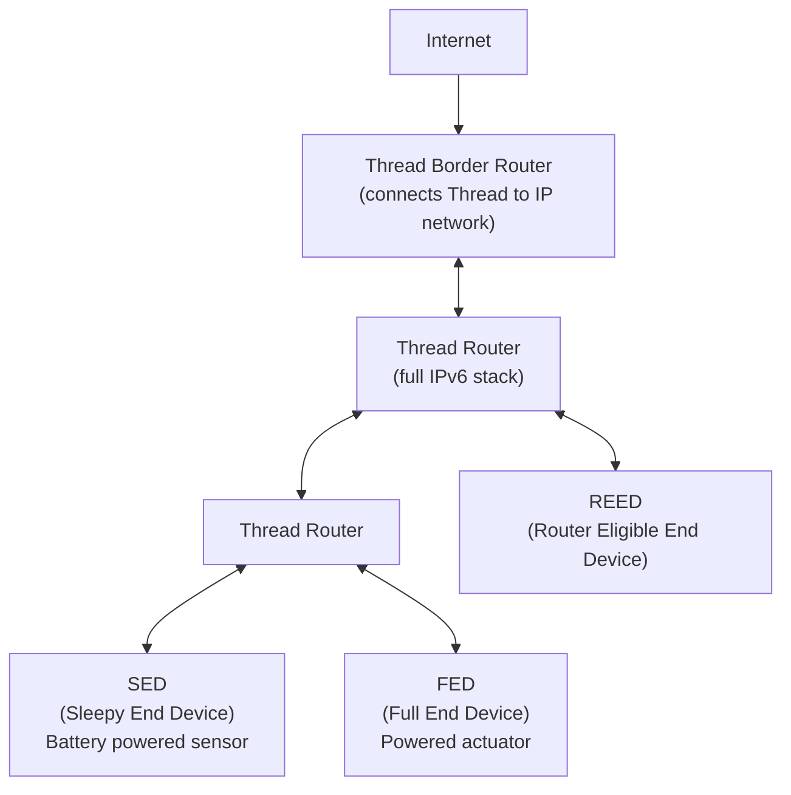

# How to Understand Thread Protocol for IoT IPv6

Author: [nawazdhandala](https://www.github.com/nawazdhandala)

Tags: IPv6, Thread, IoT, 6LoWPAN, Matter, Networking

Description: Understand the Thread protocol's use of IPv6 and 6LoWPAN to create self-healing mesh networks for IoT devices, including device roles and border router connectivity.

## Introduction

Thread is an IPv6-based mesh networking protocol designed specifically for smart home and building automation IoT devices. It is the underlying network protocol used by Matter (formerly Project CHIP). Thread uses IEEE 802.15.4 radio with 6LoWPAN to provide full IPv6 connectivity to constrained devices.

## Thread Network Architecture



## Thread Device Roles

| Role | Abbreviation | Description |
|---|---|---|
| Thread Leader | TL | Manages router table, one per partition |
| Router | R | Forwards packets, always on |
| Router Eligible End Device | REED | Can become a router if needed |
| Full End Device | FED | Always on, cannot route |
| Sleepy End Device | SED | Battery-powered, polls parent |
| Minimal End Device | MED | Simplified SED |

## IPv6 Address Types in Thread

Thread assigns multiple IPv6 address types to each device:

1. **Link-Local Address (LLA)**: `fe80::/10` - generated from IEEE EUI-64
2. **Mesh-Local EID**: `fdXX:XXXX:XXXX::/64` - unique per mesh, ULA prefix
3. **RLOC (Routing Locator)**: `fdXX:XXXX:XXXX:0:0:ff:fe00:XXXX` - contains the 16-bit RLOC16
4. **Global Unicast Address**: Assigned by the border router from the external IPv6 prefix

```bash
# Example Thread device addresses

# Link-local:      fe80::1122:3344:5566:7788
# Mesh-local EID:  fd11:2233:4455:0:1122:3344:5566:7788
# RLOC:            fd11:2233:4455::ff:fe00:9c00
# Global:          2001:db8:1:1::1122:3344:5566:7788 (from border router)
```

## Thread Border Router

The Thread Border Router (TBR) connects the Thread mesh to the broader IPv6 network:

```bash
# OpenThread Border Router daemon setup (on a Linux host with 802.15.4 radio)
# Install otbr-agent (OpenThread Border Router)
sudo apt-get install openthread-border-router

# Configure the interface (wpan0 = 802.15.4, eth0 = upstream)
sudo otbr-agent -I eth0 -B wpan0 spinel+hdlc+uart:///dev/ttyACM0

# The TBR handles:
# 1. Route injection: announces Thread prefixes to the upstream IPv6 network
# 2. NAT64: for Thread devices to reach IPv4 services
# 3. DNS64: for Thread devices to resolve IPv4-only hostnames
```

## Thread Network Formation

```bash
# Using the OpenThread CLI (ot-cli) to form a Thread network

# Initialize the Thread stack
> dataset init new
> dataset
# Shows: Active Timestamp, Channel, Network Name, PAN ID, PSKc, Network Key, etc.

# Set dataset and commit
> dataset commit active

# Start the Thread interface
> ifconfig up
> thread start

# Check the device state
> state
# Should show: leader (or router after a few seconds)

# Show IPv6 addresses
> ipaddr
# Shows: fe80::, mesh-local EID, RLOC
```

## Security in Thread

Thread uses IEEE 802.15.4 security with AES-CCM encryption for all frame-level security, plus:
- **Network Key**: Shared secret for all devices in the Thread partition (rotatable)
- **PSKc**: Commissioning credential for joining devices
- **DTLS**: For commissioning handshake (Joiner ↔ Commissioner)

```bash
# Set network key (do not use this example key in production)
> networkkey 00112233445566778899aabbccddeeff

# Start commissioner to allow new devices to join
> commissioner start
Commissioner: petitioning
Commissioner: active

# Add a new device's EUI-64 and join credential
> commissioner joiner add eui64:1122334455667788 J01NU5
```

## Conclusion

Thread provides a fully IPv6-based mesh networking solution for IoT devices, using 6LoWPAN for header compression on IEEE 802.15.4 links and a Border Router for connectivity to the broader internet. Every Thread device has a unique IPv6 address and can be reached end-to-end from any IPv6-enabled host, enabling direct cloud connectivity without NAT. Thread's self-healing mesh topology and built-in security make it the preferred network layer for Matter smart home devices.
