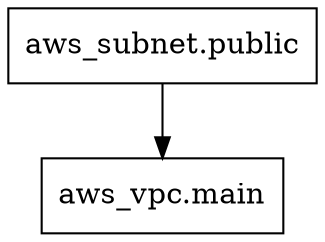

# How to Visualize OpenTofu Configurations with tofu graph

Author: [nawazdhandala](https://www.github.com/nawazdhandala)

Tags: OpenTofu, Terraform, Graph, Visualization, Dependency Management, Infrastructure as Code

Description: Learn how to use the `tofu graph` command to generate and visualize dependency graphs for your OpenTofu configurations, helping you understand resource relationships.

## Introduction

The `tofu graph` command outputs a visual representation of the dependencies between resources in your configuration in DOT graph language format. This helps you understand how resources relate to each other, identify circular dependencies, and document your infrastructure architecture.

## Running the Graph Command

Generate a dependency graph:

```bash
tofu graph
```

This outputs DOT language to stdout. To save it:

```bash
tofu graph > graph.dot
```

## Converting DOT to an Image

Install Graphviz to render the DOT output as an image:

```bash
# macOS

brew install graphviz

# Ubuntu/Debian
apt install graphviz
```

Generate a PNG:

```bash
tofu graph | dot -Tpng > graph.png
```

Generate an SVG (better for large graphs):

```bash
tofu graph | dot -Tsvg > graph.svg
```

## Graph Types

The `-type` flag controls what is graphed:

```bash
# Default - shows planned resources
tofu graph -type=plan

# Show applied resources and state
tofu graph -type=apply

# Show planned destroy operations
tofu graph -type=plan-destroy
```

## Filtering the Graph

Focus on a specific resource and its dependencies:

```bash
tofu graph -type=plan | grep -A5 "aws_instance"
```

## Online Visualization

Paste the DOT output into an online viewer:
- `dreampuf.github.io/GraphvizOnline`
- `viz-js.com`

## Example: Reading the Output



Arrows represent dependencies - `aws_subnet.public` depends on `aws_vpc.main`.

## Practical Uses

1. **Onboarding** - Help new team members understand infrastructure structure
2. **Debugging** - Identify unexpected dependencies causing apply failures
3. **Documentation** - Generate architecture diagrams automatically
4. **Circular dependency detection** - Visualize cycles before they cause errors

## Automation in CI

```yaml
- name: Generate infrastructure graph
  run: |
    tofu graph | dot -Tsvg > docs/infrastructure-graph.svg
    git add docs/infrastructure-graph.svg
```

## Conclusion

`tofu graph` is a simple but powerful tool for understanding and documenting your OpenTofu infrastructure. By converting the DOT output to an image with Graphviz, you get an automatic architecture diagram that always reflects your current configuration.
