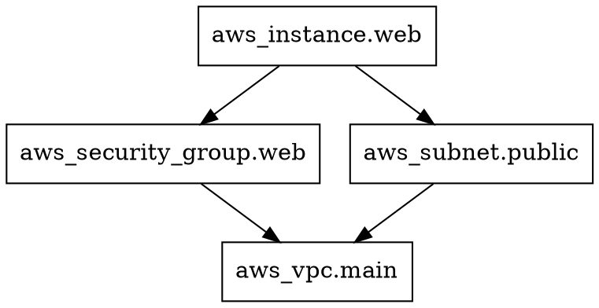

# How to Use the tofu graph Command

Author: [nawazdhandala](https://www.github.com/nawazdhandala)

Tags: OpenTofu, Graph Command, Debugging, Visualization, Infrastructure as Code

Description: Learn how to use the `tofu graph` command to visualize resource dependencies — generating DOT format graphs that reveal apply order, circular dependencies, and module relationships.

## Introduction

`tofu graph` outputs a DOT-format representation of the resource dependency graph. When rendered with Graphviz, it becomes a visual map of your infrastructure — showing which resources depend on which, in what order they'll be created, and where cycles exist.

## Basic Usage

```bash
# Generate DOT format output
tofu graph

# Pipe directly to Graphviz for PNG output
tofu graph | dot -Tpng > dependency-graph.png

# Generate SVG (better for large graphs)
tofu graph | dot -Tsvg > dependency-graph.svg

# Generate PDF
tofu graph | dot -Tpdf > dependency-graph.pdf
```

## Installing Graphviz

```bash
# macOS
brew install graphviz

# Ubuntu/Debian
sudo apt-get install graphviz

# Verify
dot -V
# dot - graphviz version 2.50.0
```

## Graph Types

```bash
# Default: configuration graph (plan-time dependencies)
tofu graph

# Plan graph: shows only what would change
tofu plan -out=tfplan.binary
tofu graph -plan=tfplan.binary | dot -Tpng > plan-graph.png

# Apply graph: shows apply-time dependencies
tofu graph -type=apply | dot -Tpng > apply-graph.png

# Destroy graph: reverse dependency order
tofu graph -type=destroy | dot -Tpng > destroy-graph.png
```

## Reading the DOT Output

```bash
tofu graph
```

Sample output:



The `->` arrows show dependency direction (resource needs the target to exist first).

## Filtering with grep

For large configs, filter the graph output to focus on specific resources:

```bash
# Show only database-related dependencies
tofu graph | grep -E "aws_db|aws_rds|aws_subnet" | dot -Tpng > db-graph.png

# Remove provider nodes for cleaner output
tofu graph | grep -v "provider\[" | dot -Tpng > clean-graph.png
```

## Module Graph

For configurations with modules, the graph shows module boundaries:

```bash
# Show module-level graph (collapse module internals)
tofu graph -draw-cycles | dot -Tpng > module-graph.png
```

## Detecting Cycles

```bash
# -draw-cycles highlights circular dependencies in red
tofu graph -draw-cycles | dot -Tpng > cycle-graph.png

# Also validates for cycles
tofu validate
# Error: Cycle: resource.a, resource.b
```

## Automating Graph Generation in CI

```yaml
# GitHub Actions: Generate and upload dependency graph on each PR
- name: Generate dependency graph
  run: |
    tofu init
    tofu graph | dot -Tsvg > /tmp/dependency-graph.svg

- name: Upload graph artifact
  uses: actions/upload-artifact@v4
  with:
    name: dependency-graph
    path: /tmp/dependency-graph.svg
    retention-days: 30
```

## Web Visualization with blast-radius

For interactive graph exploration:

```bash
# blast-radius creates an interactive web visualization
pip install blast-radius

# Serve interactive graph
blast-radius --serve .
# Open http://localhost:5000 in browser

# Or export to HTML
blast-radius . > graph.html
```

## Practical Use Cases

```bash
# 1. Understand why a resource applies before another
tofu graph | dot -Tpng > /tmp/graph.png
# Review the PNG to trace dependency chains

# 2. Debug "resource already exists" errors
# Check if a resource is being created by two different paths

# 3. Plan a large refactor
# Visualize before and after graphs to understand impact

# 4. Onboard new team members
# Visual graph is more intuitive than reading HCL files
```

## Conclusion

`tofu graph` generates a DOT-format dependency graph that, when rendered with Graphviz, provides a visual map of your infrastructure. Use it to understand apply order, debug dependency issues, detect cycles early, and onboard new team members. The `-plan` flag shows only resources that would change, making it useful for reviewing large plans. For interactive exploration, `blast-radius` provides a web-based visualization of the same graph data.
