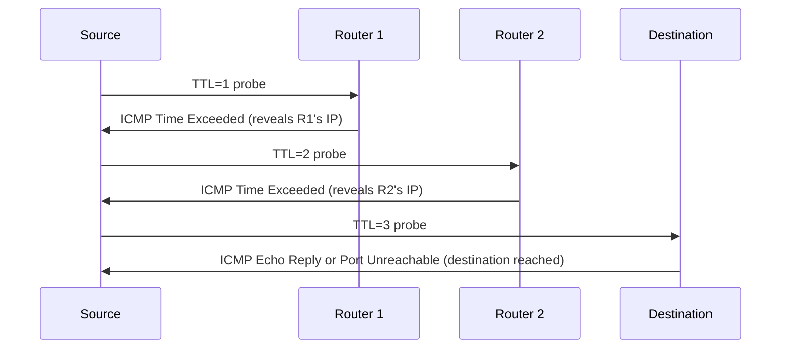

# How to Use Traceroute to Map the Network Path

Author: [nawazdhandala](https://www.github.com/nawazdhandala)

Tags: Networking, Traceroute, ICMP, IPv4, Troubleshooting, Path Analysis

Description: Use traceroute to discover the hop-by-hop path packets take to a destination, interpret each line of output, and identify where network problems occur.

## Introduction

Traceroute works by sending probe packets with incrementally increasing TTL values. Each router that decrements the TTL to zero returns an ICMP Time Exceeded message, revealing its IP address and the RTT to that hop. The result is a map of the network path from source to destination.

## How Traceroute Works



## Running Traceroute

```bash
# Basic traceroute (Linux uses UDP by default)

traceroute 8.8.8.8

# ICMP-based traceroute (less likely to be filtered)
traceroute -I 8.8.8.8

# TCP-based traceroute on port 80 (most firewall-friendly)
traceroute -T -p 80 8.8.8.8

# Numeric output (no DNS reverse lookups - much faster)
traceroute -n 8.8.8.8

# Increase max hops (default 30)
traceroute -m 50 8.8.8.8
```

## Reading Traceroute Output

```text
traceroute to 8.8.8.8, 30 hops max, 60 byte packets
 1  192.168.1.1  1.234 ms  1.156 ms  1.089 ms   <- Local router
 2  10.0.0.1     5.432 ms  5.391 ms  5.401 ms   <- ISP edge
 3  203.0.113.1  8.123 ms  7.987 ms  8.045 ms   <- ISP core
 4  * * *                                         <- No response (filtered or slow)
 5  142.250.0.1  12.456 ms  12.389 ms 12.401 ms <- Google network
 6  8.8.8.8      12.678 ms  12.612 ms 12.589 ms <- Destination reached
```

Column meanings:
- **Hop number**: TTL value used for this probe
- **IP/hostname**: Router that responded
- **Three RTT values**: Three probes sent per hop

## Identifying Problems

```bash
# High latency at a specific hop followed by normal latency - expected (router deprioritizes ICMP)
# High latency that persists from a hop onward - actual congestion or long-distance link

# Example: latency jump at hop 5
# 4  10.0.0.5     2.1 ms
# 5  203.0.113.1  87.3 ms  <- transatlantic or satellite link
# 6  10.1.0.1     89.2 ms  <- latency maintained, normal for this path

# Asterisks at one hop but normal afterward - router doesn't reply to ICMP, not a problem
# Asterisks from a certain hop onward - packet loss or firewall dropping probes
```

## Traceroute with Different Protocol Options

```bash
# Paris traceroute: maintains constant flow hash to avoid ECMP path variation
apt install paris-traceroute
paris-traceroute 8.8.8.8

# Dublin traceroute: handles MPLS and ECMP networks better
apt install dublin-traceroute
dublin-traceroute 8.8.8.8
```

## Automating Traceroute Checks

```bash
#!/bin/bash
# Alert if path to 8.8.8.8 exceeds expected hop count
HOPS=$(traceroute -n -m 30 8.8.8.8 2>/dev/null | tail -1 | awk '{print $1}')
MAX_EXPECTED=20

if [ "$HOPS" -gt "$MAX_EXPECTED" ]; then
  echo "WARNING: Path to 8.8.8.8 is $HOPS hops, expected <= $MAX_EXPECTED"
fi
```

## Conclusion

Traceroute is invaluable for understanding the physical and logical path of traffic. It helps you identify where latency is introduced, where packets are being dropped, and whether routing is following expected paths. Combine it with MTR for ongoing path analysis, and Paris traceroute for networks with ECMP.
