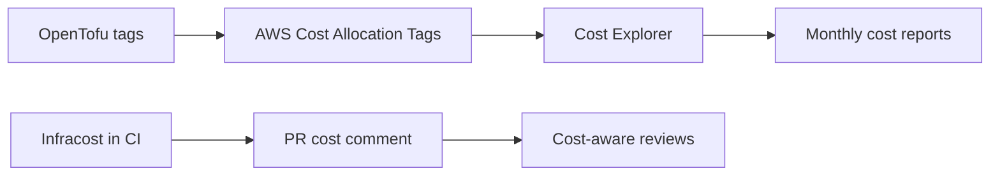

# How to Track Infrastructure Costs Across Environments with OpenTofu

Author: [nawazdhandala](https://www.github.com/nawazdhandala)

Tags: OpenTofu, Cost Tracking, AWS Cost Explorer, Infracost, Tagging, Infrastructure as Code

Description: Learn how to track and compare infrastructure costs across dev, staging, and production environments using OpenTofu tagging conventions, Infracost in CI/CD, and AWS Cost Explorer.

---

Without cost visibility per environment, it's hard to justify infrastructure spend or identify which environment is running expensive resources. A consistent tagging strategy plus Infracost in pull requests gives teams real-time cost awareness.

## Cost Tracking Architecture



## Consistent Environment Tagging

```hcl
# locals.tf

locals {
  cost_tags = {
    Environment  = var.environment
    Team         = var.team
    Project      = var.project
    CostCenter   = var.cost_center
    ManagedBy    = "opentofu"
  }
}

# providers.tf
provider "aws" {
  default_tags {
    tags = local.cost_tags
  }
}
```

## Cost Explorer Queries per Environment

```hcl
# Outputs to support cost explorer queries
output "cost_explorer_filter" {
  description = "Filter to use in AWS Cost Explorer for this environment"
  value = {
    filter_key   = "Environment"
    filter_value = var.environment
    note         = "Activate this tag in AWS Cost Explorer > Cost Allocation Tags"
  }
}
```

## Infracost in CI/CD

```yaml
# .github/workflows/cost.yml
name: Cost Estimation
on:
  pull_request:
    paths: ['**.tf', '**.tfvars']

jobs:
  infracost:
    runs-on: ubuntu-latest
    permissions:
      pull-requests: write

    steps:
      - uses: actions/checkout@v4

      - name: Setup Infracost
        uses: infracost/actions/setup@v2
        with:
          api-key: ${{ secrets.INFRACOST_API_KEY }}

      - name: Generate Infracost JSON (base branch)
        run: |
          infracost breakdown \
            --path environments/production \
            --format json \
            --out-file /tmp/infracost-base.json
        env:
          AWS_ACCESS_KEY_ID: ${{ secrets.AWS_ACCESS_KEY_ID }}
          AWS_SECRET_ACCESS_KEY: ${{ secrets.AWS_SECRET_ACCESS_KEY }}

      - uses: actions/checkout@v4
        with:
          ref: ${{ github.event.pull_request.head.ref }}

      - name: Generate Infracost JSON (PR branch)
        run: |
          infracost breakdown \
            --path environments/production \
            --format json \
            --out-file /tmp/infracost-pr.json

      - name: Post diff to PR
        run: |
          infracost diff \
            --path /tmp/infracost-pr.json \
            --compare-to /tmp/infracost-base.json \
            --format diff \
            --out-file /tmp/infracost-diff.txt

          infracost comment github \
            --path /tmp/infracost-diff.txt \
            --repo ${{ github.repository }} \
            --pull-request ${{ github.event.pull_request.number }} \
            --github-token ${{ github.token }} \
            --behavior update
```

## Per-Environment Cost Report

```hcl
# Generate cost summary as an output for reporting
output "estimated_monthly_cost" {
  description = "Estimated monthly infrastructure cost (from Infracost)"
  value = {
    environment     = var.environment
    last_updated    = formatdate("YYYY-MM-DD", timestamp())
    note            = "Run 'infracost breakdown --path .' for current estimate"
  }
}
```

## AWS Cost Anomaly Detection

```hcl
resource "aws_ce_anomaly_monitor" "environment" {
  name              = "${var.environment}-anomaly-monitor"
  monitor_type      = "DIMENSIONAL"
  monitor_dimension = "SERVICE"
}

resource "aws_ce_anomaly_subscription" "environment" {
  name      = "${var.environment}-anomaly-alert"
  frequency = "DAILY"

  monitor_arn_list = [aws_ce_anomaly_monitor.environment.arn]

  subscriber {
    type    = "SNS"
    address = aws_sns_topic.cost_alerts.arn
  }

  threshold_expression {
    dimension {
      key           = "ANOMALY_TOTAL_IMPACT_ABSOLUTE"
      values        = ["100"]  # Alert on $100+ anomalies
      match_options = ["GREATER_THAN_OR_EQUAL"]
    }
  }
}
```

## Best Practices

- Activate cost allocation tags in AWS Cost Explorer before they appear in cost reports - there's a 24-hour activation delay.
- Use Infracost in CI/CD to show cost impact of each PR - teams make better decisions when they see the dollar impact.
- Enable AWS Cost Anomaly Detection per environment to catch unexpected spend spikes automatically.
- Create a monthly cost report in Slack or email that breaks down spend by environment and team.
- Budget alerts are reactive; anomaly detection is proactive - use both for comprehensive cost coverage.
