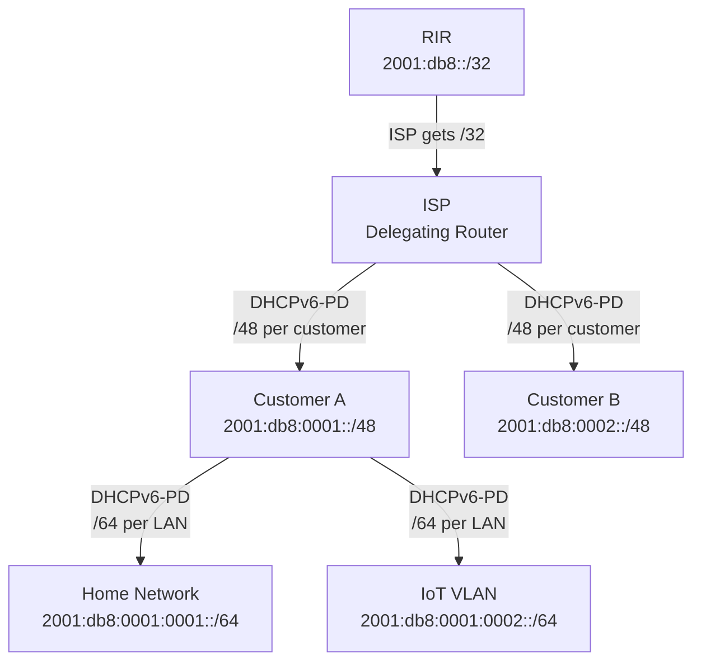

# How to Track IPv6 Prefix Delegations in IPAM

Author: [nawazdhandala](https://www.github.com/nawazdhandala)

Tags: IPv6, IPAM, Prefix Delegation, DHCPv6-PD, Network Management

Description: Track IPv6 prefix delegations (DHCPv6-PD) from ISP to CPE devices and within an organization, recording delegation relationships and validating prefix usage in IPAM.

## Introduction

IPv6 prefix delegation (DHCPv6-PD, RFC 3633) enables a delegating router to assign a prefix to a requesting router for downstream use. In enterprise and ISP environments, tracking these delegations in IPAM ensures the address plan reflects actual assignments and enables detection of unauthorized delegation.

## Delegation Chain Structure



## Step 1: Monitor DHCPv6-PD Leases from Kea

```python
#!/usr/bin/env python3
# track_pd_leases.py

# Monitor Kea DHCPv6 prefix delegation leases

import json
import urllib.request
from datetime import datetime

KEA_URL = "http://[::1]:8000"

def kea_command(command: str, service: str = "dhcp6") -> dict:
    payload = json.dumps({
        "command": command,
        "service": [service]
    }).encode()
    req = urllib.request.Request(KEA_URL, data=payload,
                                  headers={"Content-Type": "application/json"})
    with urllib.request.urlopen(req, timeout=10) as resp:
        return json.load(resp)

# Get all active DHCPv6-PD leases
pd_leases = kea_command("lease6-get-all", "dhcp6")

print("Active DHCPv6-PD Delegations:")
print(f"{'Prefix':<35} {'Client DUID':<40} {'Expires'}")
print("-" * 90)

for lease in pd_leases.get("arguments", {}).get("leases", []):
    if lease.get("type") == "IA_PD":
        prefix = f"{lease['prefix']}/{lease['prefix-len']}"
        duid = lease.get("duid", "unknown")
        expires = datetime.fromtimestamp(
            lease.get("cltt", 0) + lease.get("valid-lft", 0)
        ).strftime("%Y-%m-%d %H:%M")
        print(f"{prefix:<35} {duid:<40} {expires}")
```

## Step 2: Sync Delegations to NetBox

```python
#!/usr/bin/env python3
# sync_pd_to_netbox.py

import pynetbox
from datetime import datetime

nb = pynetbox.api("http://netbox.internal", token="your-token")

def record_delegation(parent_prefix: str, delegated_prefix: str,
                       duid: str, expires: datetime):
    """Record a DHCPv6-PD delegation in NetBox."""

    # Check if prefix already exists
    existing = nb.ipam.prefixes.filter(prefix=delegated_prefix)
    if existing:
        prefix_obj = list(existing)[0]
        # Update expiry in description
        nb.ipam.prefixes.update([{
            "id": prefix_obj.id,
            "description": f"PD from {parent_prefix} | DUID: {duid} | Expires: {expires}"
        }])
    else:
        # Create new prefix record
        nb.ipam.prefixes.create({
            "prefix": delegated_prefix,
            "description": f"PD from {parent_prefix} | DUID: {duid} | Expires: {expires}",
            "status": "active",
            "tags": [{"slug": "dhcpv6-pd"}],
            "custom_fields": {
                "delegation_source": parent_prefix,
                "client_duid": duid,
                "delegation_expires": expires.isoformat()
            }
        })

    print(f"Recorded: {delegated_prefix} (delegated from {parent_prefix})")

# Example: record a delegation
record_delegation(
    "2001:db8::/32",
    "2001:db8:0001::/48",
    "00:03:00:01:aa:bb:cc:dd:ee:ff",
    datetime(2026, 4, 20, 10, 30, 0)
)
```

## Step 3: ISC DHCP Delegation Log Parser

```python
#!/usr/bin/env python3
# parse_isc_dhcpv6_pd_log.py
import re
from collections import defaultdict

# ISC DHCPv6 log format for prefix delegation
# dhcpv6: ia-pd lease for prefix 2001:db8:1::/48 to client DUID xx...
PD_LOG_RE = re.compile(
    r'ia-pd lease for prefix (?P<prefix>[0-9a-fA-F:]+/\d+) '
    r'to client DUID (?P<duid>[0-9a-fA-F:]+)'
)

RELEASE_RE = re.compile(
    r'ia-pd release.*prefix (?P<prefix>[0-9a-fA-F:]+/\d+)'
)

active = {}  # prefix -> duid

with open("/var/log/dhcpd6.log") as f:
    for line in f:
        m = PD_LOG_RE.search(line)
        if m:
            active[m.group("prefix")] = m.group("duid")
            continue

        m = RELEASE_RE.search(line)
        if m:
            active.pop(m.group("prefix"), None)

print(f"Active PD delegations: {len(active)}")
for prefix, duid in sorted(active.items()):
    print(f"  {prefix:<35} -> DUID: {duid}")
```

## Step 4: Validate Delegated Prefixes

Ensure delegated prefixes are actually being used and have not expired:

```bash
#!/bin/bash
# validate_delegations.sh

echo "=== Prefix Delegation Validation ==="
# Check which delegated prefixes are routing traffic
# (requires access to delegating router)

# On Cisco IOS/IOS-XE:
# show ipv6 dhcp pool
# show ipv6 dhcp binding

# On Linux with Kea:
kea-admin lease-get-all dhcp6 | python3 -c "
import json, sys, datetime
data = json.load(sys.stdin)
now = datetime.datetime.now().timestamp()
for lease in data.get('arguments', {}).get('leases', []):
    if lease.get('type') == 'IA_PD':
        expires = lease.get('cltt', 0) + lease.get('valid-lft', 0)
        status = 'ACTIVE' if expires > now else 'EXPIRED'
        prefix = f\"{lease['prefix']}/{lease['prefix-len']}\"
        print(f'{status} {prefix}')
"
```

## Conclusion

Tracking IPv6 prefix delegations in IPAM requires synchronizing DHCPv6-PD lease data from the delegating router into the IPAM database. Use Kea's REST API or parse ISC DHCPv6 logs to extract active delegations, then create or update prefix records in NetBox with delegation metadata (source prefix, client DUID, expiry). Add a `dhcpv6-pd` tag to delegated prefixes to distinguish them from manually assigned static prefixes. Run periodic validation to detect expired delegations that should be reclaimed or stale IPAM records that no longer match active leases.
