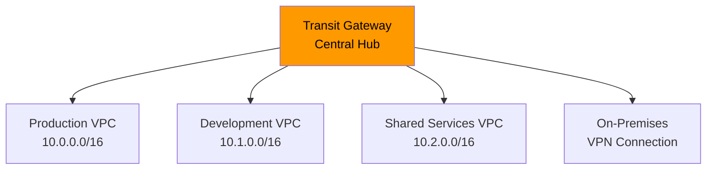

# How to Deploy AWS Transit Gateway with OpenTofu

Author: [nawazdhandala](https://www.github.com/nawazdhandala)

Tags: OpenTofu, AWS, Transit Gateway, VPC, Networking, Multi-VPC, Infrastructure as Code

Description: Learn how to create an AWS Transit Gateway using OpenTofu for hub-and-spoke VPC connectivity, enabling scalable multi-VPC networking without the complexity of VPC peering meshes.

---

AWS Transit Gateway acts as a central hub that connects multiple VPCs, on-premises networks, and VPN connections through a single gateway. OpenTofu manages the Transit Gateway, route tables, and VPC attachments for scalable multi-VPC networking.

## Transit Gateway Architecture



## Transit Gateway

```hcl
# tgw.tf
resource "aws_ec2_transit_gateway" "main" {
  description = "${var.prefix} Transit Gateway"

  # Auto-accept attachments from same account
  auto_accept_shared_attachments = "enable"

  # DNS support for VPCs attached to TGW
  dns_support = "enable"

  # VPN ECMP support for multiple VPN connections
  vpn_ecmp_support = "enable"

  # Default route table behavior
  default_route_table_association = "disable"  # Manage route tables explicitly
  default_route_table_propagation = "disable"  # Manage propagation explicitly

  tags = {
    Name        = "${var.prefix}-tgw"
    Environment = var.environment
    ManagedBy   = "opentofu"
  }
}

# Share TGW with other AWS accounts via Resource Access Manager
resource "aws_ram_resource_share" "tgw" {
  name                      = "${var.prefix}-tgw-share"
  allow_external_principals = false  # Only within AWS Organization
}

resource "aws_ram_resource_association" "tgw" {
  resource_arn       = aws_ec2_transit_gateway.main.arn
  resource_share_arn = aws_ram_resource_share.tgw.arn
}

resource "aws_ram_principal_association" "tgw" {
  for_each = toset(var.aws_account_ids)

  principal          = each.value
  resource_share_arn = aws_ram_resource_share.tgw.arn
}
```

## VPC Attachments

```hcl
# attachments.tf

# Attach each VPC to the Transit Gateway
resource "aws_ec2_transit_gateway_vpc_attachment" "production" {
  subnet_ids         = var.production_tgw_subnet_ids  # Dedicated /28 subnets for TGW
  transit_gateway_id = aws_ec2_transit_gateway.main.id
  vpc_id             = var.production_vpc_id

  dns_support   = "enable"
  ipv6_support  = "disable"

  # Don't associate with default route table
  transit_gateway_default_route_table_association = false
  transit_gateway_default_route_table_propagation = false

  tags = {
    Name = "${var.prefix}-tgw-attachment-production"
  }
}

resource "aws_ec2_transit_gateway_vpc_attachment" "development" {
  subnet_ids         = var.development_tgw_subnet_ids
  transit_gateway_id = aws_ec2_transit_gateway.main.id
  vpc_id             = var.development_vpc_id

  transit_gateway_default_route_table_association = false
  transit_gateway_default_route_table_propagation = false

  tags = {
    Name = "${var.prefix}-tgw-attachment-development"
  }
}

resource "aws_ec2_transit_gateway_vpc_attachment" "shared" {
  subnet_ids         = var.shared_tgw_subnet_ids
  transit_gateway_id = aws_ec2_transit_gateway.main.id
  vpc_id             = var.shared_vpc_id

  transit_gateway_default_route_table_association = false
  transit_gateway_default_route_table_propagation = false

  tags = {
    Name = "${var.prefix}-tgw-attachment-shared"
  }
}
```

## Transit Gateway Route Tables

```hcl
# route_tables.tf

# Separate route tables for production isolation
resource "aws_ec2_transit_gateway_route_table" "production" {
  transit_gateway_id = aws_ec2_transit_gateway.main.id

  tags = {
    Name = "${var.prefix}-tgw-rt-production"
  }
}

resource "aws_ec2_transit_gateway_route_table" "development" {
  transit_gateway_id = aws_ec2_transit_gateway.main.id

  tags = {
    Name = "${var.prefix}-tgw-rt-development"
  }
}

# Associate attachments with route tables
resource "aws_ec2_transit_gateway_route_table_association" "production" {
  transit_gateway_attachment_id  = aws_ec2_transit_gateway_vpc_attachment.production.id
  transit_gateway_route_table_id = aws_ec2_transit_gateway_route_table.production.id
}

resource "aws_ec2_transit_gateway_route_table_association" "development" {
  transit_gateway_attachment_id  = aws_ec2_transit_gateway_vpc_attachment.development.id
  transit_gateway_route_table_id = aws_ec2_transit_gateway_route_table.development.id
}

# Routes: production can reach shared services, not dev
resource "aws_ec2_transit_gateway_route" "production_to_shared" {
  destination_cidr_block         = var.shared_vpc_cidr
  transit_gateway_attachment_id  = aws_ec2_transit_gateway_vpc_attachment.shared.id
  transit_gateway_route_table_id = aws_ec2_transit_gateway_route_table.production.id
}

# Dev can reach shared services too
resource "aws_ec2_transit_gateway_route" "development_to_shared" {
  destination_cidr_block         = var.shared_vpc_cidr
  transit_gateway_attachment_id  = aws_ec2_transit_gateway_vpc_attachment.shared.id
  transit_gateway_route_table_id = aws_ec2_transit_gateway_route_table.development.id
}
```

## VPC Route Table Updates

```hcl
# vpc_routes.tf — add TGW routes to VPC route tables

# Route all 10.x.x.x traffic (other VPCs) through TGW
resource "aws_route" "production_to_tgw" {
  count = length(var.production_private_route_table_ids)

  route_table_id         = var.production_private_route_table_ids[count.index]
  destination_cidr_block = "10.0.0.0/8"  # All RFC1918 addresses via TGW
  transit_gateway_id     = aws_ec2_transit_gateway.main.id
}
```

## Best Practices

- Disable default route table association and propagation (`default_route_table_association = "disable"`) — explicit route table management gives you control over which VPCs can communicate with each other.
- Create dedicated `/28` subnets in each VPC for TGW attachments — don't share them with workload subnets. The TGW requires 1 IP per attachment per AZ.
- Use separate route tables for production and development environments — this prevents development workloads from accidentally routing to production resources.
- Share Transit Gateways via Resource Access Manager within your AWS Organization rather than creating per-account TGWs — a single TGW can serve all accounts in an organization.
- Plan your CIDR blocks carefully before creating TGW attachments — overlapping CIDR blocks between VPCs cannot be routed through Transit Gateway without network address translation.
