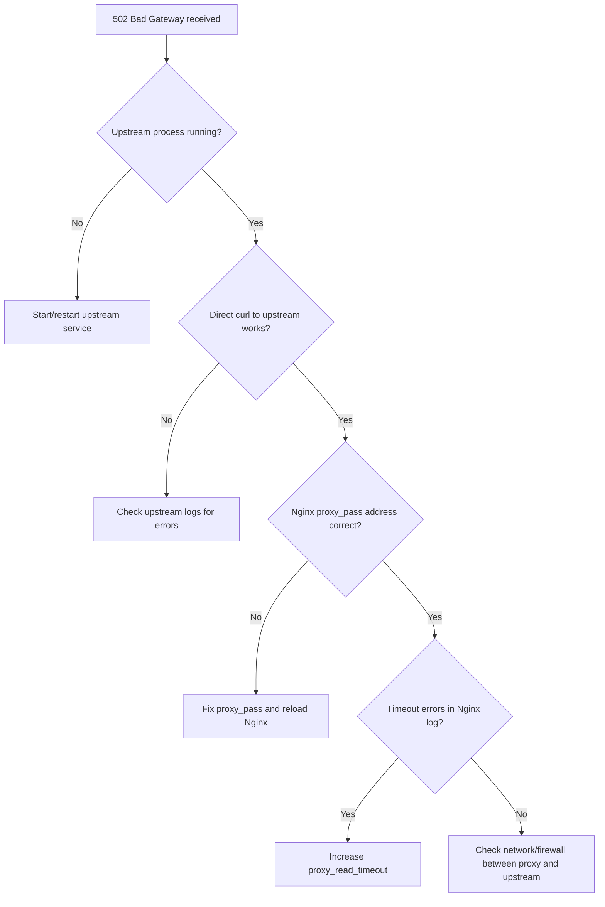

# How to Troubleshoot HTTP 502 Bad Gateway Errors Behind a Reverse Proxy

Author: [nawazdhandala](https://www.github.com/nawazdhandala)

Tags: Nginx, HTTP 502, Reverse Proxy, Debugging, DevOps, Web Server

Description: A systematic guide to diagnosing and resolving HTTP 502 Bad Gateway errors when running applications behind an Nginx or similar reverse proxy.

## What Is a 502 Bad Gateway?

A `502 Bad Gateway` error means the proxy (Nginx, HAProxy, etc.) received an invalid or no response from the upstream server. The proxy itself is running fine-the problem lies between the proxy and your application server.

## Common Causes

- Upstream application server is down or crashed
- Upstream is listening on the wrong port or address
- Upstream is overloaded and not accepting connections
- Firewall or network issue blocking the proxy-to-upstream path
- Upstream crashed mid-response (e.g., out-of-memory kill)
- Wrong `proxy_pass` address in Nginx config

## Step 1: Check Nginx Error Logs

```bash
# Tail the error log for recent 502 entries

tail -f /var/log/nginx/error.log | grep "502\|upstream\|connect"
```

Common error patterns:
- `connect() failed (111: Connection refused)` - upstream not listening
- `upstream timed out` - upstream too slow to respond
- `no live upstreams while connecting to upstream` - all upstream servers are down

## Step 2: Verify the Upstream Is Running

```bash
# Check if the upstream process is listening on its expected port
ss -tlnp | grep :3000

# Or use netstat
netstat -tlnp | grep :3000

# Attempt a direct connection to the upstream (bypassing the proxy)
curl -v http://127.0.0.1:3000/health
```

If this direct curl fails, the problem is with the upstream application, not Nginx.

## Step 3: Verify Nginx proxy_pass Configuration

```nginx
# /etc/nginx/sites-available/app.conf
server {
    listen 80;
    server_name app.example.com;

    location / {
        # Ensure this matches the actual upstream address and port
        proxy_pass http://127.0.0.1:3000;

        proxy_http_version 1.1;
        proxy_set_header Host $host;
        proxy_set_header X-Real-IP $remote_addr;

        # Increase timeouts to rule out slow upstream responses
        proxy_connect_timeout 10s;
        proxy_read_timeout    60s;
        proxy_send_timeout    60s;
    }
}
```

After changes: `nginx -t && nginx -s reload`

## Step 4: Check Upstream Application Logs

```bash
# Example: systemd-managed Node.js app
journalctl -u myapp.service -n 100 --no-pager

# Example: PM2-managed process
pm2 logs myapp --lines 100
```

Look for crashes, OOM kills, or unhandled exceptions.

## Step 5: Check System Resources

```bash
# Check for OOM kills in kernel ring buffer
dmesg | grep -i "killed process"

# Check CPU and memory
top -bn1 | head -20

# Check open file descriptor limits
ulimit -n
cat /proc/sys/fs/file-max
```

## Step 6: Test Network Connectivity

```bash
# Confirm the proxy can reach the upstream
curl -v --connect-timeout 5 http://127.0.0.1:3000/

# Check firewall rules (if upstream is on a different host)
iptables -L -n | grep 3000
```

## Diagnosing with a Flowchart



## Conclusion

502 errors always originate upstream. Start by checking whether the upstream process is running and accepting connections, then work through Nginx configuration, timeouts, and system resources. The Nginx error log is your most important diagnostic tool.
