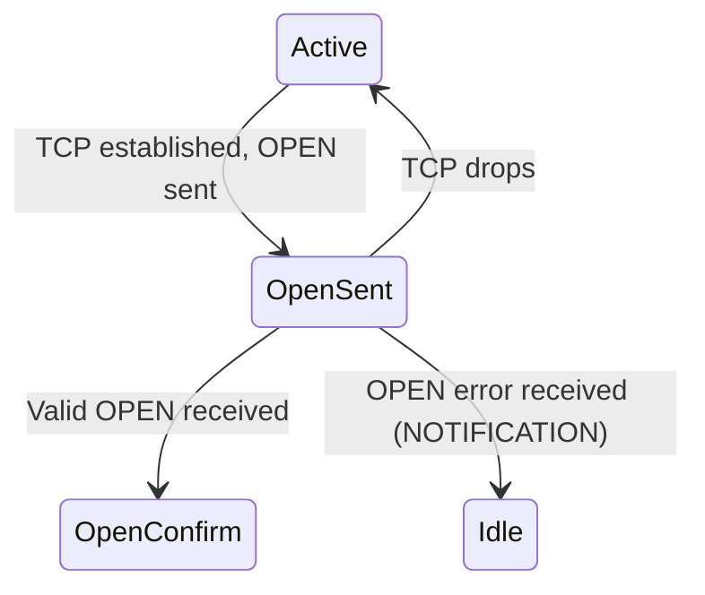

# How to Troubleshoot BGP Neighbor State Stuck in OpenSent

Author: [nawazdhandala](https://www.github.com/nawazdhandala)

Tags: BGP, Troubleshooting, OpenSent, Cisco IOS, Networking

Description: Learn how to diagnose BGP sessions stuck in the OpenSent state by identifying mismatched OPEN message parameters like hold time, BGP version, and router ID conflicts.

## What Is the OpenSent State?

OpenSent means the local router has established a TCP connection to the BGP neighbor and sent an OPEN message, but has not yet received a valid OPEN message back. The session is waiting for the peer to respond to the OPEN message.



## Step 1: Confirm the Session Is in OpenSent

```text
Router# show ip bgp summary

Neighbor        V     AS   MsgRcvd MsgSent   TblVer  InQ OutQ Up/Down  State/PfxRcd
203.0.113.2     4  65002        1       1        0    0    0  00:02:00  OpenSent
```

`MsgSent: 1` and `MsgRcvd: 0` (or low) is characteristic of OpenSent-the OPEN was sent but nothing valid has come back.

## Step 2: Check for NOTIFICATION Messages in Logs

When a BGP OPEN is rejected, the peer sends a NOTIFICATION message with an error code. Check system logs:

```text
Router# show log | include BGP|NOTIFICATION

! Common notification messages:
! %BGP-3-NOTIFICATION: received from neighbor 203.0.113.2 2/2 (peer in wrong AS) 0 bytes
! %BGP-3-NOTIFICATION: received from neighbor 203.0.113.2 2/6 (Unacceptable Hold Time) 0 bytes
! %BGP-3-NOTIFICATION: received from neighbor 203.0.113.2 2/4 (Bad BGP Identifier) 0 bytes
```

## Step 3: Identify Error Code Meaning

| Error Code | Sub-code | Meaning |
|---|---|---|
| 2/2 | Peer in wrong AS | AS number mismatch in OPEN |
| 2/6 | Unacceptable Hold Time | Hold timer mismatch |
| 2/4 | Bad BGP Identifier | Duplicate Router ID detected |
| 2/8 | Unsupported Optional Parameter | Capability mismatch |

## Step 4: Fix AS Number Mismatch (Error 2/2)

The most common OpenSent issue is an AS number mismatch:

```text
! Verify what AS you configured for the neighbor
Router# show run | section router bgp

! If error 2/2 appears, the remote-as configured doesn't match
! the AS in the peer's OPEN message

! Correct it:
router bgp 65001
 no neighbor 203.0.113.2 remote-as 65002   ! Remove wrong AS
 neighbor 203.0.113.2 remote-as 65003       ! Add correct AS
```

## Step 5: Fix Hold Time Mismatch (Error 2/6)

BGP requires a minimum hold time of 3 seconds. If one side sends 0 (disable hold timer) and the other doesn't accept it:

```text
! Check configured hold time
Router# show ip bgp neighbors 203.0.113.2 | include hold

! Set a compatible hold time (negotiated to the lower of the two values)
! Both sides set a non-zero hold time >= 3 seconds:
router bgp 65001
 neighbor 203.0.113.2 timers 30 90   ! keepalive=30s, hold=90s
```

The hold time is negotiated to the lower of the two values in the OPEN messages.

## Step 6: Fix Duplicate Router ID (Error 2/4)

Two BGP routers in the same AS cannot have the same Router ID:

```text
! Check Router ID on both routers
Router1# show ip bgp | include local router ID
Router2# show ip bgp | include local router ID

! If IDs are the same, change one
Router2(config)# router bgp 65001
Router2(config-router)# bgp router-id 2.2.2.2
```

For eBGP sessions, Router ID conflicts are possible if both routers share the same management IP or if loopbacks are identically numbered.

## Step 7: Debug BGP OPEN Messages

For detailed OPEN message inspection:

```text
! Enable BGP open message debugging (use carefully)
Router# debug ip bgp 203.0.113.2 events
Router# debug ip bgp 203.0.113.2 opens

! Look for:
! BGP: 203.0.113.2 OPEN rcvd: version 4, my as 65003, holdtime 90, id 3.3.3.3
! BGP: 203.0.113.2 OPEN has AS mismatch: received 65003, expected 65002

Router# no debug all
```

## Step 8: Check for Capability Negotiation Issues

If a peer doesn't support a BGP capability you're advertising (like multiprotocol extensions), disable it:

```text
! Disable capability negotiation if peer doesn't support it
router bgp 65001
 neighbor 203.0.113.2 dont-capability-negotiate
```

## Conclusion

BGP sessions stuck in OpenSent indicate that the TCP session was established but the OPEN message exchange failed. Always start by checking system logs for NOTIFICATION error codes. AS number mismatches (error 2/2) are most common-verify with `show run` that `remote-as` matches the peer's actual AS. For hold time or Router ID issues, adjust the relevant parameters and clear the session to retry.
