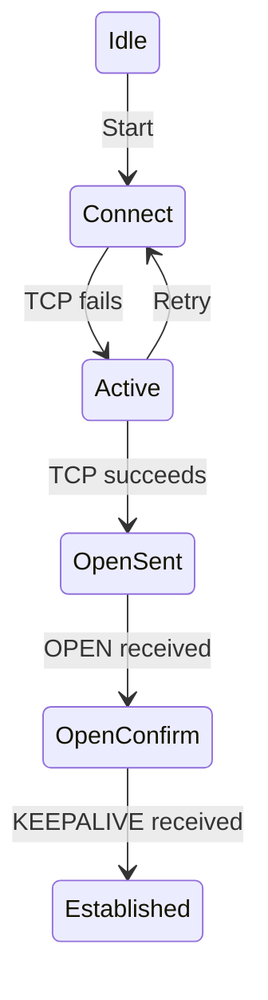

# How to Troubleshoot BGP Neighbor State Stuck in Active

Author: [nawazdhandala](https://www.github.com/nawazdhandala)

Tags: BGP, Troubleshooting, Cisco IOS, Active State, Networking

Description: Learn how to diagnose and fix BGP neighbor sessions stuck in the Active state by systematically checking TCP connectivity, AS numbers, and authentication.

## What Does "Active" State Mean?

In BGP, the Active state means the router is trying to establish a TCP connection to the neighbor but has not succeeded. It is actively trying-hence the name. This is different from Idle (not trying) and Established (fully connected).



## Step 1: Verify the Session Is Stuck

```text
Router# show ip bgp summary

Neighbor        V     AS   MsgRcvd MsgSent   TblVer  InQ OutQ Up/Down  State/PfxRcd
203.0.113.2     4  65002        0       0        0    0    0  never    Active
```

The `State/PfxRcd` column shows `Active` instead of a prefix count.

## Step 2: Check IP Reachability

The most common cause of Active state is that the neighbor IP is unreachable:

```text
! Ping the neighbor IP
Router# ping 203.0.113.2

! If ping fails, check the route to the neighbor
Router# show ip route 203.0.113.2

! If using loopback peering, ping the loopback with source
Router# ping 2.2.2.2 source 1.1.1.1
```

If ping fails, fix the underlying routing or interface issue first.

## Step 3: Verify TCP Port 179 Is Reachable

BGP uses TCP port 179. An ACL or firewall might be blocking it:

```text
! Test TCP connection to port 179
Router# telnet 203.0.113.2 179

! Check for ACLs on the interface
Router# show ip interface GigabitEthernet0/0

! Check for ACLs that might block TCP 179
Router# show ip access-lists
```

If telnet to port 179 fails but ping works, a firewall is blocking BGP.

## Step 4: Verify AS Number Configuration

A mismatched AS number is a common cause of Active state. The session establishes TCP, then drops when the OPEN message reveals an unexpected AS number:

```text
! Verify what AS you're expecting from the neighbor
Router# show run | section router bgp

! The neighbor statement must match the peer's actual AS
! router bgp 65001
!  neighbor 203.0.113.2 remote-as 65002   <- must match peer's AS
```

Confirm the remote router's AS number with the peer directly.

## Step 5: Check Authentication Mismatch

If MD5 authentication is configured on one side but not the other (or passwords don't match), the TCP SYN has an MD5 signature that the peer drops:

```text
! Check if authentication is configured
Router# show run | section neighbor 203.0.113.2

! If one side has 'password' and the other doesn't, the SYN is dropped
! Enable TCP debugging to see authentication failures
Router# debug ip bgp 203.0.113.2 events
```

## Step 6: Enable BGP Debugging

If the above checks don't reveal the issue, enable BGP event debugging:

```text
! Enable debug for specific neighbor only (be careful on production)
Router# debug ip bgp 203.0.113.2 events

! Watch for messages like:
! BGP: 203.0.113.2 active open failed - connection refused
! BGP: 203.0.113.2 open active, local address 203.0.113.1
```

Turn off debugging immediately after gathering information:

```text
Router# no debug all
```

## Step 7: Check the update-source Configuration

For loopback-based iBGP peering, the `update-source` must be configured or the TCP connection comes from the wrong IP:

```text
! Verify update-source is set for loopback peering
Router# show run | section router bgp

! If peering to 2.2.2.2 (loopback), must have:
! neighbor 2.2.2.2 update-source Loopback0

! Without update-source, the TCP session sources from a physical interface
! that may not match what the peer expects
```

## Step 8: Check ebgp-multihop for Non-Directly-Connected Peers

eBGP sessions to non-directly-connected peers require `ebgp-multihop`:

```text
! If the neighbor is not directly connected, add multihop
router bgp 65001
 neighbor 203.0.113.5 remote-as 65002
 neighbor 203.0.113.5 ebgp-multihop 2
```

Without multihop, the TTL=1 on eBGP packets will cause them to be dropped by intermediate hops.

## Summary Checklist

| Check | Command |
|---|---|
| IP reachability | `ping <neighbor>` |
| Route to neighbor | `show ip route <neighbor>` |
| TCP port 179 | `telnet <neighbor> 179` |
| AS number | `show run \| section router bgp` |
| MD5 password | `show run \| include password` |
| update-source | `show run \| include update-source` |
| ACL blocking | `show ip access-lists` |

## Conclusion

BGP Active state almost always indicates a TCP connectivity problem: the neighbor IP is unreachable, port 179 is blocked, the AS number is wrong, or authentication is mismatched. Work through the checklist systematically-start with `ping`, then check AS numbers and authentication-and use `debug ip bgp events` only after confirming basic connectivity.
