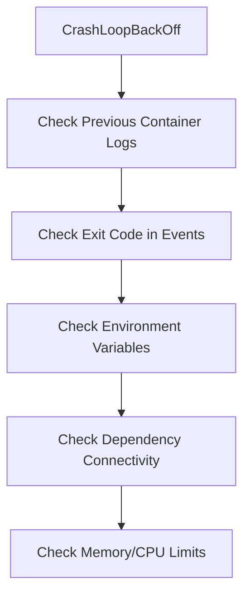

# How to Troubleshoot CrashLoopBackOff Errors in Portainer - Troubleshoot

Author: [nawazdhandala](https://www.github.com/nawazdhandala)

Tags: Portainer, Kubernetes, CrashLoopBackOff, Troubleshooting, Debugging

Description: Debug and fix CrashLoopBackOff errors in Kubernetes containers using Portainer's log viewer, pod events, and console access.

---

CrashLoopBackOff means your container is starting, crashing, and Kubernetes is backing off retrying. The application is exiting with a non-zero exit code. Portainer provides the log access and event view needed to find the root cause.

## Diagnostic Steps



## Step 1: View Previous Container Logs

In Portainer, open the pod, click **Logs**, and enable **Previous container**. This shows the stdout/stderr from the instance that crashed:

```bash
## kubectl equivalent
kubectl logs <pod-name> --previous -n <namespace>
```

Common crash messages to look for:
- \`Error: cannot find module\` - missing dependency in image
- \`connection refused\` - database or service not available
- \`invalid value for environment variable\` - misconfigured env
- \`OOMKilled\` - ran out of memory

## Step 2: Check the Exit Code

In pod events, the exit code tells you what went wrong:

| Exit Code | Meaning |
|---|---|
| 1 | General application error |
| 137 | OOMKilled (SIGKILL from kernel) |
| 139 | Segmentation fault |
| 143 | SIGTERM (container asked to stop) |

## Step 3: Verify Environment Variables

Missing or wrong environment variables are a common crash cause. Use Portainer's pod detail to inspect configured env vars, or add a debug init container:

```yaml
initContainers:
  - name: debug-env
    image: busybox
    command: ["env"]
```

## Step 4: Use a Debug Container

Replace the failing container with a long-running debug container to inspect the environment:

```yaml
## Temporarily replace the command to prevent crash
command: ["sleep", "3600"]
```

Deploy this version, exec into the container via Portainer's Console, and run the original startup command manually to see its output.

## Step 5: Increase Memory Limits

If exit code 137 (OOMKilled), increase the memory limit:

```yaml
resources:
  limits:
    memory: "1Gi"   # Increase from previous value
  requests:
    memory: "512Mi"
```

## Summary

CrashLoopBackOff requires reading application logs from the crashed instance. Portainer's previous-container log view makes this accessible without kubectl. Start with logs, check the exit code, verify environment variables, and test dependency connectivity to resolve the majority of crash cases.
