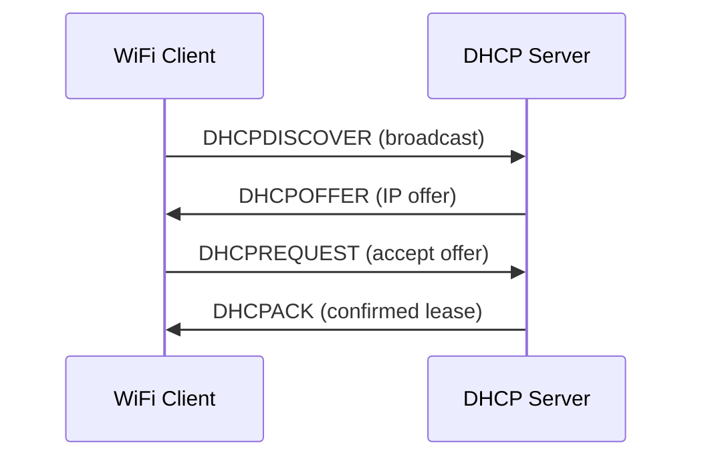

# How to Troubleshoot DHCP Issues on WiFi Networks

Author: [nawazdhandala](https://www.github.com/nawazdhandala)

Tags: DHCP, WiFi, Troubleshooting, Network, IP Address

Description: Learn how to systematically troubleshoot DHCP failures on WiFi networks, from client-side failures to DHCP server configuration issues.

## DHCP Process Overview

DHCP follows a four-step DORA process:



A failure at any step causes the client to get no IP or an APIPA address (169.254.x.x).

## Step 1: Identify the Failure Point

```bash
# Linux: Watch DHCP negotiation
sudo dhclient -v -i wlan0 2>&1 | head -30

# Or with journald
journalctl -u NetworkManager -f | grep -i dhcp

# Windows: View DHCP events
# Event Viewer → Windows Logs → System → Filter for "DHCPv4"

# macOS:
sudo ipconfig set en0 BOOTP
sudo ipconfig set en0 DHCP
# Watch /var/log/system.log for DHCP messages
```

## Step 2: Check DHCP Lease on the Router/Server

On the DHCP server or router:

```bash
# Linux DHCP server (ISC DHCPD) - view active leases
cat /var/lib/dhcp/dhcpd.leases | grep -A8 "lease 192.168"

# dnsmasq - view leases
cat /var/lib/misc/dnsmasq.leases

# Check if pool is exhausted
grep "no free leases" /var/log/syslog

# Router CLI (Cisco IOS)
show ip dhcp pool
show ip dhcp binding
show ip dhcp statistics
```

## Step 3: Verify DHCP Server Configuration

```bash
# Check ISC DHCPD configuration
cat /etc/dhcp/dhcpd.conf

# Verify the subnet definition matches the interface
subnet 192.168.1.0 netmask 255.255.255.0 {
    range 192.168.1.100 192.168.1.200;
    option routers 192.168.1.1;
    option domain-name-servers 8.8.8.8;
    default-lease-time 3600;
    max-lease-time 7200;
}

# Check if DHCPD is running on the correct interface
grep -E "INTERFACES|INTERFACESv4" /etc/default/isc-dhcp-server
# Should list your server's interface: INTERFACES="eth0"
```

## Step 4: Test DHCP with a Manual DHCP Request

```bash
# Linux: Manual DHCP request (kills existing connection)
sudo dhclient -r wlan0   # Release
sudo dhclient -v wlan0   # Request new lease

# Force DHCP renewal
sudo dhclient -1 wlan0

# Windows:
ipconfig /release
ipconfig /renew

# macOS:
sudo ipconfig set en0 DHCP
```

## Step 5: Capture DHCP Traffic

```bash
# Capture DHCP traffic (UDP ports 67 and 68)
sudo tcpdump -i wlan0 -n port 67 or port 68 -vv

# Output should show DISCOVER → OFFER → REQUEST → ACK sequence
# If no OFFER is seen, the server is not responding
# If REQUEST is seen but no ACK, the server is rejecting the request

# Save for Wireshark analysis
sudo tcpdump -i wlan0 -w /tmp/dhcp-capture.pcap port 67 or port 68
```

## Step 6: Common DHCP Issues and Fixes

**Pool Exhausted:**
```bash
# Expand the DHCP pool
# In dhcpd.conf:
range 192.168.1.50 192.168.1.250;    # Was .100-.150

# Delete old stale leases
echo "" > /var/lib/dhcp/dhcpd.leases
systemctl restart isc-dhcp-server
```

**DHCP Server Not Receiving Broadcasts:**
```bash
# Check if firewall is blocking UDP 67/68
sudo iptables -L INPUT -n | grep -E "67|68"

# Allow DHCP
sudo iptables -I INPUT -p udp --dport 67 -j ACCEPT
sudo iptables -I INPUT -p udp --dport 68 -j ACCEPT
```

**DHCP on Wrong Interface:**
```bash
# Ensure DHCP server listens on the right interface
# /etc/default/isc-dhcp-server
INTERFACESv4="eth0"    # Not wlan0 if this is the server's wired interface
```

## Conclusion

DHCP issues on WiFi are diagnosed by tracing the DORA sequence: use `sudo dhclient -v wlan0` to watch the negotiation, `tcpdump port 67 or port 68` to capture packets, and check the DHCP server logs for pool exhaustion or rejection messages. The most common causes are exhausted DHCP pools, firewall blocking UDP 67/68, and the DHCP server not listening on the correct interface.
