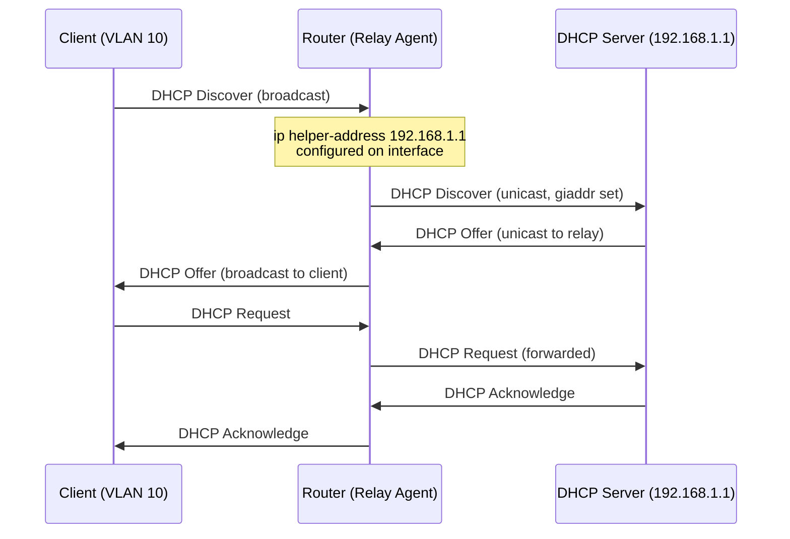

# How to Troubleshoot DHCP Relay Agent Not Forwarding Requests

Author: [nawazdhandala](https://www.github.com/nawazdhandala)

Tags: DHCP Relay, Ip helper-address, Troubleshooting, Network, Cisco

Description: Learn how to diagnose and fix DHCP relay agent issues where clients in remote subnets cannot get IP addresses because relay agents are not properly forwarding DHCP Discover packets to the DHCP server.

## How DHCP Relay Works



## Step 1: Confirm the Problem

```bash
# On client side - check if DHCP is failing

# Linux
sudo dhclient -v eth0 2>&1 | head -20
# Look for: "No DHCPOFFERS received" - relay not forwarding

# Windows
ipconfig /release
ipconfig /renew
# If it gets 169.254.x.x = DHCP failed completely

# Check if other VLANs (on same DHCP server) work
# If VLAN 20 works but VLAN 10 doesn't: relay issue specific to VLAN 10
```

## Step 2: Check Relay Agent Configuration (Cisco IOS)

```text
! Check if ip helper-address is configured on the client VLAN interface
Router# show run interface Vlan10
!
interface Vlan10
 ip address 10.10.0.1 255.255.255.0
 ip helper-address 192.168.1.100    ! DHCP server address - must be here
!
! If helper-address is missing, add it:
Router# configure terminal
Router(config)# interface Vlan10
Router(config-if)# ip helper-address 192.168.1.100
Router(config-if)# end
Router# write memory

! Verify relay statistics
Router# show ip dhcp relay information statistics
```

## Step 3: Verify Routing Between Relay and DHCP Server

```bash
# The relay agent must be able to route to the DHCP server
# Test from the router (Cisco)
Router# ping 192.168.1.100 source Vlan10

# If ping fails, routing between relay and DHCP server is broken
# Check routing table
Router# show ip route 192.168.1.100

# Linux relay agent (dhcrelay) - check routing
ip route get 192.168.1.100
# Must show a valid route, not "unreachable"
```

## Step 4: Check DHCP Server for Scope Issues

```bash
# ISC DHCPD - verify subnet scope exists for the relay VLAN
# /etc/dhcp/dhcpd.conf must have a subnet matching the relay's giaddr

# The giaddr is the relay agent's IP on the client VLAN (10.10.0.1)
# DHCPD needs a subnet declaration for 10.10.0.0

cat /etc/dhcp/dhcpd.conf
# Must contain:
# subnet 10.10.0.0 netmask 255.255.255.0 {
#   range 10.10.0.100 10.10.0.200;
#   option routers 10.10.0.1;
# }

# Check DHCPD logs for relay requests
journalctl -u isc-dhcp-server | grep "10.10.0" | tail -20
# Look for: DHCPDISCOVER from xx:xx:xx:xx via 10.10.0.1
```

## Step 5: Check Firewall Rules

```bash
# DHCP uses UDP 67 (server) and 68 (client)
# Firewall must allow relay traffic

# On Linux relay host - check iptables
sudo iptables -L -n | grep -E "67|68"

# Allow DHCP relay traffic
sudo iptables -I INPUT -p udp --dport 67 -j ACCEPT
sudo iptables -I INPUT -p udp --dport 68 -j ACCEPT
sudo iptables -I FORWARD -p udp --dport 67 -j ACCEPT
sudo iptables -I FORWARD -p udp --dport 68 -j ACCEPT

# On DHCP server - must accept relay traffic from relay agent IP
sudo iptables -I INPUT -s 10.10.0.1 -p udp --dport 67 -j ACCEPT
```

## Step 6: Deploy Linux DHCP Relay Agent (dhcrelay)

```bash
# Install
sudo apt-get install isc-dhcp-relay   # Debian/Ubuntu
sudo yum install dhcp                  # RHEL/CentOS

# Configure
sudo tee /etc/default/isc-dhcp-relay << 'EOF'
# DHCP servers to relay to
SERVERS="192.168.1.100"

# Interfaces to listen on (client side)
INTERFACES="eth1"

# Additional options
OPTIONS=""
EOF

sudo systemctl enable isc-dhcp-relay
sudo systemctl start isc-dhcp-relay

# Verify relay is running and listening
ss -ulnp | grep :67
```

## Step 7: Capture DHCP Traffic to Confirm Relay

```bash
# On relay agent - capture DHCP traffic on both interfaces
# Client-facing interface (should see broadcasts)
sudo tcpdump -i eth1 -n port 67 or port 68 -v

# Server-facing interface (should see unicast relay)
sudo tcpdump -i eth0 -n port 67 or port 68 -v

# Expected relay flow:
# eth1: 0.0.0.0.68 > 255.255.255.255.67: BOOTP/DHCP Request (Discover)
# eth0: 10.10.0.1.67 > 192.168.1.100.67: BOOTP/DHCP Request (Discover) <- relay
# eth0: 192.168.1.100.67 > 10.10.0.1.67: BOOTP/DHCP Reply (Offer)
# eth1: 10.10.0.1.67 > 255.255.255.255.68: BOOTP/DHCP Reply (Offer)
```

## Conclusion

DHCP relay failures are diagnosed by checking for `ip helper-address` on the client VLAN interface (Cisco), verifying routing between the relay and DHCP server with a sourced ping, and confirming the DHCP server has a subnet scope matching the relay's giaddr. Use `tcpdump port 67 or port 68` on both relay interfaces to trace exactly where the DHCP conversation breaks down.
