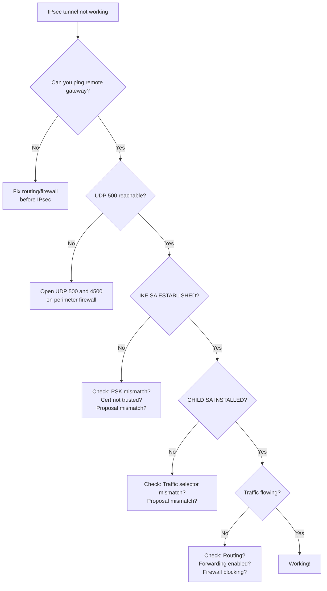

# How to Troubleshoot IPsec IPv6 Connection Failures

Author: [nawazdhandala](https://www.github.com/nawazdhandala)

Tags: IPv6, IPsec, Troubleshooting, strongSwan, Debugging

Description: Systematic guide to diagnosing and resolving IPv6 IPsec connection failures, covering IKEv2 negotiation errors, authentication failures, and traffic flow issues.

## Overview

IPv6 IPsec troubleshooting follows a systematic process: verify network reachability, check IKEv2 negotiation, validate authentication, confirm SA installation, and test traffic flow. This guide provides a diagnostic flowchart and solutions for the most common failure modes.

## Troubleshooting Flowchart



## Step 1: Verify Network Reachability

```bash
# Can you reach the remote gateway?
ping6 -c 3 2001:db8:gw2::1

# Is UDP 500 (IKE) reachable? Use netcat or nmap
nmap -6 -p U:500,U:4500 2001:db8:gw2::1

# Check for blocking firewalls
tcpdump -i eth0 'udp port 500 and host 2001:db8:gw2::1' &
swanctl --initiate conn:my-vpn
# Should see outbound packet — if no response, remote firewall is blocking
```

## Step 2: Analyze IKEv2 Negotiation

```bash
# Enable IKEv2 debugging in strongSwan
# /etc/strongswan.d/charon.conf or /etc/strongswan.conf
charon {
    filelog {
        /var/log/charon.log {
            default = 1
            ike = 3
            cfg = 2
            net = 2
        }
    }
}

# Restart and monitor
systemctl restart strongswan
tail -f /var/log/charon.log

# Initiate tunnel
swanctl --initiate conn:my-vpn

# Key messages to look for:
# "IKE_SA_INIT request 0 sent to 2001:db8:gw2::1"  ← Request sent
# "received IKE_SA_INIT response"                    ← Response received
# "authentication of 'gw2.example.com' with RSA signature successful"  ← Auth OK
# "CHILD_SA site1-site2 established"                ← Tunnel up
```

## Common Failure: NO_PROPOSAL_CHOSEN

```
Error in log:
"received NO_PROPOSAL_CHOSEN notify error"
→ Cipher suite mismatch between initiator and responder

Diagnosis:
# Enable detailed logging and look for:
# "no acceptable PROPOSAL found"

Fix: Ensure both sides have matching proposals
# GW1:
proposals = aes256-sha256-ecp256
esp_proposals = aes256gcm128-prfsha256-ecp256

# GW2 must have the SAME proposals
# Test with a broader proposal set first to identify accepted ciphers:
proposals = aes256-sha256-ecp256,aes256-sha256-modp2048
```

## Common Failure: AUTHENTICATION_FAILED

```
Error in log:
"received AUTHENTICATION_FAILED notify error"

Possible causes:
1. PSK mismatch
   → Verify identical PSK on both ends
   → Check for whitespace or encoding differences

2. Certificate not trusted
   → Verify CA cert is in /etc/swanctl/x509ca/ on both sides
   → Check certificate validity dates
   openssl x509 -in gw2.crt -noout -dates

3. ID mismatch
   → Check that 'id' in local/remote blocks matches certificate CN or SubjectAltName
   → Or for PSK: check that 'id' in secrets block matches
```

```bash
# Debug certificate validation
# Run with extra certificate debugging
strongswan:
charon {
    filelog {
        /var/log/charon.log {
            cert = 4   ! Maximum cert debugging
        }
    }
}
```

## Common Failure: CHILD_SA Installation Fails

```
IKE SA established but CHILD_SA fails:
"TS_UNACCEPTABLE: traffic selectors didn't match"
→ local_ts/remote_ts don't match between peers

# GW1 expects:
local_ts  = 2001:db8:site1::/48
remote_ts = 2001:db8:site2::/48

# GW2 must have the MIRROR:
local_ts  = 2001:db8:site2::/48
remote_ts = 2001:db8:site1::/48
```

## Common Failure: SA Installed But No Traffic

```bash
# SA is UP, but traffic not flowing

# 1. Check forwarding is enabled
sysctl net.ipv6.conf.all.forwarding
# Must be 1

# 2. Check routing — does a route exist to remote site?
ip -6 route | grep site2

# 3. Check if traffic matches IPsec policy
# Use ip xfrm to test policy lookup
ip xfrm policy get src 2001:db8:site1::10 dst 2001:db8:site2::10 proto tcp dir out

# 4. Check firewall forwarding rules
ip6tables -L FORWARD -n -v | grep site2

# 5. Check if traffic is being encrypted
ip -s xfrm state list | grep bytes
# The byte counters should increase when you send traffic
```

## Common Failure: MTU / Fragmentation

```bash
# Symptom: Large transfers fail, small packets work
# Cause: IPsec adds ~50-80 bytes overhead, exceeding MTU

# Test with explicit packet sizes
ping6 -c 3 -s 1400 2001:db8:site2::1   # Should work
ping6 -c 3 -s 1450 2001:db8:site2::1   # May fail

# Fix: Reduce MTU on client interfaces or adjust TCP MSS
ip6tables -t mangle -A FORWARD -p tcp --tcp-flags SYN,RST SYN \
  -m tcp -j TCPMSS --set-mss 1360

# Or set lower MTU on VPN hosts
ip link set eth0 mtu 1400
```

## Quick Diagnostic Commands

```bash
# All in one diagnostic snapshot
echo "=== IKE SAs ==="
swanctl --list-sas

echo "=== XFRM States ==="
ip xfrm state list

echo "=== XFRM Policies ==="
ip xfrm policy list

echo "=== IPv6 Routes ==="
ip -6 route

echo "=== Forwarding ==="
sysctl net.ipv6.conf.all.forwarding

echo "=== Recent strongSwan logs ==="
journalctl -u strongswan --since "5 minutes ago" | tail -50
```

## Summary

IPv6 IPsec troubleshooting proceeds in order: network reachability → IKE negotiation → authentication → CHILD SA installation → traffic flow. The most common failures are: NO_PROPOSAL_CHOSEN (mismatched cipher suites — verify both sides have identical `proposals`/`esp_proposals`), AUTHENTICATION_FAILED (wrong PSK or untrusted certificate), TS_UNACCEPTABLE (traffic selector mismatch — `local_ts`/`remote_ts` must mirror on each side), and MTU issues (large transfers fail due to ESP overhead). Enable `ike = 3` in charon.conf for detailed negotiation logs.
