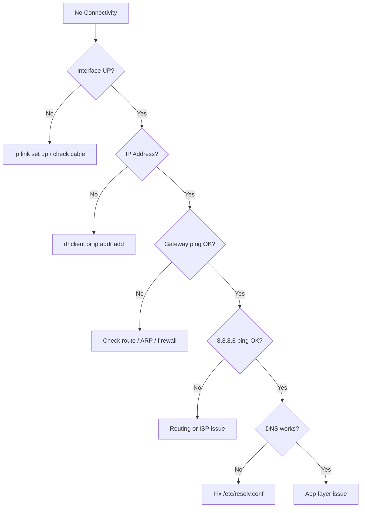

# How to Troubleshoot IPv4 Network Connectivity Issues on Linux

Author: [nawazdhandala](https://www.github.com/nawazdhandala)

Tags: Linux, Networking, IPv4, Troubleshooting, Network Diagnostics, Connectivity

Description: Systematically diagnose and resolve IPv4 connectivity failures on Linux by checking interface state, IP assignment, routing, DNS, and firewall rules in a logical order.

## Introduction

Network connectivity failures have a finite set of causes. Working through a structured checklist eliminates each layer until the fault is found. This guide provides a layered troubleshooting procedure for IPv4 on Linux.

## Step 1: Check Interface State

```bash
# Is the interface UP and has it detected a link?

ip link show eth0
# Look for: LOWER_UP (physical link detected), UP (interface enabled)
```

If missing `LOWER_UP`, check the cable or `sudo ip link set eth0 up`.

## Step 2: Check IP Address Assignment

```bash
# Does the interface have an IP address?
ip -4 addr show eth0
```

If no address: either run `sudo dhclient eth0` or assign a static address with `sudo ip addr add`.

## Step 3: Check the Default Route

```bash
# Is there a default gateway?
ip route show default
```

If missing: `sudo ip route add default via <gateway>`. If you don't know the gateway, check other hosts on the same subnet or consult your network team.

## Step 4: Ping the Gateway

```bash
# Can you reach the local gateway?
ping -c 3 $(ip route show default | awk '/default/{print $3}')
```

If gateway ping fails: check ARP (`ip neigh show`), check if the gateway IP is correct, and verify no firewall is blocking ICMP.

## Step 5: Ping a Known External IP

```bash
# Skip DNS - ping a raw IP to test internet reachability
ping -c 3 8.8.8.8
```

If this fails but the gateway responded: routing issue at the ISP or firewall blocking outbound traffic.

## Step 6: Test DNS Resolution

```bash
# If pinging 8.8.8.8 works but domain names fail, it's DNS
nslookup google.com
dig google.com

# Check /etc/resolv.conf
cat /etc/resolv.conf
```

Fix: set correct DNS in `/etc/resolv.conf`, systemd-resolved, or NetworkManager.

## Step 7: Check iptables Firewall

```bash
# Are any iptables rules blocking traffic?
sudo iptables -L -n -v | grep -E "DROP|REJECT"

# Quick test: temporarily flush all rules
sudo iptables -F
# If connectivity restores, a firewall rule was the cause
# Re-add rules carefully after diagnosing
```

## Step 8: Check Routing on Remote End

```bash
# Trace the path to the destination
traceroute -I 8.8.8.8
mtr -n 8.8.8.8

# Is there an asymmetric routing issue?
# Check what route would be used
ip route get 8.8.8.8
```

## Step 9: Check for Duplicate IPs

```bash
# Use arping to detect if another host has the same IP
sudo arping -D -I eth0 192.168.1.100
# Exit code 0 = IP is unique, exit code 1 = duplicate detected
```

## Step 10: Check MTU Issues

Large packets failing while small packets succeed indicates an MTU mismatch:

```bash
# Test with large packets
ping -s 1400 -M do 8.8.8.8

# If this fails but small ping works, there is an MTU issue
# Reduce MTU temporarily to test
sudo ip link set eth0 mtu 1400
```

## Troubleshooting Decision Tree



## Conclusion

Work through the layers: physical link → IP address → gateway reachability → internet IP → DNS. Each step narrows the search space. Most Linux connectivity issues are resolved by step 6 (DNS) - the IP stack is working but name resolution is broken.
