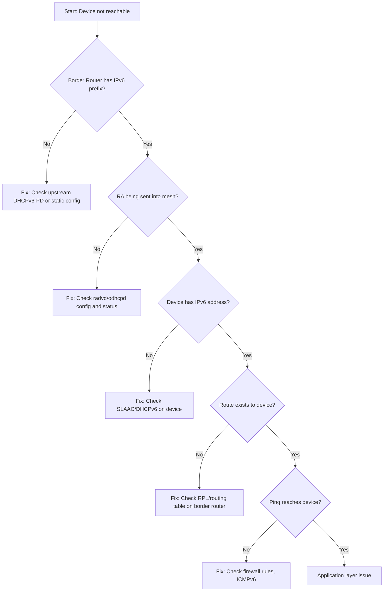

# How to Troubleshoot IPv6 IoT Connectivity Issues

Author: [nawazdhandala](https://www.github.com/nawazdhandala)

Tags: IPv6, IoT, Troubleshooting, Debugging, Networking, Connectivity

Description: Systematically troubleshoot IPv6 connectivity issues in IoT deployments, from border router prefix delegation failures to individual device connectivity problems.

## Introduction

IPv6 IoT connectivity issues can occur at multiple layers: the border router may fail to receive a prefix delegation from upstream, the mesh may not form correctly, individual devices may fail to obtain addresses, or application-level communication may fail despite network connectivity. This guide provides a systematic troubleshooting approach.

## Troubleshooting Hierarchy



## Step 1: Verify Border Router Prefix

```bash
# Check if border router received a prefix delegation from upstream

ip -6 addr show eth0   # Upstream interface
# Should show a global unicast address

# Check if prefix was assigned to the mesh interface
ip -6 addr show lowpan0
# Should show a /64 derived from the delegated prefix

# If no prefix on lowpan0, check radvd configuration
sudo systemctl status radvd
sudo journalctl -u radvd -n 30
```

## Step 2: Verify Router Advertisement Delivery

```bash
# From a device on the same segment, check for RA
rdisc6 lowpan0

# From the border router, capture RA packets being sent
sudo tcpdump -i lowpan0 "icmp6 and ip6[40] == 134" -c 5 -v

# Check if radvd is running and configured correctly
cat /etc/radvd.conf
sudo systemctl restart radvd
```

## Step 3: Check Device IPv6 Address Assignment

On a constrained device (RIOT OS):
```bash
# In RIOT shell, check interface status
> ifconfig
# Should show: inet6 addr: <global address>  scope: global  VAL

# Check for RPL parent (for mesh devices)
> rpl
# Should show parent information and DODAG status
```

On a Linux-based IoT gateway:
```bash
# Check if SLAAC address was formed
ip -6 addr show scope global

# If no address, check if RA is being received
ip -6 route show default
# Should show: default via fe80::... dev eth0 proto ra

# Force RA request
sudo ndisc6 -r 3 eth0
# or
sudo ip link set eth0 down && sudo ip link set eth0 up
```

## Step 4: Verify Routing

```bash
# From border router, check if device address is in routing table
ip -6 route show | grep "2001:db8:iot:"

# Check IPv6 neighbor cache (ARP equivalent for IPv6)
ip -6 neigh show dev lowpan0
# Device should appear as REACHABLE or STALE

# Test with a simple ping to the device
ping6 -c 3 2001:db8:iot:1::sensor1

# If ping fails but device is in neigh cache, check firewall
ip6tables -L FORWARD -n -v | grep ACCEPT
```

## Step 5: Check Firewall Rules

```bash
# Check if ICMPv6 is allowed (required for IPv6)
ip6tables -L FORWARD -n | grep icmpv6
# Must have ACCEPT for icmpv6

# Check if the device's traffic is being blocked
ip6tables -L FORWARD -n -v
# Add logging to debug
ip6tables -I FORWARD -s 2001:db8:iot:1::sensor1 -j LOG --log-prefix "IoT-DEBUG: "
# Then check: journalctl -k | grep "IoT-DEBUG"
```

## Step 6: Application-Level Debugging

For CoAP devices:
```bash
# Test CoAP connectivity
coap-client -m GET coap://[2001:db8:iot:1::sensor1]/

# Use verbose mode to see DTLS handshake issues
coap-client -v 6 -m GET coap://[2001:db8:iot:1::sensor1]/.well-known/core

# Check if the device's CoAP port is open
# (using a TCP/UDP scan - note CoAP uses UDP 5683)
nmap -6 -sU -p 5683 2001:db8:iot:1::sensor1
```

## Common Issues and Solutions

| Symptom | Likely Cause | Solution |
|---|---|---|
| No global IPv6 address on device | RA not received | Check radvd, verify RA with rdisc6 |
| Address assigned but no default route | RA lifetime = 0 | Check AdvDefaultLifetime in radvd.conf |
| Ping fails with "No route to host" | Missing route | Check routing table, RPL on mesh |
| Ping fails with no response | Firewall blocking | Add ICMPv6 ACCEPT rule |
| CoAP times out | DTLS failure or wrong port | Use coap-client -v 6 for details |
| Device drops out periodically | Mesh link quality | Check 802.15.4 radio interference |

## Quick Diagnostic Script

```bash
#!/bin/bash
# diagnose_iot_device.sh
# Quick diagnostic for an IPv6 IoT device

DEVICE_ADDR="${1:-2001:db8:iot:1::sensor1}"
echo "Diagnosing: $DEVICE_ADDR"

echo -n "[1] Ping test: "
if ping6 -c 2 -W 3 "$DEVICE_ADDR" > /dev/null 2>&1; then
    echo "OK"
else
    echo "FAILED"
fi

echo -n "[2] CoAP test: "
if coap-client -m GET "coap://[$DEVICE_ADDR]/.well-known/core" -B 5 > /dev/null 2>&1; then
    echo "OK"
else
    echo "FAILED (no CoAP server or wrong address)"
fi

echo "[3] Neighbor cache entry:"
ip -6 neigh show "$DEVICE_ADDR" 2>/dev/null || echo "NOT IN CACHE"

echo "[4] Route to device:"
ip -6 route get "$DEVICE_ADDR" 2>/dev/null || echo "NO ROUTE"
```

## Conclusion

IPv6 IoT connectivity troubleshooting follows a systematic path: verify the border router has a prefix, verify RAs are being sent, check device address assignment, verify routing, check firewalls, and finally test at the application layer. The combination of `rdisc6`, `ping6`, `ip -6 neigh show`, and `ip6tables -L` covers most diagnostic scenarios. For mesh networks, RPL-specific debugging tools in RIOT OS or OpenThread provide visibility into the mesh routing state.
