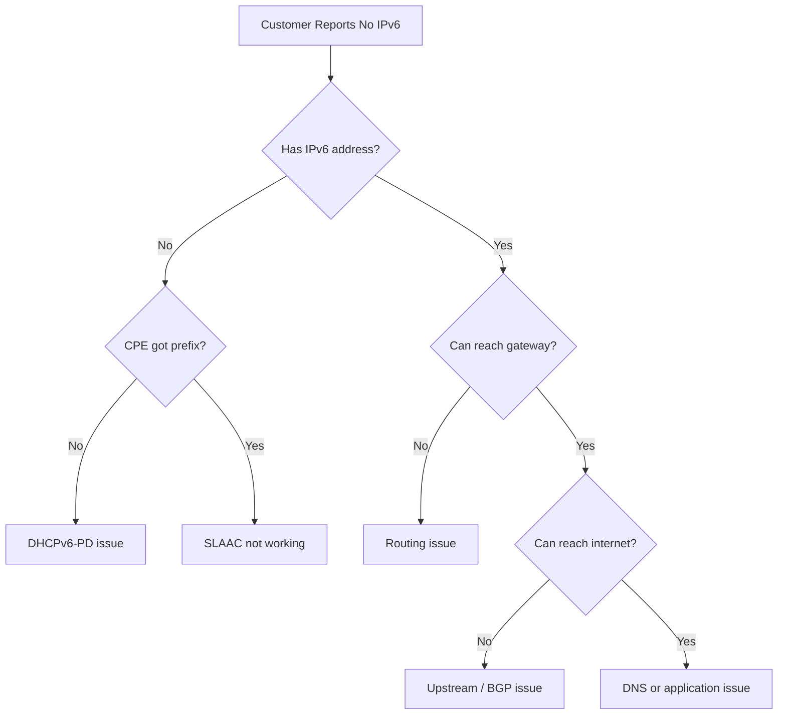

# How to Troubleshoot ISP Customer IPv6 Issues

Author: [nawazdhandala](https://www.github.com/nawazdhandala)

Tags: IPv6, ISP, Troubleshooting, DHCPv6, Customer Support

Description: Diagnose and resolve IPv6 connectivity issues for ISP residential and business customers, covering DHCPv6 failures, prefix delegation problems, and routing misconfigurations.

## Troubleshooting Flow



## Step 1: Verify CPE Has an IPv6 Prefix

Check that the customer's CPE router received a delegated prefix from the BNG/BRAS.

```bash
# On BNG - check active DHCPv6-PD leases for customer

# (Kea DHCP lease database)
mysql -u kea -p kea -e "
  SELECT address, prefixlen, dhcp_identifier, expire
  FROM lease6
  WHERE lease_type = 2           -- type 2 = prefix delegation
  AND INET6_NTOA(address) LIKE '2001:db8:home:%'
  ORDER BY expire DESC LIMIT 20;
"

# On Cisco BNG
show ipv6 dhcp binding | include "^Client\|Prefix\|Remaining"

# On Juniper MX
show dhcpv6 server binding detail | match "Prefix|State"
```

## Step 2: Check Subscriber Session on BNG

A customer with no IPv6 usually has a session issue at layer 2 or authentication.

```bash
# Cisco ASR9K - find subscriber session
show subscriber session all filter username customer@example.com detail | include IPv6

# Juniper MX
show subscribers extensive | match "User|IPv6|State"

# FreeRADIUS - check recent accounting for customer
mysql -u radius -p radius -e "
  SELECT username, framedipv6prefix, delegatedipv6prefix,
         acctstarttime, acctstoptime
  FROM radacct
  WHERE username = 'customer@example.com'
  ORDER BY acctstarttime DESC LIMIT 5;
"
```

## Step 3: Test DHCPv6-PD Relay Path

If the CPE is not getting a prefix, test the relay path from BNG to DHCPv6 server.

```bash
# From BNG, ping DHCPv6 server
ping6 2001:db8::dhcp source 2001:db8:bng::1

# Verify relay is configured on subscriber interface
# Cisco
show running-config interface Bundle-Ether1 | include dhcp

# Capture DHCPv6 traffic on BNG interface to spot failures
tcpdump -i bng0 -n 'udp port 546 or udp port 547' -c 20
```

## Step 4: Verify Routing

Even with a valid prefix, misconfigured routes will black-hole traffic.

```bash
# Check that customer prefix is in routing table
ip -6 route show 2001:db8:home:a0::/56

# On BNG - verify subscriber route is installed
show ipv6 route 2001:db8:home:a0:: detail

# Traceroute from BNG to customer prefix
traceroute6 2001:db8:home:a0::1
```

## Step 5: Test from Customer Device

Walk the customer through testing from their device to narrow scope.

```bash
# Customer runs on their device (Linux/macOS/Windows)

# 1. Check for a global IPv6 address
ip -6 addr show | grep "scope global"          # Linux
ifconfig | grep "inet6"                        # macOS
ipconfig | findstr "IPv6"                      # Windows

# 2. Check default route
ip -6 route show default
route -6 print                                 # Windows

# 3. Ping gateway
ping6 fe80::1%eth0                             # link-local gateway ping

# 4. Ping external IPv6
ping6 2606:4700:4700::1111                    # Cloudflare DNS

# 5. Test DNS over IPv6
dig AAAA google.com @2606:4700:4700::1111
```

## Step 6: Common Fixes

Address the most frequent root causes found during diagnosis.

```bash
# Fix 1: CPE not sending DHCPv6-PD request - restart DHCP client
# (on CPE running Linux)
systemctl restart dhcpcd
# or
dhclient -6 -P wan0

# Fix 2: BNG missing relay configuration
# Cisco IOS-XR
interface Bundle-Ether1.100
  ipv6 dhcp relay destination 2001:db8::dhcp

# Fix 3: DHCPv6 pool exhausted
# Check pool utilization
mysql -u kea -p kea -e "SELECT COUNT(*) FROM lease6 WHERE lease_type=2 AND expire > NOW();"

# Fix 4: Static prefix not matching RADIUS assignment
# Verify RADIUS returns correct delegated prefix
radtest -6 customer@example.com password 2001:db8::radius 1812 secret | grep -i prefix
```

## Conclusion

ISP IPv6 troubleshooting follows a layered approach: verify the subscriber session exists at the BNG, confirm DHCPv6-PD assigned a prefix, check that the prefix is routed back to the BNG, and validate that the CPE is distributing /64s to LAN devices via SLAAC. Use BNG CLI commands (`show subscriber session`, `show ipv6 dhcp binding`) and RADIUS accounting records to quickly pinpoint whether the problem is authentication, prefix delegation, routing, or DNS. Always reproduce the test from the customer device to confirm the fix before closing the ticket.
