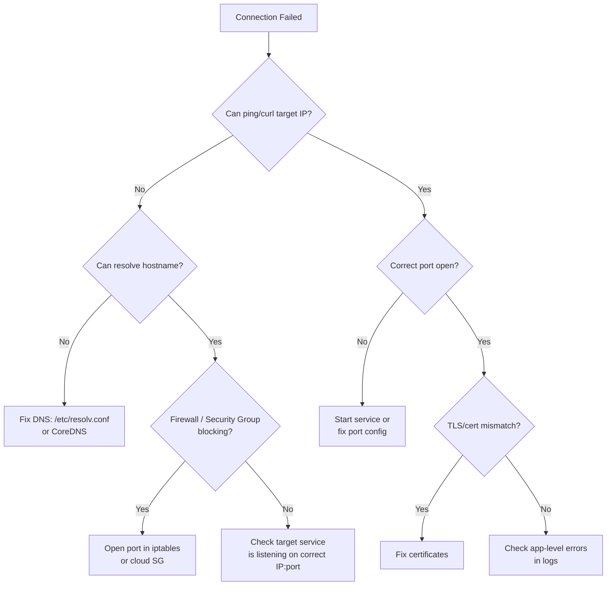

# How to Troubleshoot IPv4 Connectivity Issues Between Microservices

Author: [nawazdhandala](https://www.github.com/nawazdhandala)

Tags: Microservices, IPv4, Troubleshooting, Networking, Docker, Kubernetes

Description: Learn a systematic approach to troubleshooting IPv4 connectivity problems between microservices, covering DNS resolution, port checks, firewall rules, and container networking diagnostics.

## Troubleshooting Flowchart



## Step 1: DNS Resolution

```bash
# From inside the container / pod

nslookup auth-service.default.svc.cluster.local
dig auth-service.default.svc.cluster.local A

# Python equivalent
python3 -c "import socket; print(socket.getaddrinfo('auth-service', 80, socket.AF_INET))"
```

## Step 2: Network Reachability

```bash
# Basic ping
ping -c 4 192.168.1.10

# Check if a specific port is reachable (no nmap needed)
timeout 3 bash -c 'echo > /dev/tcp/192.168.1.10/8080' && echo "open" || echo "closed"

# curl with verbose output
curl -v http://192.168.1.10:8080/health
```

## Step 3: Verify the Service Is Listening

```bash
# On the target machine - what is actually listening?
ss -tlnp | grep 8080
netstat -tlnp | grep 8080

# Is it bound to the right address?
# "0.0.0.0:8080" → all interfaces
# "127.0.0.1:8080" → localhost only - callers on other hosts can't reach it
```

## Step 4: Firewall and Security Groups

```bash
# Check iptables rules
iptables -L INPUT -n -v | grep 8080

# Test with nmap
nmap -p 8080 192.168.1.10

# Temporarily allow port to confirm firewall is the issue
iptables -I INPUT -p tcp --dport 8080 -j ACCEPT
```

## Step 5: Kubernetes-Specific Diagnostics

```bash
# Check Service endpoints - are pods registered?
kubectl get endpoints auth-service -n default

# Exec into a pod and test
kubectl exec -it deploy/frontend -- curl http://auth-service:8080/health

# Check pod networking
kubectl get pods -o wide   # see pod IPs

# Check NetworkPolicy - may be blocking cross-namespace traffic
kubectl get networkpolicies -A
```

## Python: Connectivity Self-Test at Startup

```python
import socket
import sys

def check_service(host: str, port: int, timeout: float = 3.0) -> bool:
    try:
        with socket.create_connection((host, port), timeout=timeout):
            return True
    except (socket.timeout, ConnectionRefusedError, OSError):
        return False

# Fail fast at startup if dependencies are unreachable
dependencies = [
    ("db.internal",   5432),
    ("cache.internal",6379),
    ("auth.internal", 8080),
]

for host, port in dependencies:
    if check_service(host, port):
        print(f"OK   {host}:{port}")
    else:
        print(f"FAIL {host}:{port}", file=sys.stderr)
        sys.exit(1)
```

## Conclusion

Troubleshoot IPv4 connectivity systematically: DNS → ping/curl → port check → firewall → service binding. A service bound to `127.0.0.1` is unreachable from other hosts - it must bind to `0.0.0.0` or a specific interface IP. In Kubernetes, empty `Endpoints` objects mean no pods are ready or the label selector doesn't match. Add a startup connectivity check to microservices to fail fast and produce clear error messages instead of mysterious timeouts after deployment.
