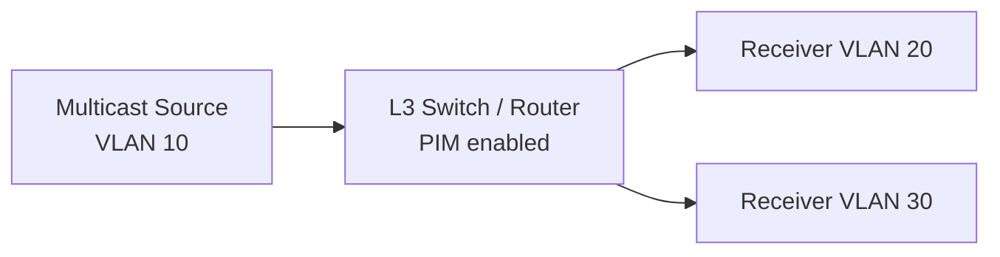

# How to Troubleshoot Multicast Not Working Across VLANs

Author: [nawazdhandala](https://www.github.com/nawazdhandala)

Tags: Networking, Multicast, VLAN, IGMP Snooping, Troubleshooting, Switching

Description: Diagnose and fix multicast delivery failures between VLANs by checking IGMP snooping, querier configuration, and inter-VLAN routing settings.

## Introduction

Multicast across VLANs fails silently — packets simply never arrive. The culprit is almost always IGMP snooping misconfiguration, a missing IGMP querier, or incorrect inter-VLAN routing. This guide provides a systematic troubleshooting workflow.

## How Multicast Traverses VLANs

Multicast within a single VLAN is controlled by **IGMP snooping** on the switch. Cross-VLAN delivery requires a **Layer 3 device** (router or multilayer switch) running PIM, plus an IGMP querier in each VLAN.



## Step 1: Confirm IGMP Membership on the Receiver

```bash
# On the receiver Linux host — confirm group is joined
ip maddr show dev eth0

# If not joined, join it manually for testing
sudo python3 -c "
import socket, struct
sock = socket.socket(socket.AF_INET, socket.SOCK_DGRAM)
mreq = socket.inet_aton('239.1.2.3') + socket.inet_aton('0.0.0.0')
sock.setsockopt(socket.IPPROTO_IP, socket.IP_ADD_MEMBERSHIP, mreq)
print('Joined 239.1.2.3')
import time; time.sleep(60)
"
```

## Step 2: Check IGMP Snooping Status on the Switch

On a Cisco switch:

```
# Show IGMP snooping global and per-VLAN status
show ip igmp snooping
show ip igmp snooping vlan 20

# List forwarding entries learned via snooping
show ip igmp snooping groups vlan 20
```

If the receiver's port is not listed in the group's forwarding entry, snooping is not learning the join.

## Step 3: Verify an IGMP Querier Is Present

IGMP snooping requires a querier to solicit membership reports. Without one, snooping tables never populate.

```
# On Cisco — check querier per VLAN
show ip igmp snooping querier vlan 20

# If no querier is found, enable the switch as querier
conf t
ip igmp snooping vlan 20 querier
ip igmp snooping vlan 20 querier address 10.20.0.1
```

## Step 4: Check PIM on the Inter-VLAN Interface

On the Layer 3 device, PIM must be enabled on both the source VLAN SVI and the receiver VLAN SVI:

```
# Verify PIM neighbors and mode
show ip pim interface
show ip pim neighbor

# Enable PIM sparse-dense or dense mode on each SVI
conf t
interface vlan 10
 ip pim sparse-dense-mode

interface vlan 20
 ip pim sparse-dense-mode
```

## Step 5: Check the Multicast Routing Table

```
# Verify (S,G) or (*,G) entries exist in the mroute table
show ip mroute 239.1.2.3
```

A missing entry means the router has not received a PIM Join from the receiver side. Trace back through PIM joins.

## Step 6: Check for ACLs Blocking Multicast

```bash
# On Linux iptables — ensure multicast is not blocked
sudo iptables -L FORWARD -n -v | grep 224

# Allow multicast forwarding if blocked
sudo iptables -I FORWARD -d 224.0.0.0/4 -j ACCEPT
```

## Step 7: Capture Traffic at Each Hop

```bash
# On the source VLAN interface — confirm packets are leaving
sudo tcpdump -i eth0.10 -n "dst 239.1.2.3"

# On the router/L3 switch interface facing receivers
sudo tcpdump -i eth0.20 -n "dst 239.1.2.3"
```

If packets appear on the source interface but not on the receiver interface, the issue is in the L3 routing or PIM forwarding.

## Common Root Causes Summary

| Symptom | Likely Cause |
|---|---|
| No join in snooping table | Missing IGMP querier |
| Snooping table populated, no traffic | PIM not configured on SVIs |
| Traffic reaches router, not receiver | ACL or reverse path forwarding check failure |
| Works on one VLAN, not another | PIM not enabled on that SVI |

## Conclusion

Cross-VLAN multicast requires a working IGMP querier in each VLAN, IGMP snooping learning joins correctly, and PIM enabled on all Layer 3 interfaces. Work through each layer systematically — membership, switching, then routing — to isolate the failure point.
