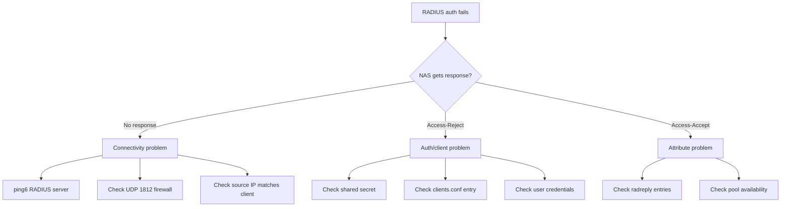

# How to Troubleshoot RADIUS with IPv6

Author: [nawazdhandala](https://www.github.com/nawazdhandala)

Tags: RADIUS, IPv6, Troubleshooting, FreeRADIUS, Debugging, AAA, Networking

Description: Diagnose and fix common RADIUS authentication failures in IPv6 environments including connectivity issues, attribute problems, and client configuration errors.

## Common RADIUS IPv6 Problems

| Problem | Symptom | Likely Cause |
|---|---|---|
| Authentication timeout | NAS gets no response | RADIUS unreachable via IPv6 |
| Client not found | Access-Reject: NAS not in clients.conf | NAS IPv6 != expected client IP |
| Wrong shared secret | Access-Reject: bad secret | Mismatch between NAS and clients.conf |
| No IPv6 prefix assigned | User authenticates but gets no IPv6 | Missing radreply entry |
| Pool exhausted | Access-Accept but no address | IPv6 pool full |
| Accounting gaps | Sessions don't close | Accounting packets dropped |

## Diagnostic Flowchart



## Step 1: Test Basic IPv6 Connectivity

```bash
#!/bin/bash
# test-radius-connectivity.sh

RADIUS_IPV6="2001:db8::radius"
RADIUS_PORT=1812

echo "1. Ping test:"
ping6 -c 3 "${RADIUS_IPV6}" && echo "PASS: IPv6 reachable" || echo "FAIL: IPv6 unreachable"

echo ""
echo "2. UDP port test:"
# netcat UDP test
nc -6 -z -u -w3 "${RADIUS_IPV6}" "${RADIUS_PORT}" 2>/dev/null
echo "RADIUS UDP port status: $?"

echo ""
echo "3. Auth test packet:"
radclient -x -t 5 "[${RADIUS_IPV6}]":${RADIUS_PORT} auth testing123 << 'EOF'
User-Name = "test"
User-Password = "test"
EOF
```

## Step 2: Enable FreeRADIUS Debug Mode

```bash
# Stop service and run in debug mode
systemctl stop freeradius
freeradius -X 2>&1 | tee /tmp/freeradius-debug.log

# In another terminal, send a test request
radclient -x [2001:db8::radius]:1812 auth testing123 << 'EOF'
User-Name = "alice"
User-Password = "secret"
NAS-IPv6-Address = "2001:db8:nas::1"
EOF

# Look for key debug output:
grep -E "client|Found|Reject|Accept|NAS" /tmp/freeradius-debug.log
```

## Step 3: Diagnose Client Not Found

```bash
# FreeRADIUS debug shows: "No client found for request"
# This means the source IP of RADIUS packets doesn't match clients.conf

# Find the actual source IP of incoming RADIUS packets
tcpdump -i eth0 -n udp port 1812 -c 10 2>/dev/null | \
    awk '{print "Source:", $3}' | head -5

# Compare with clients.conf
grep -A5 "client" /etc/freeradius/3.0/clients.conf

# Fix: add the NAS's actual IPv6 address to clients.conf
cat >> /etc/freeradius/3.0/clients.conf << 'EOF'
client new_nas {
    ipv6addr = 2001:db8:nas::2
    secret   = naspassword
    shortname = new-nas
}
EOF

systemctl reload freeradius
```

## Step 4: Diagnose Missing IPv6 Attributes

```bash
# Test with full debug — check what attributes are returned
radclient -x [2001:db8::radius]:1812 auth testing123 << 'EOF' | grep -i "ipv6\|prefix\|pool"
User-Name = "alice"
User-Password = "secret"
EOF

# If no IPv6 prefix returned:
# 1. Check radreply table
mysql -u radius -p radius << 'SQL'
SELECT * FROM radreply WHERE username = 'alice';
SQL

# 2. Check if pool is configured correctly
grep -A10 "ipv6_pool\|ipv6pool" /etc/freeradius/3.0/mods-enabled/

# 3. Check if pool has available addresses
redis-cli -h ::1 dbsize  # Count pool entries
```

## Step 5: Capture and Analyze RADIUS Packets

```bash
# Capture RADIUS traffic on IPv6 interface
tcpdump -i eth0 -n udp port 1812 or udp port 1813 -w /tmp/radius-capture.pcap &
TCPDUMP_PID=$!

# Generate some test traffic
radclient -x [2001:db8::radius]:1812 auth testing123 << 'EOF'
User-Name = "alice"
User-Password = "secret"
EOF

kill $TCPDUMP_PID

# Analyze capture
tshark -r /tmp/radius-capture.pcap -Y "radius" -V 2>/dev/null | \
    grep -E "Code|User-Name|Framed-IPv6|NAS-IPv6|Reply-Message"
```

## Common Error Messages and Fixes

```bash
# Error: "Failed to find client for request"
# Fix: Add NAS to clients.conf or verify NAS source IP

# Error: "Invalid user (Home Server)"
# Fix: Check User-Name format — ensure no domain mangling

# Error: "mschap: FAILED: No NT-Password"
# Fix: For PEAP/MSCHAPv2, store NT-Password in users/SQL

# Error: "Pool has no more addresses"
# Fix 1: Increase pool range
# Fix 2: Flush expired leases from Redis
redis-cli -h ::1 --scan --pattern "ipv6pool_*" | \
    xargs redis-cli -h ::1 DEL

# Error: "Request from ... unknown client"
# Fix: Source IP doesn't match any client block
# Debug: show what IP is seen by server
freeradius -X 2>&1 | grep "from client"

# Error: Accounting packets dropped
# Fix: Ensure UDP 1813 is open
ip6tables -A INPUT -p udp --dport 1813 -j ACCEPT
```

## Quick Diagnostic Script

```bash
#!/bin/bash
# diagnose-radius-ipv6.sh — Full diagnostic report

RADIUS="2001:db8::radius"
SECRET="testing123"
USER="alice"
PASS="secret"

echo "=== RADIUS IPv6 Diagnostic Report ==="
echo "Server: ${RADIUS}"
echo "Date: $(date)"
echo ""

# 1. Connectivity
echo "--- Connectivity ---"
ping6 -c 2 -W 2 "${RADIUS}" &>/dev/null && echo "Ping: OK" || echo "Ping: FAIL"
nc -6 -z -w2 "${RADIUS}" 1812 2>/dev/null && echo "UDP 1812: OK" || echo "UDP 1812: FAIL"

# 2. Authentication test
echo ""
echo "--- Authentication Test ---"
RESULT=$(radclient -t 5 "[${RADIUS}]":1812 auth "${SECRET}" \
    <<< "User-Name = \"${USER}\"
User-Password = \"${PASS}\"
NAS-IPv6-Address = \"2001:db8:diag::1\"" 2>&1)

echo "${RESULT}" | grep -E "Accept|Reject|timeout|refused"

# 3. IPv6 attributes returned
echo ""
echo "--- IPv6 Attributes ---"
echo "${RESULT}" | grep -i "IPv6\|ipv6\|Framed\|Delegated" || echo "No IPv6 attributes returned"

# 4. FreeRADIUS status
echo ""
echo "--- FreeRADIUS Process ---"
systemctl is-active freeradius || echo "FAIL: freeradius not running"
ss -6 -u -l -n | grep 1812 && echo "Listening on UDP 1812 (IPv6)" || echo "FAIL: not listening"
```

## Conclusion

RADIUS troubleshooting in IPv6 environments follows the same pattern as IPv4 but with IPv6-specific considerations. Start with connectivity (`ping6` and `nc -6 -u`), then verify the NAS is in `clients.conf` with the correct IPv6 address (FreeRADIUS matches clients by source IP, not `NAS-IPv6-Address` attribute). Use `freeradius -X` debug mode to trace the complete authorization process. For missing IPv6 prefix assignments, check the SQL `radreply` table and pool availability in Redis. Capture RADIUS packets with `tcpdump` and analyze with `tshark` to verify attribute content at the wire level.
