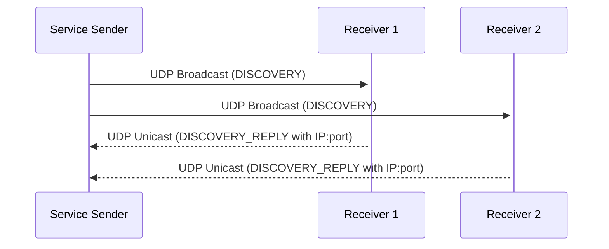

# How to Send UDP Broadcast Messages over IPv4 in Node.js

Author: [nawazdhandala](https://www.github.com/nawazdhandala)

Tags: Node.js, UDP, Broadcast, IPv4, Dgram, Networking

Description: Learn how to send and receive UDP broadcast messages over IPv4 in Node.js using the dgram module for local network service discovery.

## What Is UDP Broadcast?

UDP broadcast sends a single packet to all hosts on a subnet. The broadcast address is the subnet's highest address (e.g., `192.168.1.255` for a `/24` subnet). The special address `255.255.255.255` broadcasts to all directly connected networks.

## UDP Broadcast Sender

```javascript
const dgram = require('dgram');

const BROADCAST_ADDR = '255.255.255.255';  // Limited broadcast
const PORT = 41234;

const sender = dgram.createSocket('udp4');

// setBroadcast(true) is required before sending to a broadcast address
sender.bind(() => {
    sender.setBroadcast(true);

    const message = JSON.stringify({
        type: 'DISCOVERY',
        service: 'my-service',
        version: '1.0',
        timestamp: Date.now(),
    });

    const buf = Buffer.from(message);

    // Send broadcast every 2 seconds
    const interval = setInterval(() => {
        sender.send(buf, PORT, BROADCAST_ADDR, (err) => {
            if (err) {
                console.error(`Broadcast error: ${err.message}`);
            } else {
                console.log(`Broadcast sent to ${BROADCAST_ADDR}:${PORT}: ${message}`);
            }
        });
    }, 2000);

    // Stop after 10 seconds
    setTimeout(() => {
        clearInterval(interval);
        sender.close();
        console.log('Sender closed');
    }, 10000);
});
```

## UDP Broadcast Receiver

```javascript
const dgram = require('dgram');

const PORT = 41234;

const receiver = dgram.createSocket('udp4');

receiver.on('message', (msg, rinfo) => {
    try {
        const data = JSON.parse(msg.toString());
        console.log(`Discovery packet from ${rinfo.address}:${rinfo.port}`);
        console.log(`  Service: ${data.service} v${data.version}`);
        console.log(`  Latency: ${Date.now() - data.timestamp}ms`);

        // Optionally reply directly to the sender (unicast)
        const reply = Buffer.from(JSON.stringify({
            type: 'DISCOVERY_REPLY',
            host: '192.168.1.50',  // Our address
            port: 8080,
        }));
        receiver.send(reply, rinfo.port, rinfo.address, (err) => {
            if (err) console.error(`Reply error: ${err.message}`);
        });
    } catch (e) {
        console.error(`Invalid message: ${msg.toString()}`);
    }
});

receiver.on('error', (err) => {
    console.error(`Receiver error: ${err.message}`);
});

receiver.on('listening', () => {
    const addr = receiver.address();
    console.log(`Listening for broadcasts on port ${addr.port}`);
    // Enable broadcast receiving
    receiver.setBroadcast(true);
});

// Bind to all interfaces to receive broadcasts
receiver.bind(PORT);
```

## Directed Broadcast to Subnet

```javascript
const dgram = require('dgram');

// Directed broadcast to the 192.168.1.x subnet only
const SUBNET_BROADCAST = '192.168.1.255';
const PORT = 41234;

const socket = dgram.createSocket('udp4');
socket.bind(() => {
    socket.setBroadcast(true);

    const msg = Buffer.from('Hello local subnet!');
    socket.send(msg, PORT, SUBNET_BROADCAST, (err) => {
        if (err) console.error(err);
        else console.log(`Sent to subnet broadcast ${SUBNET_BROADCAST}:${PORT}`);
        socket.close();
    });
});
```

## Service Discovery Pattern



## Conclusion

UDP broadcast in Node.js requires calling `socket.setBroadcast(true)` before sending to `255.255.255.255` or a subnet broadcast address. This pattern is commonly used for local service discovery (similar to mDNS or SSDP). Receivers reply with unicast so the sender knows which hosts are available and at what addresses.
