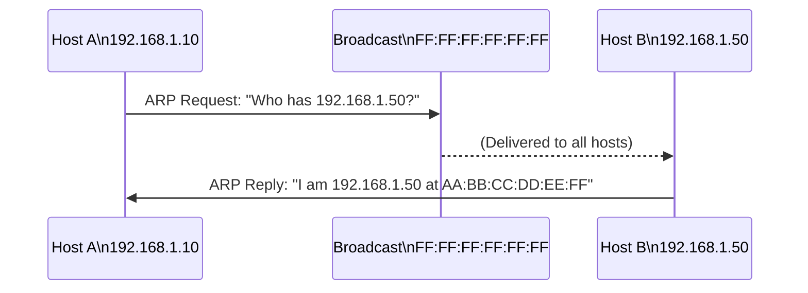

# How to Understand ARP Broadcast and Its Role in IPv4 Networks

Author: [nawazdhandala](https://www.github.com/nawazdhandala)

Tags: Networking, ARP, Broadcast, IPv4, Ethernet, Layer 2

Description: Understand how ARP uses Ethernet broadcast to resolve IPv4 addresses to MAC addresses, examine ARP packet structure, and manage the ARP cache on Linux.

## Introduction

Address Resolution Protocol (ARP) bridges Layer 3 (IPv4) and Layer 2 (Ethernet). Before a host can send an IP packet to another device on the same subnet, it must discover the destination's MAC address - and ARP does this via broadcast.

## How ARP Broadcast Works

When Host A wants to reach `192.168.1.50` and does not know its MAC:

1. Host A sends an ARP Request as an **Ethernet broadcast** (`FF:FF:FF:FF:FF:FF`)
2. Every device on the segment receives it
3. Only `192.168.1.50` replies with its MAC (unicast ARP Reply)
4. Host A caches the `IP → MAC` mapping



## ARP Packet Structure

```text
Hardware type:     1 (Ethernet)
Protocol type:     0x0800 (IPv4)
Hardware len:      6 (MAC = 6 bytes)
Protocol len:      4 (IPv4 = 4 bytes)
Operation:         1 (Request) or 2 (Reply)
Sender MAC:        AA:BB:CC:00:11:22
Sender IP:         192.168.1.10
Target MAC:        00:00:00:00:00:00 (unknown, in request)
Target IP:         192.168.1.50
```

## Capturing ARP with tcpdump

```bash
# Capture all ARP traffic on eth0

sudo tcpdump -i eth0 -n arp

# Filter only ARP requests (broadcasts)
sudo tcpdump -i eth0 -n "arp and ether dst ff:ff:ff:ff:ff:ff"
```

Example output:

```text
14:00:01.123 ARP, Request who-has 192.168.1.50 tell 192.168.1.10, length 28
14:00:01.125 ARP, Reply 192.168.1.50 is-at aa:bb:cc:dd:ee:ff, length 28
```

## Viewing and Managing the ARP Cache

```bash
# Display the ARP cache (IP-to-MAC mappings)
ip neigh show

# Show only entries on eth0
ip neigh show dev eth0

# Flush the entire ARP cache
sudo ip neigh flush all

# Delete a specific entry
sudo ip neigh del 192.168.1.50 dev eth0

# Add a static ARP entry (permanent - will not age out)
sudo ip neigh add 192.168.1.50 lladdr aa:bb:cc:dd:ee:ff dev eth0 nud permanent
```

## Gratuitous ARP

A **gratuitous ARP** is an ARP Reply sent without a prior request. It announces a new IP-MAC mapping to update all caches. Used by:
- Virtual IP failover (VRRP, HSRP)
- After DHCP lease assignment
- After NIC replacement

```bash
# Send a gratuitous ARP to announce 192.168.1.10 → your MAC
sudo arping -A -I eth0 192.168.1.10 -c 3
```

## ARP Cache Tuning

On busy subnets, the ARP cache may time out too quickly:

```bash
# Increase ARP cache GC timeout (seconds before removal after reachability unconfirmed)
sudo sysctl -w net.ipv4.neigh.default.gc_stale_time=300

# Increase base reachable time (NUD state validity)
sudo sysctl -w net.ipv4.neigh.eth0.base_reachable_time_ms=60000
```

## Conclusion

ARP broadcast is fundamental to IPv4 communication on Ethernet. Every IP packet to a local host requires a prior ARP resolution. Understanding the ARP cache, gratuitous ARP, and how to capture ARP traffic is essential for diagnosing connectivity and failover issues.
