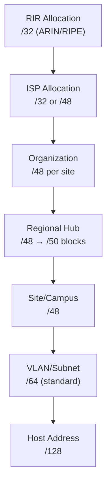

# How to Understand IPv6 IP Address Management (IPAM)

Author: [nawazdhandala](https://www.github.com/nawazdhandala)

Tags: IPv6, IPAM, Address Management, Network Planning, NetBox

Description: Understand IPv6 IPAM concepts including prefix hierarchies, address delegation, utilization tracking, and the differences from IPv4 IPAM.

## Introduction

IPv6 IPAM (IP Address Management) differs from IPv4 IPAM in several important ways: the address space is so vast that exhaustion is not the primary concern, hierarchical prefix delegation is fundamental (RIR → ISP → Organization → Site → VLAN), and /64 is the standard subnet size for all LANs regardless of actual host count. Understanding these principles is essential for designing a scalable IPv6 IPAM system.

## IPv4 vs IPv6 IPAM Comparison

| Aspect | IPv4 | IPv6 |
|--------|------|------|
| Primary concern | Prevent exhaustion | Maintain hierarchy |
| Subnet granularity | Variable (/24, /28, /30) | Always /64 for LANs |
| Organization allocation | /24 (254 hosts) | /48 (65,536 /64 subnets) |
| Site allocation | /24 or /26 | /48 or /56 |
| VLAN allocation | /24 or /26 | /64 (every VLAN gets /64) |
| Utilization concern | Critical | Secondary (space is abundant) |
| NAT requirement | Common (space conservation) | Not needed |

## IPv6 Address Hierarchy



## Standard IPv6 Address Plan Structure

```python
#!/usr/bin/env python3
# ipv6_address_plan.py

import ipaddress

def show_address_plan(org_prefix: str):
    """Show an example IPv6 address plan for an organization."""

    org = ipaddress.ip_network(org_prefix)
    print(f"Organization prefix: {org}")
    print(f"Available /64 subnets: {2 ** (64 - org.prefixlen):,}")
    print()

    # Allocate /48 per site (for a /32 org)
    # Structure: org:site:vlan::/64
    sites = {
        "headquarters": "0001",
        "data-center-east": "0002",
        "data-center-west": "0003",
        "branch-new-york": "0010",
        "branch-london": "0011",
    }

    vlans = {
        "servers":    "0001",
        "management": "0002",
        "dmz":        "0003",
        "workstations": "0010",
        "iot":        "0020",
    }

    org_parts = org_prefix.replace("/32", "").rstrip(":")
    # e.g., "2001:db8" -> use first 32 bits

    print(f"{'Site':<20} {'VLAN':<15} {'Subnet'}")
    print("-" * 65)
    for site_name, site_id in sites.items():
        for vlan_name, vlan_id in vlans.items():
            subnet = f"{org_parts}:{site_id}:{vlan_id}::/64"
            print(f"{site_name:<20} {vlan_name:<15} {subnet}")

show_address_plan("2001:db8::/32")
```

## IPAM Tool Requirements for IPv6

Key capabilities to look for in an IPv6 IPAM tool:

| Capability | Why It Matters |
|------------|---------------|
| /64 as atomic unit | Every VLAN gets exactly one /64 |
| Prefix delegation tracking | ISP delegates /48 to org; track what came from where |
| SLAAC address derivation | Predict EUI-64 and stable-privacy addresses |
| DHCPv6 lease integration | See actual addresses assigned |
| CIDR search | Find all addresses in a /32 quickly |
| Multi-site prefix plans | Assign /48 blocks per site with consistent naming |
| REST API | Automate address assignments in infrastructure-as-code |

## IPAM Utilization Metrics for IPv6

Unlike IPv4, tracking individual IP utilization is meaningless for IPv6. Track at prefix level:

```python
#!/usr/bin/env python3
# ipv6_ipam_metrics.py

import ipaddress

class IPv6PrefixTracker:
    def __init__(self):
        self.prefixes = {}  # prefix -> {"allocated": [], "purpose": str}

    def allocate(self, parent: str, purpose: str) -> str:
        """Allocate the next available /48 or /64 from a parent prefix."""
        parent_net = ipaddress.ip_network(parent)
        allocated = self.prefixes.get(parent, {}).get("children", [])

        # Find first unallocated child prefix
        if parent_net.prefixlen == 32:
            child_prefix_len = 48
        elif parent_net.prefixlen == 48:
            child_prefix_len = 64
        else:
            raise ValueError(f"Unsupported parent prefix length: {parent_net.prefixlen}")

        for subnet in parent_net.subnets(new_prefix=child_prefix_len):
            subnet_str = str(subnet)
            if subnet_str not in allocated:
                if parent not in self.prefixes:
                    self.prefixes[parent] = {"children": [], "purposes": {}}
                self.prefixes[parent]["children"].append(subnet_str)
                self.prefixes[parent]["purposes"][subnet_str] = purpose
                return subnet_str

        raise RuntimeError(f"Parent {parent} is fully allocated!")

    def utilization(self, parent: str) -> float:
        parent_net = ipaddress.ip_network(parent)
        allocated = len(self.prefixes.get(parent, {}).get("children", []))
        if parent_net.prefixlen == 32:
            total = 2 ** (48 - 32)
        else:
            total = 2 ** (64 - parent_net.prefixlen)
        return (allocated / total) * 100

tracker = IPv6PrefixTracker()
hq_prefix   = tracker.allocate("2001:db8::/32", "HQ Site")
dc_prefix   = tracker.allocate("2001:db8::/32", "Data Center")
print(f"HQ: {hq_prefix}")
print(f"DC: {dc_prefix}")
print(f"Utilization: {tracker.utilization('2001:db8::/32'):.4f}%")
```

## IPAM Integration with NetBox

```python
import pynetbox

nb = pynetbox.api("http://netbox.internal", token="your-token")

# Create a prefix in NetBox
nb.ipam.prefixes.create({
    "prefix": "2001:db8:0001::/48",
    "site": {"name": "headquarters"},
    "description": "HQ site prefix",
    "status": "active",
    "tags": [{"name": "ipv6"}]
})

# Get all available /48 prefixes in the org /32
prefix = nb.ipam.prefixes.get(prefix="2001:db8::/32")
available = nb.ipam.prefixes.filter(parent="2001:db8::/32", available=True)
```

## Conclusion

IPv6 IPAM revolves around hierarchy management rather than scarcity management. Design your address plan top-down: allocate /32 from RIR, assign /48 per site or major location, divide each /48 into /64s for individual VLANs (one per VLAN, always). Track prefix allocation and delegation chains rather than individual host addresses. Choose an IPAM tool with native IPv6 support (NetBox, phpIPAM, Infoblox) that can represent the hierarchical relationship from /32 to /64 and provide REST APIs for automation.
