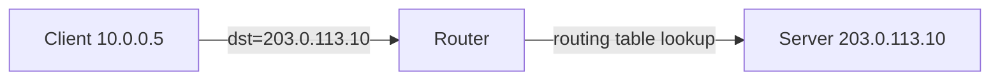

# How to Understand Unicast Addressing in IPv4

Author: [nawazdhandala](https://www.github.com/nawazdhandala)

Tags: IPv4, Unicast, Networking, IP Addressing, TCP/IP

Description: Unicast addressing delivers a packet from one source to exactly one destination, making it the standard communication model for TCP connections, HTTP, SSH, and most internet traffic.

## What Is Unicast?

Unicast is a one-to-one communication model where a packet sent to a unicast IP address is delivered to exactly one network interface. This contrasts with:

| Type | Destinations | Address Range |
|------|-------------|--------------|
| Unicast | One specific host | Most of IPv4 (Class A/B/C) |
| Broadcast | All hosts on segment | 255.255.255.255 / subnet broadcast |
| Multicast | Group of subscribers | 224.0.0.0/4 |
| Anycast | Nearest of a group | Any unicast address (BGP-managed) |

## Unicast Address Ranges

Every public and private address outside the special-purpose ranges is unicast:
- `0.0.0.1` to `9.255.255.255`
- `11.0.0.0` to `126.255.255.255`
- `128.0.0.0` to `172.15.255.255`
- And most of the remaining public space

## How Unicast Delivery Works



The router performs a longest-prefix-match lookup on the destination IP and forwards the packet to the next hop. The packet arrives only at the server with address `203.0.113.10`.

## TCP: Unicast by Definition

All TCP connections are unicast - every segment goes from one IP:port to one IP:port:

```python
import socket

# TCP client - sends to exactly one server (unicast)

client = socket.socket(socket.AF_INET, socket.SOCK_STREAM)
client.connect(("93.184.216.34", 80))   # example.com
client.sendall(b"GET / HTTP/1.0\r\nHost: example.com\r\n\r\n")
response = client.recv(4096)
print(response[:200].decode(errors='replace'))
client.close()
```

## UDP Can Be Unicast, Broadcast, or Multicast

```python
import socket

# Unicast UDP
sock = socket.socket(socket.AF_INET, socket.SOCK_DGRAM)
sock.sendto(b"unicast message", ("192.168.1.10", 9999))

# Broadcast UDP (all hosts on segment)
sock.setsockopt(socket.SOL_SOCKET, socket.SO_BROADCAST, 1)
sock.sendto(b"broadcast message", ("192.168.1.255", 9999))
```

## Verifying Unicast Delivery with tcpdump

```bash
# Capture unicast traffic to/from a specific host
tcpdump -i eth0 'host 192.168.1.10 and not broadcast and not multicast'
```

## Key Takeaways

- Unicast is the default IPv4 addressing model: one sender, one receiver.
- All TCP connections are inherently unicast.
- UDP can be unicast, broadcast, or multicast depending on the destination address.
- Routing decisions (longest-prefix match) apply to unicast destinations.
