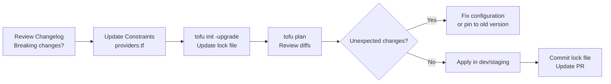

# How to Upgrade Provider Versions in OpenTofu

Author: [nawazdhandala](https://www.github.com/nawazdhandala)

Tags: OpenTofu, Provider Versions, Upgrade, Lock File, Migration, Infrastructure as Code

Description: Learn how to safely upgrade OpenTofu provider versions with a tested, step-by-step process including constraint management, breaking change review, and rollback planning.

---

Provider upgrades bring bug fixes, new features, and security patches but can include breaking changes that require configuration updates. A systematic upgrade process with testing at each step prevents production incidents from unexpected provider behavior changes.

## Provider Upgrade Workflow



## Current Provider Version Check

```bash
# Check what versions are currently installed

tofu providers

# Check what the lock file specifies
cat .terraform.lock.hcl | grep -A 3 "version ="

# Check for available updates
tofu providers schema -json | jq '.provider_schemas | keys'
```

## Reviewing Provider Changelogs

```bash
# AWS Provider changelog: https://github.com/hashicorp/terraform-provider-aws/releases
# Look for:
# - BREAKING CHANGES section
# - Deprecated resources/attributes
# - Resource behavior changes

# Check if your resources are affected
tofu plan -out=before_upgrade.plan
```

## Updating Version Constraints

```hcl
# providers.tf - before upgrade
terraform {
  required_providers {
    aws = {
      source  = "hashicorp/aws"
      version = "~> 5.0"
    }
  }
}

# providers.tf - pin to specific version for gradual rollout
terraform {
  required_providers {
    aws = {
      source  = "hashicorp/aws"
      version = "5.45.0"  # Exact version during testing
    }
  }
}

# providers.tf - after successful validation, widen constraint
terraform {
  required_providers {
    aws = {
      source  = "hashicorp/aws"
      version = "~> 5.45"  # Allow 5.45.x patches
    }
  }
}
```

## Running the Upgrade

```bash
# Upgrade a specific provider
tofu init -upgrade

# Verify the lock file changed as expected
git diff .terraform.lock.hcl

# Run plan to detect configuration changes needed
tofu plan -out=after_upgrade.plan

# Compare before and after plans
tofu show -json before_upgrade.plan > before.json
tofu show -json after_upgrade.plan > after.json

# Apply in lowest environment first
tofu workspace select dev
tofu apply after_upgrade.plan
```

## Handling Breaking Changes

```hcl
# Example: AWS provider 5.x renamed an attribute

# Before (aws provider 4.x)
resource "aws_instance" "web" {
  ami           = data.aws_ami.ubuntu.id
  instance_type = "t3.micro"

  # Old attribute name
  vpc_security_group_ids = [aws_security_group.web.id]
}

# After (aws provider 5.x - same in this case, but some attrs change)
resource "aws_s3_bucket_acl" "example" {
  # In provider 4.x, ACL was set on the bucket resource
  # In provider 5.x, it's a separate resource
  bucket = aws_s3_bucket.main.id
  acl    = "private"
}
```

## Pinning to Previous Version (Emergency Rollback)

```hcl
# If upgrade causes issues, pin to the last known-good version
terraform {
  required_providers {
    aws = {
      source  = "hashicorp/aws"
      version = "= 5.39.0"  # Exact pin - no updates
    }
  }
}
```

```bash
# Reinstall the pinned version
tofu init -upgrade

# Verify plan looks correct again
tofu plan
```

## Automated Upgrade PR with Renovate

```json
// renovate.json - auto-create PRs for provider upgrades
{
  "extends": ["config:base"],
  "terraform": {
    "enabled": true
  },
  "packageRules": [
    {
      "matchManagers": ["terraform"],
      "matchPackagePatterns": [".*"],
      "groupName": "terraform providers",
      "automerge": false,
      "reviewers": ["team:infrastructure"]
    }
  ]
}
```

## Multi-Module Upgrade Strategy

```bash
# When multiple modules use the same provider
# Upgrade root module first, then child modules

# 1. Update root module
cd infrastructure/
tofu init -upgrade && tofu plan

# 2. Update shared modules
cd modules/vpc/
tofu init -upgrade

# 3. Update environment-specific configs
for env in dev staging production; do
  cd environments/$env
  tofu init -upgrade
  tofu plan -out=plan.tfplan
  cd ../..
done
```

## Best Practices

- Never upgrade providers directly in production - test in dev → staging → production, with validation at each stage.
- Read the BREAKING CHANGES section of every provider release you're jumping across - even minor version bumps occasionally include behavior changes for previously-accepted configurations.
- Use exact version pins (`= 5.45.0`) when testing an upgrade, then widen to `~> 5.45` after successful validation - this prevents unexpected upgrades during the testing window.
- Run `tofu plan` before and after the upgrade and compare the output - plan diffs that reference resource replacements or attribute changes indicate breaking changes that need configuration updates.
- Automate upgrade discovery with Renovate or Dependabot - these tools create PRs for provider upgrades automatically, ensuring upgrades are handled regularly rather than in large batches.
