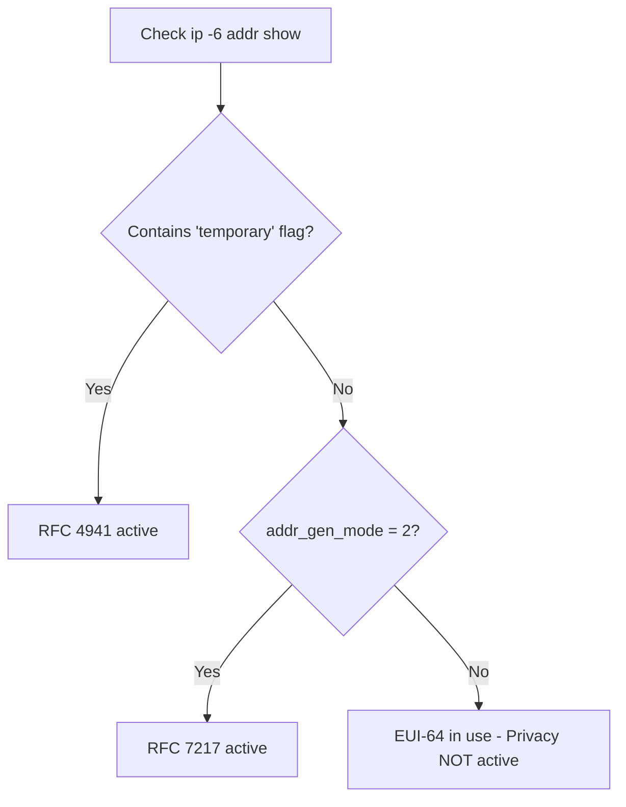

# How to Verify That Privacy Extensions Are Working

Author: [nawazdhandala](https://www.github.com/nawazdhandala)

Tags: IPv6, Privacy, Verification, Linux, Networking, Security

Description: Learn the practical steps to verify that IPv6 privacy extensions are active and generating the correct types of addresses on Linux systems.

## Introduction

Configuring IPv6 privacy extensions is only half the job - you must also verify that they are functioning correctly and that your device is not leaking a stable EUI-64 address. This guide walks through all the verification steps, from reading kernel state to testing from an external perspective.

## Step 1: Check Kernel sysctl Values

The most direct verification is reading the active kernel parameters:

```bash
# Check privacy extension settings for all interfaces

sysctl net.ipv6.conf.all.use_tempaddr
sysctl net.ipv6.conf.default.use_tempaddr

# Check addr_gen_mode (2 = stable-privacy / RFC 7217)
sysctl net.ipv6.conf.all.addr_gen_mode
sysctl net.ipv6.conf.eth0.addr_gen_mode

# Expected values:
# use_tempaddr = 2  (prefer temporary addresses)
# addr_gen_mode = 2 (stable-privacy) or 3 (random)
```

## Step 2: Inspect Assigned Addresses

Check the addresses assigned to an interface and understand their flags:

```bash
# Show all IPv6 addresses with flags and lifetimes
ip -6 addr show eth0

# Example output with privacy extensions active:
# inet6 2001:db8:1:1:a3f2:1b4e:7c9d:2e50/64 scope global temporary dynamic
#    valid_lft 86399sec preferred_lft 14399sec
# inet6 2001:db8:1:1:f4a1:b3c2:d5e6:7890/64 scope global mngtmpaddr dynamic
#    valid_lft 2591999sec preferred_lft 604799sec
# inet6 fe80::a3f2:1b4e:7c9d:2e50/64 scope link
```

Key indicators:
- `temporary` flag = temporary privacy address (RFC 4941)
- `mngtmpaddr` flag = the stable address used for generating temporaries
- The temporary address will have a shorter `preferred_lft`

## Step 3: Confirm the Address Is NOT EUI-64

Verify that neither the temporary nor the stable address is an EUI-64 derivation of the MAC:

```bash
# Get MAC address
MAC=$(ip link show eth0 | awk '/link\/ether/ {print $2}')
echo "MAC: $MAC"

# Compute what the EUI-64 IID would be
python3 -c "
mac = '$MAC'.split(':')
mac.insert(3, 'ff'); mac.insert(4, 'fe')
mac[0] = format(int(mac[0], 16) ^ 0x02, '02x')
iid = ':'.join(mac[i]+mac[i+1] for i in range(0, 8, 2))
print('EUI-64 IID would be:', iid)
"

# Compare with actual IID from ip addr show
# If no current address contains that IID, privacy extensions are working
```

## Step 4: Use an External IPv6 Test Site

Check which address is used for outbound connections:

```bash
# See which IPv6 address is used for outbound traffic
curl -6 https://ifconfig.me

# Or use a dedicated IPv6 test service
curl -6 https://api6.ipify.org
```

The returned address should be the temporary address (if RFC 4941 is configured) or a stable-privacy address (if RFC 7217 is configured), and not the EUI-64 address.

## Step 5: Check the preferred_lft

A temporary address should have a limited preferred lifetime:

```bash
# Show verbose address info including lifetimes
ip -6 addr show dev eth0

# For RFC 4941 temporary addresses:
# preferred_lft should be ~hours (default: 86400s / 24h)
# For stable privacy addresses:
# preferred_lft is longer (days to weeks)
```

## Step 6: Check NetworkManager Connection Profile

If using NetworkManager, verify the profile:

```bash
# Inspect the addr-gen-mode setting
nmcli connection show "Wired connection 1" | grep -E "addr-gen-mode|ip6-privacy"

# Expected output:
# ipv6.addr-gen-mode:                     stable-privacy
# ipv6.ip6-privacy:                       -1 (unknown)
```

## Step 7: Monitor Address Changes Over Time

For RFC 4941 temporary addresses, verify they rotate:

```bash
# Record the current temporary address
ip -6 addr show eth0 | grep temporary | awk '{print $2}'

# Wait until the preferred lifetime expires and a new address is generated
# Or force address regeneration by cycling the interface:
sudo ip link set eth0 down && sudo ip link set eth0 up

# Check again - a new temporary address should appear
ip -6 addr show eth0 | grep temporary | awk '{print $2}'
```

## Interpreting Results



## Conclusion

Verifying IPv6 privacy extensions requires checking kernel sysctl values, inspecting address flags and lifetimes, confirming the IID does not match the EUI-64 derivation of the MAC address, and optionally confirming from an external view. These steps ensure your privacy configuration is not just configured, but actually effective.
