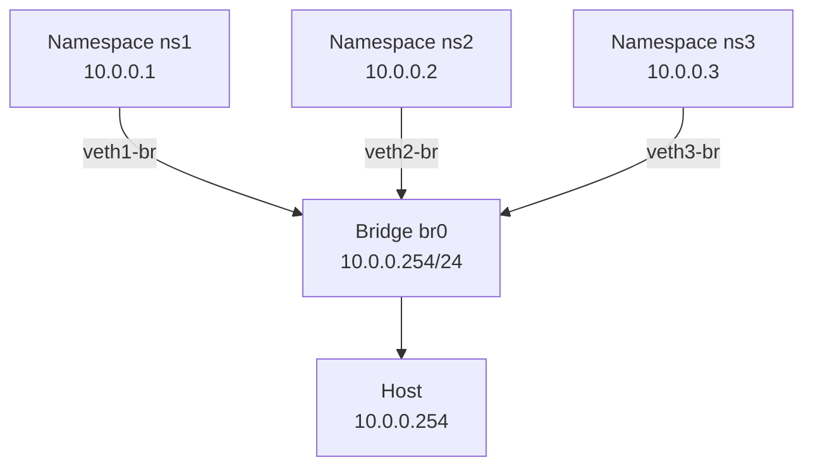

# How to Build a Virtual Bridge Between Network Namespaces on Linux

Author: [nawazdhandala](https://www.github.com/nawazdhandala)

Tags: Linux, Networking, Bridge, Network Namespaces, veth, IPv4

Description: Create a virtual bridge in the host namespace and connect multiple network namespaces to it using veth pairs, enabling all namespaces to communicate on a shared IPv4 subnet.

## Introduction

A single veth pair only connects two namespaces. To connect multiple namespaces to a shared network, create a bridge in the host namespace and attach a veth pair from each namespace to it. This mirrors what Docker does with its default `docker0` bridge.

## Architecture



## Step 1: Create the Bridge

```bash
# Create a bridge in the host namespace
sudo ip link add br0 type bridge
sudo ip link set br0 up

# Assign the bridge an IP (host's address on this virtual network)
sudo ip addr add 10.0.0.254/24 dev br0
```

## Step 2: Create Namespaces

```bash
sudo ip netns add ns1
sudo ip netns add ns2
sudo ip netns add ns3
```

## Step 3: Connect Each Namespace to the Bridge

For each namespace, create a veth pair, keep one end on the bridge, move the other into the namespace:

```bash
for ns in ns1 ns2 ns3; do
    # Create veth pair
    sudo ip link add "veth-${ns}" type veth peer name "veth-${ns}-br"

    # Attach the br-end to the bridge
    sudo ip link set "veth-${ns}-br" master br0
    sudo ip link set "veth-${ns}-br" up

    # Move the ns-end into the namespace
    sudo ip link set "veth-${ns}" netns "$ns"
done
```

## Step 4: Assign IPs Inside Each Namespace

```bash
# ns1 → 10.0.0.1
sudo ip netns exec ns1 bash -c "
  ip link set lo up
  ip link set veth-ns1 up
  ip addr add 10.0.0.1/24 dev veth-ns1
  ip route add default via 10.0.0.254
"

# ns2 → 10.0.0.2
sudo ip netns exec ns2 bash -c "
  ip link set lo up
  ip link set veth-ns2 up
  ip addr add 10.0.0.2/24 dev veth-ns2
  ip route add default via 10.0.0.254
"

# ns3 → 10.0.0.3
sudo ip netns exec ns3 bash -c "
  ip link set lo up
  ip link set veth-ns3 up
  ip addr add 10.0.0.3/24 dev veth-ns3
  ip route add default via 10.0.0.254
"
```

## Step 5: Verify Connectivity

```bash
# Ping ns2 from ns1 (via the bridge)
sudo ip netns exec ns1 ping -c 2 10.0.0.2

# Ping ns3 from ns2
sudo ip netns exec ns2 ping -c 2 10.0.0.3

# Ping the bridge (host) from ns1
sudo ip netns exec ns1 ping -c 2 10.0.0.254
```

## Adding NAT for Internet Access

To allow namespace traffic to reach the internet via the host:

```bash
# Enable forwarding on host
echo 1 | sudo tee /proc/sys/net/ipv4/ip_forward

# NAT out via host's internet interface (e.g., eth0)
sudo iptables -t nat -A POSTROUTING -s 10.0.0.0/24 -o eth0 -j MASQUERADE
sudo iptables -A FORWARD -i br0 -o eth0 -j ACCEPT
sudo iptables -A FORWARD -i eth0 -o br0 -m state --state RELATED,ESTABLISHED -j ACCEPT
```

## Cleanup

```bash
sudo ip netns del ns1
sudo ip netns del ns2
sudo ip netns del ns3
sudo ip link del br0   # Also removes attached veth-*-br interfaces
```

## Conclusion

A bridge in the host namespace acts as a virtual switch for multiple namespaces. Each namespace connects via a veth pair, with one end on the bridge. Add NAT on the host to give namespaces internet access — this is exactly the model Docker uses for its default bridge network.
