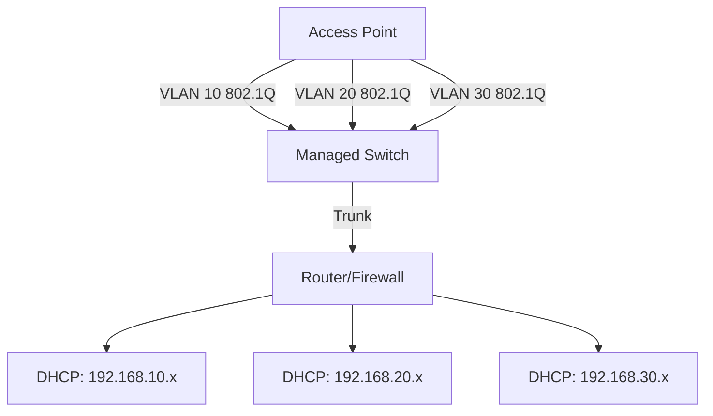

# How to Configure VLAN-Based WiFi with Separate IPv4 Subnets

Author: [nawazdhandala](https://www.github.com/nawazdhandala)

Tags: VLAN, WiFi, IPv4, Subnets, Network Segmentation, SSID

Description: Learn how to configure VLAN-tagged WiFi SSIDs with separate IPv4 subnets for network segmentation, covering access point configuration and VLAN-aware DHCP setup.

## Why Use VLANs with WiFi?

VLAN-based WiFi allows you to assign different SSIDs to different network segments:

- **Corporate SSID** → VLAN 10 → 192.168.10.0/24 (full network access)
- **Guest SSID** → VLAN 20 → 192.168.20.0/24 (internet only)
- **IoT SSID** → VLAN 30 → 192.168.30.0/24 (isolated, no internet access)

Each VLAN gets its own IPv4 subnet, DHCP scope, and firewall rules.

## Step 1: Architecture Overview



## Step 2: Configure VLANs on the Router (Linux)

```bash
# Create VLAN sub-interfaces on the router's LAN interface (eth0)

# VLAN 10 - Corporate
ip link add link eth0 name eth0.10 type vlan id 10
ip addr add 192.168.10.1/24 dev eth0.10
ip link set eth0.10 up

# VLAN 20 - Guest
ip link add link eth0 name eth0.20 type vlan id 20
ip addr add 192.168.20.1/24 dev eth0.20
ip link set eth0.20 up

# VLAN 30 - IoT
ip link add link eth0 name eth0.30 type vlan id 30
ip addr add 192.168.30.1/24 dev eth0.30
ip link set eth0.30 up
```

## Step 3: Configure VLAN-Aware DHCP Server

```bash
# /etc/dhcp/dhcpd.conf

# VLAN 10 - Corporate
subnet 192.168.10.0 netmask 255.255.255.0 {
    range 192.168.10.100 192.168.10.200;
    option routers 192.168.10.1;
    option domain-name-servers 192.168.10.1;
    default-lease-time 86400;
}

# VLAN 20 - Guest
subnet 192.168.20.0 netmask 255.255.255.0 {
    range 192.168.20.100 192.168.20.200;
    option routers 192.168.20.1;
    option domain-name-servers 8.8.8.8, 8.8.4.4;
    default-lease-time 3600;
}

# VLAN 30 - IoT
subnet 192.168.30.0 netmask 255.255.255.0 {
    range 192.168.30.100 192.168.30.200;
    option routers 192.168.30.1;
    option domain-name-servers 192.168.30.1;
    default-lease-time 7200;
}
```

## Step 4: Configure the Managed Switch

**Cisco IOS switch configuration:**
```text
! Create VLANs
vlan 10
 name CORPORATE
vlan 20
 name GUEST
vlan 30
 name IOT

! Configure uplink to router as trunk
interface GigabitEthernet0/1
 switchport mode trunk
 switchport trunk allowed vlan 10,20,30

! Configure AP port as trunk
interface GigabitEthernet0/2
 switchport mode trunk
 switchport trunk allowed vlan 10,20,30
```

## Step 5: Configure the Access Point

On the access point (using OpenWrt as example):

```bash
# /etc/config/wireless

config wifi-iface 'wifinet_corp'
    option device 'radio0'
    option mode 'ap'
    option ssid 'Corporate-WiFi'
    option key 'corp_password'
    option encryption 'psk2'
    option network 'vlan10'

config wifi-iface 'wifinet_guest'
    option device 'radio0'
    option mode 'ap'
    option ssid 'Guest-WiFi'
    option key 'guest_password'
    option encryption 'psk2'
    option network 'vlan20'

# /etc/config/network (VLAN bridge interfaces)
config interface 'vlan10'
    option type 'bridge'
    option ifname 'eth0.10'
    option proto 'dhcp'

config interface 'vlan20'
    option type 'bridge'
    option ifname 'eth0.20'
    option proto 'dhcp'
```

## Step 6: Add Inter-VLAN Firewall Rules

```bash
# Allow Corporate (VLAN 10) to reach internet
iptables -A FORWARD -i eth0.10 -o eth1 -j ACCEPT

# Allow Guest (VLAN 20) to reach internet only (not other VLANs)
iptables -A FORWARD -i eth0.20 -o eth1 -j ACCEPT
iptables -A FORWARD -i eth0.20 -o eth0.10 -j DROP
iptables -A FORWARD -i eth0.20 -o eth0.30 -j DROP

# Block IoT (VLAN 30) from internet and other VLANs
iptables -A FORWARD -i eth0.30 -j DROP

# NAT for all VLANs (for internet access)
iptables -t nat -A POSTROUTING -s 192.168.10.0/24 -o eth1 -j MASQUERADE
iptables -t nat -A POSTROUTING -s 192.168.20.0/24 -o eth1 -j MASQUERADE
```

## Conclusion

VLAN-based WiFi provides strong network segmentation by mapping each SSID to a separate VLAN and IPv4 subnet. Configure VLAN sub-interfaces on the router, VLAN-aware DHCP scopes for each subnet, trunk ports on the switch to carry tagged traffic, and the access point to tag each SSID with the appropriate VLAN ID. Apply inter-VLAN firewall rules to enforce access policies between guest, IoT, and corporate segments.
